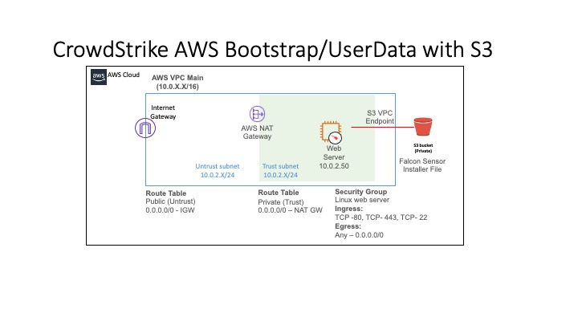

# Falcon Terraform Bootstrap/User-Data Sensor Install
This template provides a sample Terraform template to build a test VPC with a sample EC2 ubuntu webserver with the CrowdStrike sensor installed.

## Prerequisites
You will need the following from AWS:
* AWS API Keys
* AWS account with permissions to create VPCs, Route tables and subnets
* Permission to create IAM roles, deploy EC2 instances, deploy IGW, and
* Available Elastic IP (EIP)

You will need the following from CrowdStrike:
CrowdStrike account with Customer Identification (CID)
Login to Falcon console to download sensor installer file
Falcon CID for sensor installation

You will need from Terraform:
Terraform version 0.12.21 (version used to build and validate template)

## Template Architecture Build



## Contents
The template will build the above architecture. The template consists of five Terraform files and a bootstrap folder:
```bash
aws_vars.tf (input variables for the tempate)
terraform.tfvars (define input variables)
network.tf (set the terraform provider, create the VPC with route tables, subnets, and gateways)
s3bucket.tf (create the private s3 bucket with folder structure and upload falcon sensor installer file)
example_workload.tf (creates the Ubuntu EC2 instance with Falcon Sensor installed)
bootstrap (folder where the falcon sensor installer resides)
```

### Deployment of the template

### Step 1 Edit the terraform.tfvars file
#### terraform.tfvars
```bash
#Used only if you do not have a AWS profile set (recommended to use a creds file or profile)
#Key variables are commented out of the network.tf file
#aws_access_key = "place access key here"
#aws_secret_key = "place secret key here"

VPCName = "CRWD-Test-VPC"

# Name to apply to the stack
StackName = "crwd-test-stack"

# CIDR of the VPC we will create
VPCCIDR = "10.0.0.0/16"

WebSRV1_AZ1_Trust = "10.0.2.50"
WebCIDR_TrustBlock1 = "10.0.2.0/24"
WebCIDR_UntrustBlock1 = "10.0.1.0/24"

aws_region = "Add Region"
# Name of the S3 Bucket that contains the falcon sensor installation package
bucket_name = "Add Unique s3 Bucket Name"

ServerKeyName = "Add Region Keypair"

crwd_cid = "Place CID Here"

#CrowdStrike Sensor Version (ex falcon-sensor_5.27.0-9104_amd64.deb)
crwd_sensor = "falcon-sensor_5.43.0-10803_amd64.deb"
```
API credentials must be supplied for the AWS account that you are planning to deploy the template into.  However you choose to supply credentials with a cred file/profile or manually add the API key and secret key in the tfvars file.  If you choose to use the manual method, you will also need to uncomment the following lines from the network.tf file:
```bash
#access_key = var.aws_access_key
#secret_key = var.aws_secret_key
```
For more help with using API keys in AWS, please see the following document:
[https://docs.aws.amazon.com/IAM/latest/UserGuide/id_credentials_access-keys.html](https://docs.aws.amazon.com/IAM/latest/UserGuide/id_credentials_access-keys.html).

In addition to the API keys, you will also need to set the region you would like to deplo the template into.  edit the following line:
```bash
aws_region = ""
```
for example to deploy the template in us-west-2 Oregon, the line would read:
```bash
aws_region = "us-west-2"
```

You must also add a unique S3 bucketname.  S3 bucket names must be globally unique names.  If you do not create a unique name, the template deployment will fail.  Edit the following line to add the S3 bucket name:
```bash
bucket_name = "Add Unique s3 Bucket Name"
```

To access the Ubuntu EC2 instance, you must create or use an existing EC2 keypair for the region that you are deploying the template.  The keypair is region specific and must come from the region you are deploying or the template deployment will fail.  Edit the following line:
```bash
ServerKeyName = "Add Region Keypair"
```

Next, you must add the CrowdStrike Falcon CID to the file.  Edit the following line in the file to add the CID:
```bash
crwd_cid = "Place CID Here"
```

Finally, you must download a falcon sensor installer file from the CrowdStrike Falcon console.  You must make sure to download the correct versio of the sensor downloader based on the version of the OS.  For this demo, we are using an Ubuntu 16.X version of OS for the sample instance, thus the installer downloaded should be Ubuntu 14/16/18/20 from the falcon console.  Place the installerfile into the download folder in the template directory.  Once the file is in place, edit the CrowdStrike Sensor version in the file.  Edit the following line:
```bash
crwd_sensor = "add version here" 
``` 

```bash
example- crwd_sensor = "falcon-sensor_5.43.0-10803_amd64.deb"
```

### Step 2 Deploy the template:
Once the terraform.tfvars file has been updated and the sensor download file added to the bootstrap folder, you are ready to deploy the terraform template.

* Run terraform init

from the command line of your local machine cd to the directory where the template folder structure resides and run the following command:
```bash
terraform init
```

Once the above command completes, next you want to run terraform plan.  Use the following command:
```bash
terraform plan
```

Once the terraform plan runs successfully, you are ready to run the build of the template. To install the template run the following command:
```bash
terraform apply
```

Once the terraform apply command successfully completes, you will have the new demo environment build in your AWS account.

### Step 3 Validate the sensor is registered with the CrowdStrike Falcon console:
Once the terraform build has completed, after about 5 to 10 minutes, the new AWS EC2 workload should be listed as a managed host in the Falcon console CID.  You can validate the host is being managed by connecting to your Falcon console and selecting the Host\Dashboard menu.  In the main Hosts Dashboard, the new EC2 workload will show up under Servers(hosts).

### Step 4 Delete the architecture build:
Once you are done with the AWS architecture build, you can delete the build from the command line of your local host.  From your local host, again from the root of the template folder structure, issue the following command:
```bash
terraform destroy
```

The above command will delete the entire install from the AWS account, including the S3 bucket and the Falcon sensor installer file.  The managed instance in the Falcon console will need to be deleted manually. To do this, from the the Host Management menu in the Falcon console, check the box next to the AWS instance name and select the delete button in the console.
