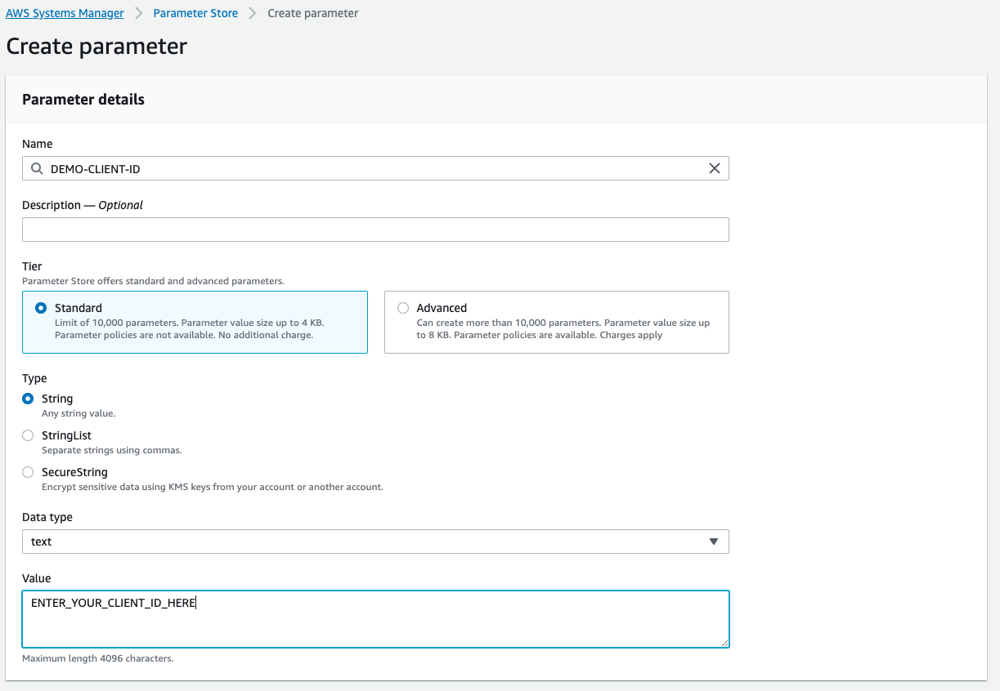
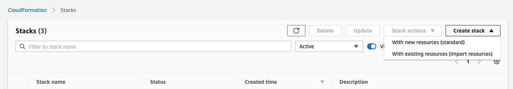
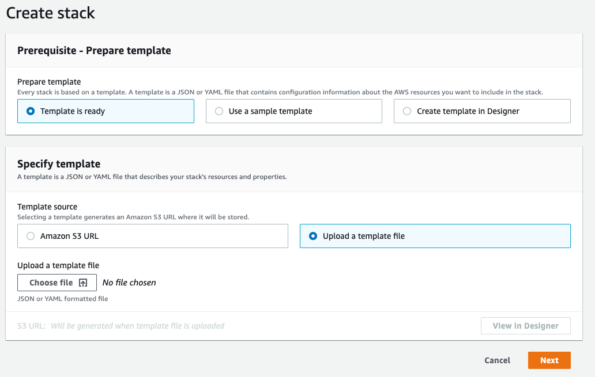
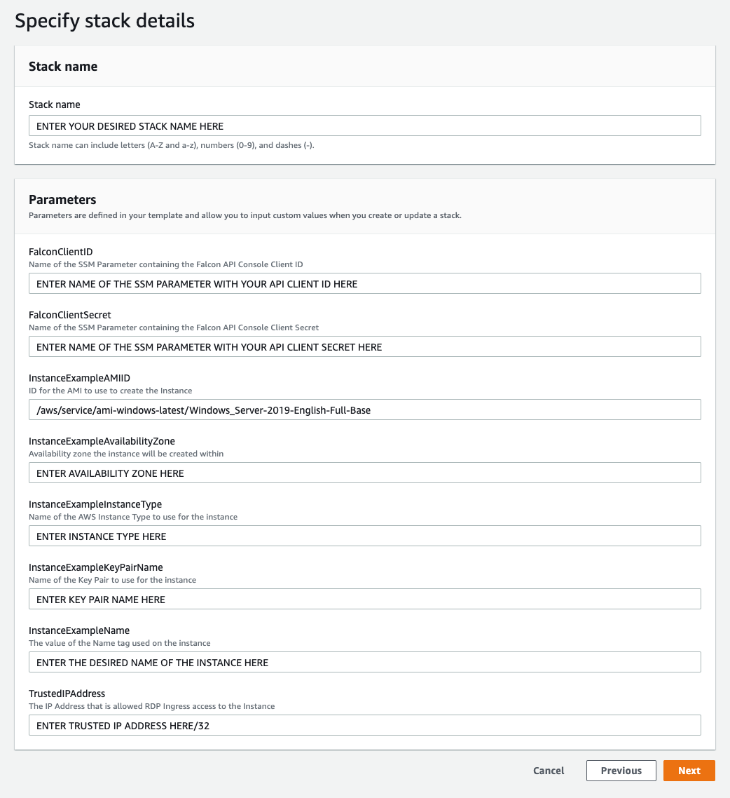
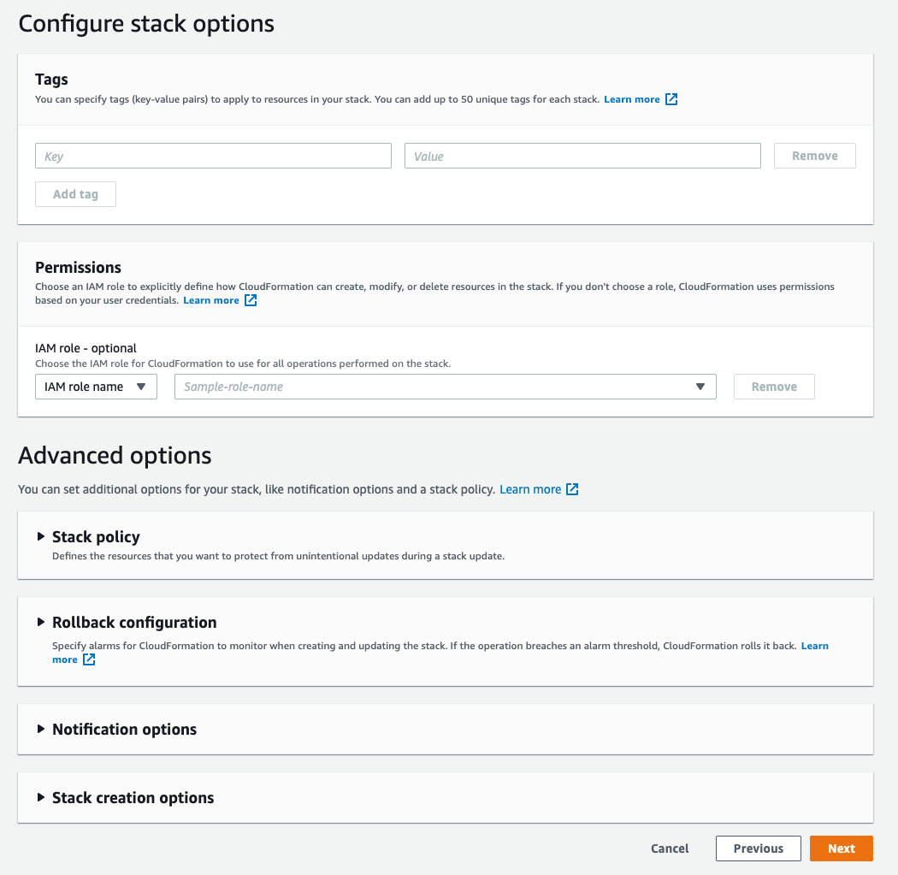
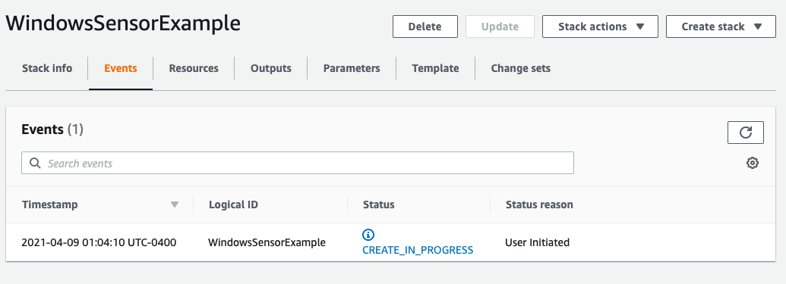
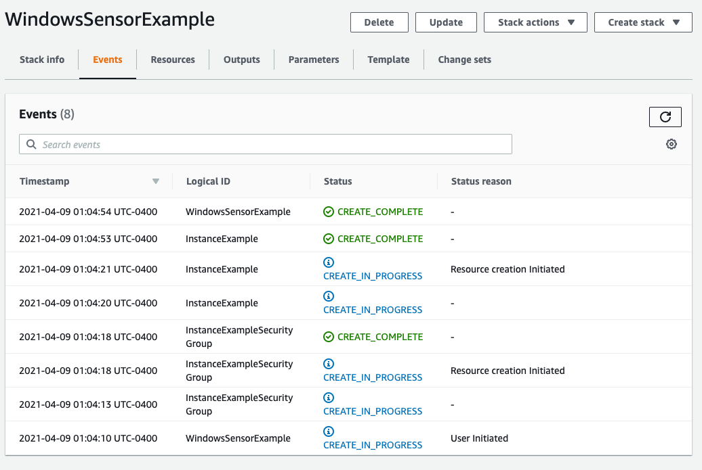

# Automating the Installation of the CrowdStrike Falcon Sensor for Windows
This example demonstrates leveraging Microsoft PowerShell to bootstrap the CrowdStrike 
Falcon sensor onto a Windows host during first boot. This solution leverages AWS Systems 
Manager Parameter Store to store API credentials for use in calling the CrowdStrike 
Falcon API to download the appropriate sensor version.

> This demonstration provides two methods for testing, [CloudFormation](#cloudformation)
and [Terraform](#terraform).

+ [Requirements](#requirements)
+ [Creating the required SSM parameters](#creating-the-required-ssm-parameters)
+ [CloudFormation](#cloudformation)
+ [Terraform](#terraform)
+ [Bootstrap timing](#bootstrap-timing)

## Requirements
+ API Credentials for your CrowdStrike Falcon CID
+ SSM parameters created that contain the value for your API client ID and secret.

## Creating the required SSM parameters
This demonstration leverages AWS SSM Parameter Store to store the API client ID and secret
used to communicate with the CrowdStrike Falcon API.

Two parameters must be created for this demonstration to function. They may be named whatever
you wish and will be referenced when you import the template into CloudFormation or call
`create-stack` using the AWS CLI. You will create one parameter to store the API client ID and
one parameter to store the API client secret. 

This image provides an example of creating a SSM parameter within the AWS console.



> Please note: At this point in time, CloudFormation does not support accessing parameters
of type `SecureString` from SSM parameter store.

## CloudFormation
An example CloudFormation template has been developed to demonstrate how this solution can
be leveraged to deploy instances that automatically download the correct version of the
sensor and install it upon first boot.

+ [WindowsInstanceExample.yml](cloudformation/WindowsInstanceExample.yml) - Example CloudFormation 
template that creates a single security group and a single Windows Server instance using the most 
recent AMI available for Windows Server 2019 Full. This template can be uploaded directly to your
AWS console or executed via the AWS CLI.

### Standing up the demonstration using the AWS Console
This template can be uploaded directly into CloudFormation within the AWS console and executed.

Login to the AWS Console and navigate to CloudFormation. If it is not already displayed, select
__Stacks__ from the left hand navigation. On the upper right of the page you should see a __Create Stack__
drop down menu. Click this drop down menu and select _With new resources (standard)_.



On the next page select _Template is ready_, _Upload a template file_, and click the __Choose file__
button. Using the file dialog provided, navigate to the `WindowsInstanceExample.yml` file and click __Upload__.
When the file dialog closes, click the __Next__ button.



Enter the necessary parameters as demonstrated in the image below. 

Once you have completed all values on the form, click the __Next__ button.

> Note: You are __not__ entering your Falcon client ID / secret in this dialog. You are entering
the names of the SSM parameters that are storing these values.



On this next page you can stack-specific options you may want to implement. The most common
example would be to specify additional custom tags that would be propagated to the instance
upon creation. Once you have specified all of your options, scroll to the bottom of the page
and click the __Next__ button.



The next page will confirm all of your choices. Carefully review the options you've selected
and when you are satisfied, click the __Create Stack__ button.


You will be brought back to the Stacks status dashboard and will see the stack initiating creation.



Within a few minutes, the stack will complete its work and the instance will be available.




### Standing up the demonstration using the AWS CLI
The sample command below demonstrates how to utilize the AWS CLI to create a stack using the
provided template. The command below is a sample, and needs the following values updated to match
your environment.
+ `STACK_NAME` - The name to use for your CloudFormation stack.
+ `CLIENT_ID_PARAMETER_NAME` - The name of the SSM parameter to use for your Falcon Client ID. This
parameter must exist within the same region you specify as REGION.
+ `CLIENT_SECRET_PARAMETER_NAME` - The name of the SSM parameter to use for your Falcon Client Secret.
This parameter must exist within the same region you specify as REGION.
+ `TRUSTED_IP` - The IP address to provided RDP (TCP 3389) access to upon creation.
+ `AVAILABILITY_ZONE` - The availability zone to deploy the example instance to. This availability 
zone must reside within the same region you specify as REGION.
+ `KEY_PAIR_NAME` - The name of the key pair to use for the instance. This key pair must exist
within the same region as the region you specify as REGION.
+ `INSTANCE_TYPE` - The AWS Instance Type to use for the instance.
+ `INSTANCE_NAME` - The name to use for the name tag on the instance.
+ `REGION` - The AWS region where the instance and security group are deployed.
```bash
aws cloudformation create-stack --template-body file://WindowsInstanceExample.yml \
--stack-name STACK_NAME \
--parameters ParameterKey=FalconClientID,ParameterValue=CLIENT_ID_PARAMETER_NAME \
ParameterKey=FalconClientSecret,ParameterValue=CLIENT_SECRET_PARAMETER_NAME \
ParameterKey=TrustedIPAddress,ParameterValue=TRUSTED_IP/32 \
ParameterKey=InstanceExampleAvailabilityZone,ParameterValue=AVAILABILITY_ZONE \
ParameterKey=InstanceExampleKeyPairName,ParameterValue=KEY_PAIR_NAME \
ParameterKey=InstanceExampleInstanceType,ParameterValue=INSTANCE_TYPE \
ParameterKey=InstanceExampleName,ParameterValue=INSTANCE_NAME \
--region REGION
```

If successful, you will receive a response containing the request ID for this stack creation
request. The stack will take approximately 3 to 5 minutes to stand up the demonstration.

```bash
arn:aws:cloudformation:us-east-2:{ACCT_ID}:stack/WindowsSensorExample2/72ee79f2-96ef-12ab-8554-02b5a70b77dc
```

## Terraform


## Bootstrap timing
Typically, you should be able to retrieve the Windows Administrator password for the demonstration
instance from the AWS console within 3 - 5 minutes of the instance being created. 

The CrowdStrike Falcon sensor agent will be installed to the instance as it completes its first 
boot tasks. On average, this process takes approximately 5 minutes.
