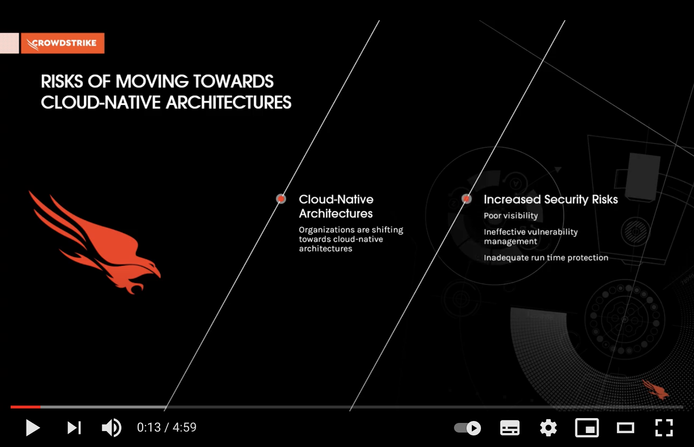

# CrowdStrike Container Security

## Runtime Protection
 - [Implementation Guide in AWS EKS / Fargate](eks-implementation-guide.md)
 - [Implementation Guide in GKE](gke-implementation-guide.md) (Technology Preview)

## Additional Resources
 - CrowdStrike Container Security: [Product Page](https://www.crowdstrike.com/products/cloud-security/falcon-cloud-workload-protection/container-security/)
 - So You Think Your Containers Are Secure? Four Steps to Ensure a Secure Container Deployment: [Blog Post](https://www.crowdstrike.com/blog/four-steps-to-ensure-a-secure-containter-deployment/)
 - Container Security With CrowdStrike: [Blog Post](https://www.crowdstrike.com/blog/tech-center/container-security/)
 - To learn more about Falcon Container Sensor for Linux: [Deployment Guide](https://falcon.crowdstrike.com/support/documentation/146/falcon-container-sensor-for-linux), [Release Notes](https://falcon.crowdstrike.com/support/news/release-notes-falcon-container-sensor-for-linux)
