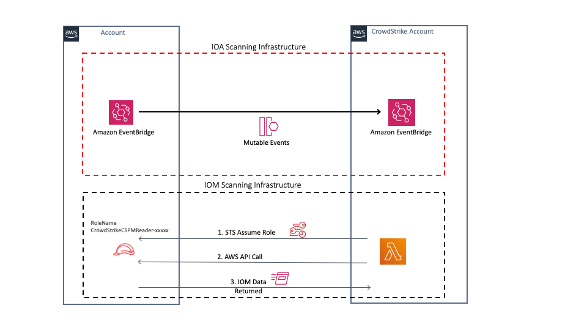
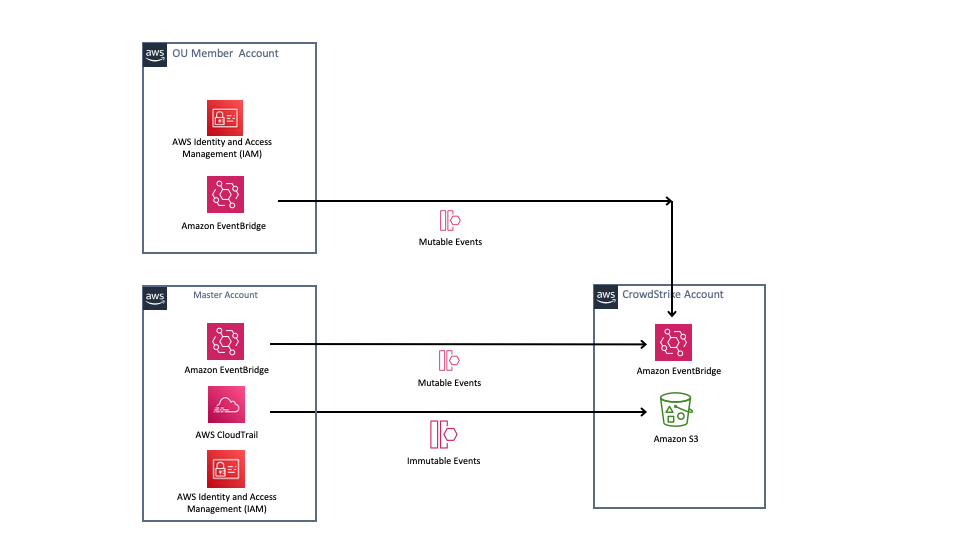

# CrowdStrike Horizon
Horizon delivers continuous agentless discovery and visibility of cloud-native assets from the host to the cloud, providing valuable context and insights into the overall security posture and the actions required to prevent potential security incidents.
Horizon also provides intelligent agentless monitoring of cloud resources to detect *Indicators of Misconfiguration* (IOM) by assuming an IAM role in your accounts and making API queries to discover assets and assess their state.

CrowdStrike also observes EventBridge streams in near real time across all your accounts.  CrowdStrike applies algorithms that reveal adversarial or anomalous activities from the log file streams. It correlates new and historical events in real time while enriching the events with CrowdStrike threat intelligence data.  CrowdStrike will generate an *Indicator of Attack* if suspicious activity is detected. Each IOA is prioritized with the likelihood of activity being malicious via scoring and mapped to the MITRE ATT&CK framework.

CrowdStrikes adversary-focused approach provides real-time threat intelligence on 150+ adversary groups, 50+ IOA detections and guided remediation that improves investigation speed by up to 88%, enabling teams to respond faster and stop breaches.

CrowdStrikes Org Registration Process is designed to support all AWS Organization setups including Control Tower. 

The following resources will be created

1) An IAM role in each account that is assumed by CrowdStrike to discover assets in your account.  CrowdStrike will scan these assets for *Indicators of Misconfiguration*

2) (Optional but highly recommended) Creates EventBridge Rules in each active region in each account that will forward cloudtrail events to CrowdStrike.  CrowdStrike uses these events to scan for *Indicators of Attack*.  For more information on sending events across accounts https://docs.aws.amazon.com/eventbridge/latest/userguide/eb-targets.html For more information on CrowdStrike IOAs https://aws.amazon.com/blogs/architecture/detect-adversary-behavior-in-seconds-with-crowdstrike-and-amazon-eventbridge/

3) (Optional but recommended) Creates an additional *Organization Wide* CloudTrail in the master or delegated account to forward Read events from CloudTrail.  The additional trail is not created today as this is an additional cost item. 

IOA Architecture diagram

NOTE: EventBridge does not forward read events today

# Resources Created

The following resources are created during the setup process

**Cloudformation Stacks**

*CrowdStrike-CSPM-Integration* -- Stackset that defines the IAM role and is applied to a single region in the **Master** account.

**Cloudformation StackSets**

* *CrowdStrike-CSPM-Integration* -- 
CrowdStrike-CSPM-Integration is a ``SERVICE-MANAGED`` Stackset that defines the IAM role that is assumed by CrowdStrike to discover resources in your account.  The StackSet is applied to all accounts in the organization.

* *CrowdStrike-CSPM-Integration-EB* -- CrowdStrike-CSPM-Integration-EB is a ``SERVICE-MANAGED`` Stackset that defines EventBridge rules that are applied to all regions in all member accounts that require monitoring.

* *CrowdStrike-CSPM-Integration-Root-EB* -- CrowdStrike-CSPM-Integration-Root-EB is a ``SELF-MANAGED`` Stackset that defines EventBridge rules that is applied to all regions in the **Master** account.

