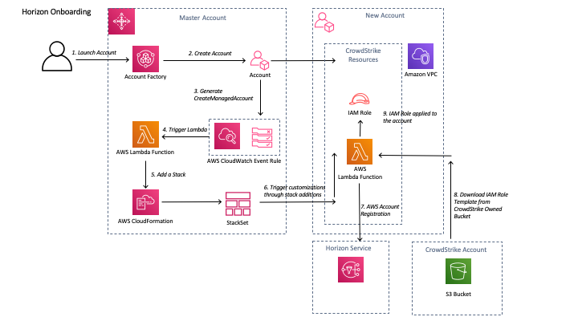
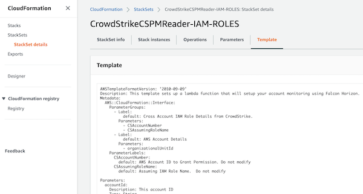
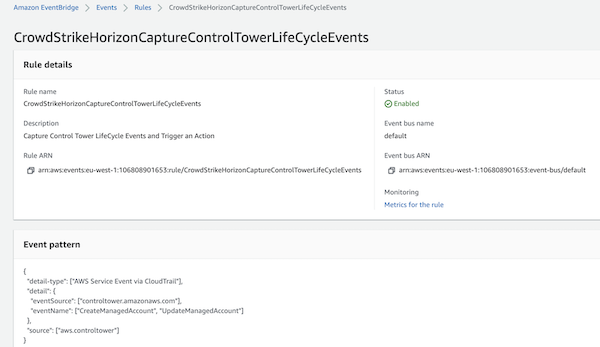
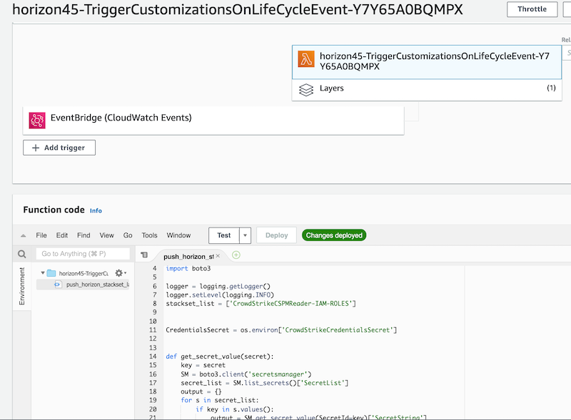
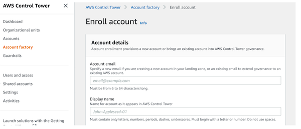
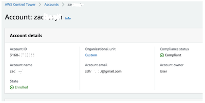
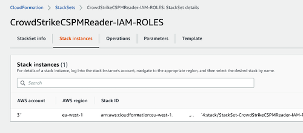
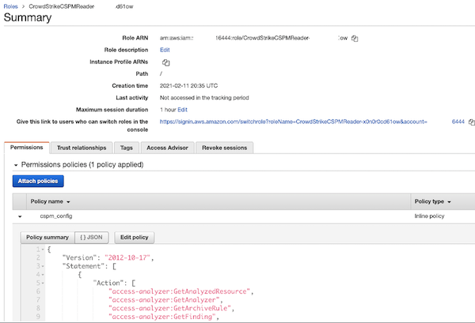
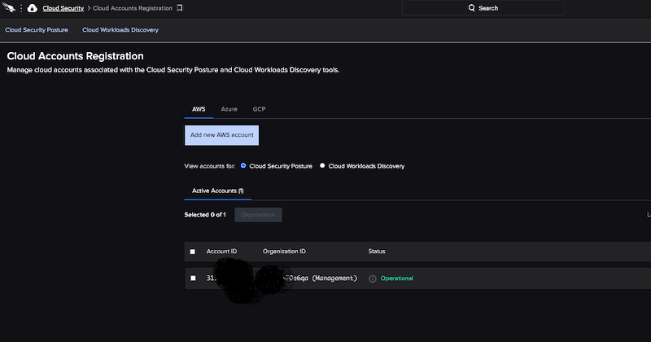

# Implementation Guide 
## CrowdStrike CSPM (Horizon) with AWS Control Tower

# Foreword
Horizon connects to your AWS and Azure cloud accounts, assesses your cloud settings, and analyzes the findings to identify potential misconfigurations that can lead to security risks.

Horizon assesses your cloud configurations continuously and compares your settings to its policies. Using the information from those assessments, Horizon produces a cloud security posture-based dashboard and reports.

# Introduction

The diagram below shows the processes involved in registering an AWS account with CrowdStrike Horizon during the initial account creation process.

Figure 1: CrowdStrike Horizon Account Registration Architecture Diagram

The account creation process consists of the following steps

1) The Customer creates a new AWS account using Account Factory within AWS Control Tower Master account.
Account Factory creates a new AWS account and applies baseline guardrails.

2) The account is created 
 
  
3) The account creation process generates a  *CreateManagedAccount* event notification in CloudWatch. Reference the AWS documentation at https://docs.aws.amazon.com/controltower/latest/userguide/lifecycle-events.html#createmanaged-account.

4) A CloudWatch event rule triggers a Lambda function (push_horizon_stackset_lambda.py).   

5) The Lambda function fetches CrowdStrike API credentials from secrets manager.

6) The lambda function then applies the secrets obtained from secrets manager as input parameters to the stackset (CrowdStrikeCSPMReader-IAM-ROLES) that is sent to the new account.
   

7) The StackSet creates a lambda function that registers the new account with the CrowdStrike. 
   

8) The lambda function then downloads a cloudformation template for the IAM role that is applied to the account.  The response from the api call is parsed the values extracted provide the input parameters for the cloudformation template.

# Pre-requisites
Customers will require the following:
* Subscription to Falcon Horizon **or** the Falcon Cloud Workload Protection Bundle.
* Subscription to Falcon Insight
* AWS Secrets Manager enabled in the region that you are using for Control Tower.  We use secrets manager to store the CrowdStrike API keys with Read+Write permissions for the “AWS Accounts” role.

CrowdStrike will pass an ``externalid`` when trying to assume a role to describe assets in your account.

How to Use an External ID When Granting Access to Your AWS Resources to a Third Party:
[https://docs.aws.amazon.com/IAM/latest/UserGuide/id_roles_create_for-user_externalid.html](https://docs.aws.amazon.com/IAM/latest/UserGuide/id_roles_create_for-user_externalid.html)

Note: the ``externalid`` is a string of random characters generated by CrowdStrike.  If you wish to modify the externalID or the Role name you will need to remove the stackset and reapply it.

If you are new to AWS, see Getting Started with AWS:
[https://aws.amazon.com/getting-started/](https://aws.amazon.com/getting-started/)

For additional information on AWS Marketplace:
[https://aws.amazon.com/marketplace/help/about-us?ref_=footer_nav_about_aws_marketplace](https://aws.amazon.com/marketplace/help/about-us?ref_=footer_nav_about_aws_marketplace)

To get started with AWS Control Tower, review the User Guide:
[https://docs.aws.amazon.com/controltower/latest/userguide/getting-started-with-control-tower.html](https://docs.aws.amazon.com/controltower/latest/userguide/getting-started-with-control-tower.html)

# Deployment Configuration Steps

Perform the tasks below to enable Control Tower to automatically register your account with CrowdStrike CSPM (Horizon).

1) Generate CrowdStrike Falcon API Keys.

    First login to the CrowdStrike console and go to ``Support --> API Clients and Keys``. Obtain CrowdStrike OAuth2 keys from the Falcon Console. Copy the ``CLIENT ID`` and ``SECRET`` as these will be used in the template.
   
    
   
    
2) Download the code from [https://github.com/CrowdStrike/Cloud-AWS](https://github.com/CrowdStrike/Cloud-AWS).

    The GitHub repository contains a folder "Control-Tower/horizon":

    * Select the template "Falcon_Horizon_Control_Tower.yaml" from the "Control-Tower-For-Horizon/cloudformation" folder.

3) Load the CloudFormation template in the 'master' account

   Login to your Control Tower ``master`` account and apply the CloudFormation template "*Falcon_Horizon_Control_Tower.yaml*".
   
   
   Fill in the missing parameter values 

   Parameters that are fixed and should only be modifed if advised by CrowdStrike:
   
   | Parameter Name | Parameter Description | 
   | :-----------------|:-----------------------|
   | CSAccountNumber | The CrowdStrike account number supplied in the template |
   | CSAssumingRoleName | The name of the Role used by CrowdStrike to assume the role in the account. `CrowdStrikeCSPMConnector` |
   | CrowdStrikeCSPMRoleTemplateURL | The URL for the Template the describes the IAM role to be applied for Horizon access | YES |
   | CrowdStrikeCSPMStackName | The name of the Cloudformation stack applied in the new account |

   Parameters that are fixed and should be provided by the customer:

   | Parameter Name | Parameter Description | 
   | :---         |     :---      | 
   | FalconClientId   | Your Falcon OAuth2 API Key from the CrowdStrike Console     |
   | FalconSecret   | Your Falcon OAuth2 API Secret from the CrowdStrike Console     |

   The CloudFormation template will create the following resources in the account:
   
* StackSet that will be applied to all new accounts.

    
 
  
* CloudWatch rule to trigger a lambda function.

    

* Lambda function triggered by CloudWatch to push the StackSet to a new account.

    

## Testing 

Create or Enroll an account in to AWS Control Tower using account factory:

Once the account has been created (usually takes around 30 minutes), check the status of the account:

Go to CloudFormation -> StackSets and verify the stack instance exists:

Login to the new account and check that the StackSet has been applied.

Verify that the IAM role has been configured in the new account:

Check the Account Status in the CrowdStrike Console

Login to the CrowdStrike console and check the account status. Navigate to ``Cloud Security --> Cloud Accounts Registration``. The screen below will show the accounts that have been added:

Accounts and resources will begin to appear in the dashboard:

# Additional Resources
ID When Granting Access to Your AWS Resources to a Third Party:
* [https://docs.aws.amazon.com/IAM/latest/UserGuide/id_roles_create_for-user_externalid.html](https://docs.aws.amazon.com/IAM/latest/UserGuide/id_roles_create_for-user_externalid.html)

If you are new to AWS, see Getting Started with AWS:
* [https://aws.amazon.com/getting-started/](https://aws.amazon.com/getting-started/)

For additional information on AWS Marketplace:
* [https://aws.amazon.com/marketplace/help/about-us?ref_=footer_nav_about_aws_marketplace](https://aws.amazon.com/marketplace/help/about-us?ref_=footer_nav_about_aws_marketplace)

To get started with AWS Control Tower:
* [https://docs.aws.amazon.com/controltower/latest/userguide/getting-started-with-control-tower.html](https://docs.aws.amazon.com/controltower/latest/userguide/getting-started-with-control-tower.html)

# CrowdStrike Resources
To learn more about CrowdStrike:
* [CrowdStrike on Amazon Partner Network (APN)](https://aws.amazon.com/partners/find/partnerdetails/?n=CrowdStrike&id=001E000001VAPbPIAX)
* [CrowdStrike website](http://crowdstrike.com/)

To review CrowdStrike AWS Marketplace Listings:
* [CrowdStrike AWS Marketplace Listings](https://aws.amazon.com/marketplace/seller-profile?id=f4fb055a-5333-4b6e-8d8b-a4143ad7f6c7)

To learn more about Falcon Cloud Workload Protection product:
* [CrowdStrike Falcon Cloud Workload Protection Website](https://www.crowdstrike.com/cloud-security-products/falcon-cloud-workload-protection/)
* [CrowdStrike Falcon Cloud Workload Protection Data sheet](https://www.crowdstrike.com/resources/data-sheets/falcon-cloud-workload-protection/)

# CrowdStrike Contact Information
For questions regarding CrowdStrike offerings on AWS Marketplace or service integrations: [aws@crowdstrike.com](aws@crowdstrike.com)

For questions around product sales: [sales@crowdstrike.com](sales@crowdstrike.com)

For questions around support: [support@crowdstrike.com](support@crowdstrike.com)

For additional information and contact details: [https://www.crowdstrike.com/contact-us/](https://www.crowdstrike.com/contact-us/)
