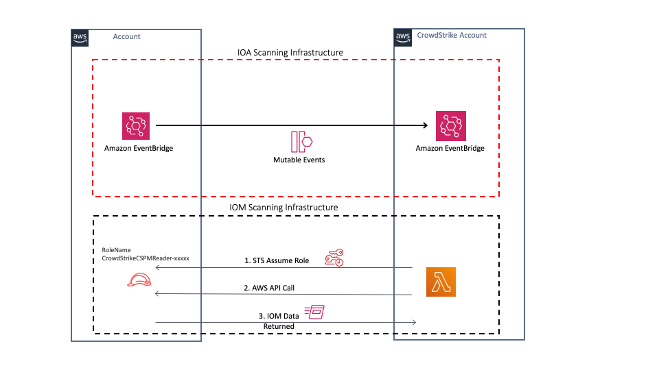

# Registering AWS Organizations within Falcon Horizon

CrowdStrike's AWS Organization registration process is designed to support all AWS Organization setups, including AWS Control Tower. This document provides an overview of the registration process and the resources it creates.

## Overview

Falcon Horizon delivers continuous agentless discovery and visibility of cloud-native assets from the host to the cloud, providing valuable context and insights into the overall security posture and the actions required to prevent potential security incidents. Falcon Horizon also provides intelligent agentless monitoring of cloud resources to detect *Indicators of Misconfiguration (IOM)* by assuming an IAM Role in your AWS accounts and performing API queries to discover and assess the state of your assets.

By processing a real-time stream of events across your accounts via Amazon EventBridge, CrowdStrike applies algorithms that reveal adversarial or anomalous activities that would otherwise go unnoticed. CrowdStrike enriches these events with CrowdStrike threat data and correlates this data with historical events in your environment. If suspicious activity is detected, CrowdStrike will generate an *Indicator of Attack (IOA)* alert. Each IOA is prioritized with the likelihood of activity being malicious through a scoring matrix and mapped to the MITRE ATT&CK framework.

CrowdStrike's adversary-focused approach provides real-time threat intelligence on ~200 adversary groups, 50+ IOA detections and guided remediation that improves investigation speed by up to 88%, enabling teams to respond faster and stop breaches.

|  |
|:--:|
| *Falcon Horizon data flow architecture diagram* |

## Resources created by the registration process

The registration process creates the following resources across your accounts:

1. An IAM Role in each account that is assumed by CrowdStrike to discover assets and assess them for *Indicators of Misconfiguration*.

1. Amazon EventBridge rules in each active region of every account that forward AWS CloudTrail events to CrowdStrike. CrowdStrike uses these events to scan for *Indicators of Attack*.
   1. *Optional, but highly recommended. Enabled by default*

1. An additional *Organization Wide* CloudTrail trail in the master or delegated account to forward `read` events from CloudTrail.
   1. *Optional, but recommended. The additional trail is disabled by default, as this is an additional cost item.*
   1. *AWS CloudTrail doesn't forward `read` events to Amazon EventBridge as of this writing, hence the need for an additional trail to receive all possible events.git*

|  |
|:--:|
| *Falcon Horizon Indicators of Attack (IOA) architecture diagram* |

### CloudFormation templates

The registration process deploys the following CloudFormation resource:

| Name | Type | Description |
|:- | :- | :- |
| CrowdStrike-CSPM-Integration | Stack | CloudFormation Stack that deploys a StackSet instance in every account within your AWS Organization *(see below)* |
| CrowdStrike-CSPM-Integration | StackSet | This is a `SERVICE-MANAGED` StackSet that defines the IAM Role which CrowdStrike assumes to discover and assess the state of the resources in your account. |
| CrowdStrike-CSPM-Integration-EB | StackSet | This is a `SERVICE-MANAGED` StackSet that defines the Amazon EventBridge rules in every active region in your accounts. |
| CrowdStrike-CSPM-Integration-Root-EB | StackSet | This is a `SELF-MANAGED` StackSet that defines the Amazon EventBridge rules in every region of your organization master account. |

## Resources

- [Detect Adversary Behavior in Milliseconds with CrowdStrike and Amazon EventBridge](https://aws.amazon.com/blogs/architecture/detect-adversary-behavior-in-seconds-with-crowdstrike-and-amazon-eventbridge/)
