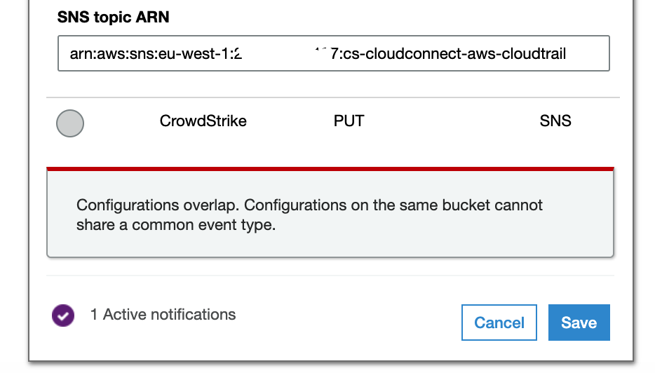
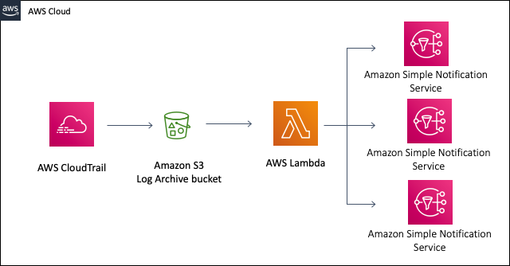

## Problem Description

In some circumstances there may already be an S3 notification configured for PUT events in the log archive account. 
 
Other vendors including Splunk sometimes require that S3 PUT notifications are sent to an S3 topic.  

AWS does not allow multiple event notifications for the same event.
In this case we can use a lambda function to forward the S3 notifications to multiple SNS topics

This is easily archived by adding a lambda function to the log archive account and send the s3 notificaitons fist to lambda and then have the lambda function forward to multiple SNS topics.

Example modified S3 notification forwarding to a lambda function

The lambda function can be found here.
[s3-lambda-sns](https://github.com/CrowdStrike/Cloud-AWS/tree/master/Control-Tower/multiple-sns/lambda)

