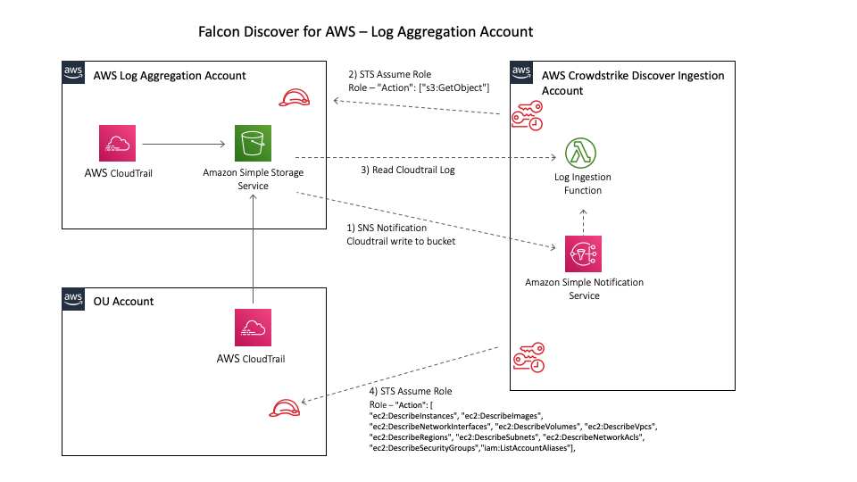
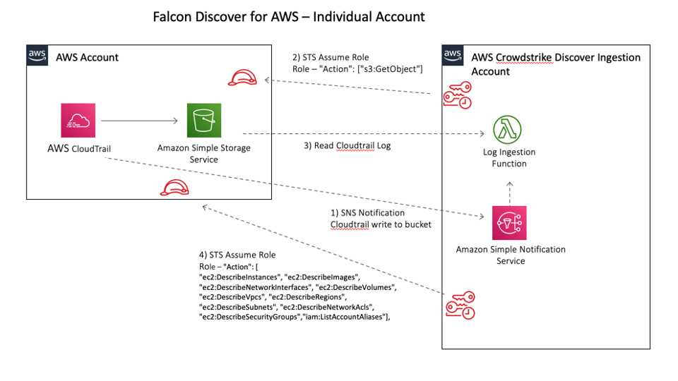

## Folder Structure

# Templates for customers using a single S3 bucket to consolidate all CloudTrail logs

## Folder Structure

1) "terraform" contains terraform templates for setting up the account containing the S3 bucket (log archive account) and additional accounts. 

2) "troubleshooting" contains a description of configuration settings to check together with some troubleshooting scripts.

3) "cloudformation" contains cloudformation templates for setting up the log-archive account IAM role for log file access and the bucket notification and templates for new accounts that will write CloudWatch logs to the log archive account.

# How Crowdstrike Discover Works

## Log Aggregation Account

**Step 1: S3 bucket publishes and SNS notification to the Crowdstrike SNS topic**

When a new object is written to the S3 bucket the bucket will send an SNS notification to the Crowdstrike SNS topic. Crowdstrike hosts sns topics in all available US and EU regions, ap-southeast-1, ap-southeast-2 and me-south-1 are also supported today. Other regions may be available and if your bucket exists in another region please check with support.

The topic always follows the same format _arn:aws:sns:(region):292230061137:cs-cloudconnect-aws-cloudtrail._

The s3 bucket must be configured so that it sends event notifications to a sns topic in the same region as the bucket is hosted. It is not possible at present to send SNS notifications across regions.

The notification is passed to an SQS queue where it is read and the name of the log archive is extracted. The notification we receive has two fields of interest to us.

In the notification there is an &quot;Object&quot; key and a &quot;bucket&quot; key. These two fields are used in step 2.

**Step 2: Crowdstrike assumes a role from the customer account that permits access.**

On receipt of the SNS notification Crowdstrike will make an api call to the customer account and will attempt to assume an IAM role to allow us to read the object from the S3 bucket specified in the SNS notification.

A role should exist in the account that owns the S3 bucket that grants the Crowdstrike account number 292230061137 s3:getObject access to all resources in the bucket. Crowdstrike will pass an &quot;externalid&quot; in the request to assume the role for authentication purposes.

**Step 3: Crowdstrike reads the log file from the bucket.**

The log file is read from the S3 bucket.

If an event of interest is found we proceed to step 4

**Step 4: Crowdstrike assumes a role from the customer account that permits access.**

If an event of interest is found in the log file, Crowdstrike will attempt to assume a role in the account where the event has occurred and discover more about the AWS object that has been created.

## Standalone Account

**Step 1: S3 bucket publishes and SNS notification to the Crowdstrike SNS topic**

When a new object is written to the S3 bucket Cloudtrail will send an SNS notification to the Crowdstrike SNS topic. Crowdstrike hosts sns topics in all available US and EU regions, ap-southeast-1, ap-southeast-2 and me-south-1 are also supported today. Other regions may be available and if your bucket exists in another region please check with support.

The topic always follows the same format _arn:aws:sns:(region):292230061137:cs-cloudconnect-aws-cloudtrail._

Cloudtrail must be configured so that it sends event notifications to a sns topic in the same region as the bucket is hosted. It is not possible at present to send SNS notifications across regions.

The notification is passed to an SQS queue where it is read and the name of the log archive is extracted. The notification we receive has two fields of interest to us.

In the notification there is an &quot;Object&quot; key and a &quot;bucket&quot; key. These two fields are used in step

**Step 2: Crowdstrike assumes a role from the customer account that permits access.**

On receipt of the SNS notification Crowdstrike will make an api call to the customer account and will attempt to assume an IAM role to allow us to read the object from the S3 bucket specified in the SNS notification.

A role should exist in the account that owns the S3 bucket that grants the Crowdstrike account number 292230061137 s3:getObject access to all resources in the bucket. Crowdstrike will pass an &quot;externalid&quot; in the request to assume the role for authentication purposes.

**Step 3: Crowdstrike reads the log file from the bucket.**

The log file is read from the S3 bucket.

If an event of interest is found we proceed to step 4

**Step 4: Crowdstrike assumes a role from the customer account that permits access.**

If an event of interest is found in the log file, Crowdstrike will attempt to assume a role in the account and discover more about the AWS object that has been created.

A role must exist in the account that has the following permissions

