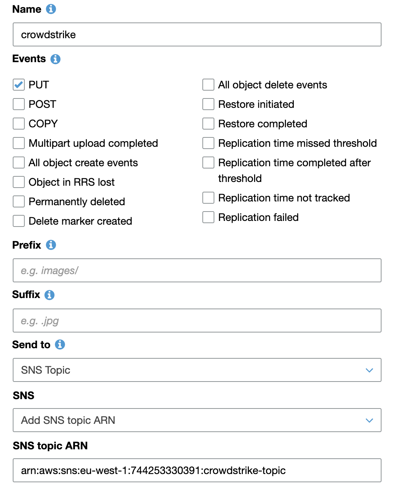
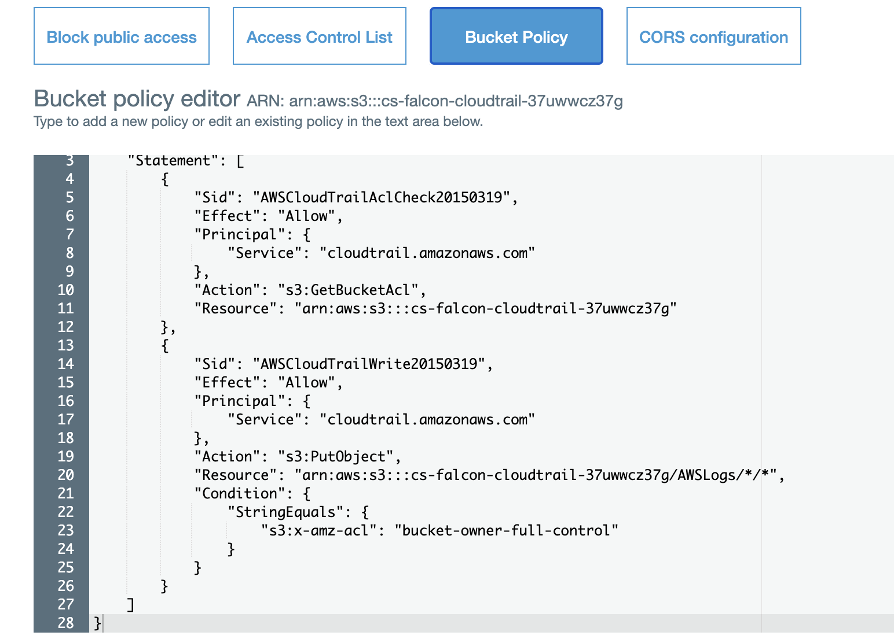

Troubleshooting
===============

Check the s3 Bucket Event Policy
--------------------------------

Verify that the bucket is setup for notifications
```bash
% aws s3api get-bucket-notification-configuration --bucket cs-falcon-cloudtrail-xxxxxxxx
```
```json
{
    "TopicConfigurations": [
        {
            "Id": "xxxxxxxxxxx",
            "TopicArn":"arn:aws:sns:eu-west-1:292230061137:cs-cloudconnect-aws-cloudtrail",
            "Events":"s3:ObjectCreated:Put"
        }
    ]
}
```

Via the console *Bucket --\> Properties -\> Events*

{width="3.5175437445319333in" height="4.3852810586176725in"}

Figure 1 - Example Notification

```json
{
    "Type":"Notification",
    "MessageId":"5caad601-303a-5424-8360-81563a2dd550",
    "TopicArn":"arn:aws:sns:us-west-1:106xxxxxxx53:discovernotification",
    "Subject":"Amazon S3 Notification",
    "Message":"{
        "Records":[
            {
                "eventVersion":"2.1",
                "eventSource":"aws:s3",
                "awsRegion":"us-west-1",
                "eventTime":"2020-06-07T15:29:24.373Z",
                "eventName":"ObjectCreated:Put",
                "userIdentity":{
                    "principalId":"AWS:AROAIF4JELG3VJGB7GNKM:regionalDeliverySession"
                },
                "requestParameters":{
                    "sourceIPAddress":"34.255.117.103"
                },
                "responseElements":{
                    "x-amz-request-id":"8B31967DB0022DB8",
                    "x-amz-id-2":"BBP1gx85O/IPBAt46K2nrDP5Se+e0rFZvoBgW/zpVk0bmdjgN0hqdEyvukVyPKUG28Txu5SrdVmydazKoPpCP4nuXzKJv3vt"
                },
                "s3":{
                    "s3SchemaVersion":"1.0",
                    "configurationId":"YTIxZGZmMDUtYzhiZi00NmQ4LThkN2YtODE2MzBmNzAwMjhi",
                    "bucket":{
                        "name":"discovertrailbucket1",
                        "ownerIdentity":{
                            "principalId":"A3B7CH7GNBQZO9"
                        },
                        "arn":"arn:aws:s3:::discovertrailbucket1"
                    },
                    "object":{
                        "key":"AWSLogs/106xxxxxxx53/CloudTrail/eu-west-1/2020/06/07/106xxxxxxx53_CloudTrail_eu-west-1_20200607T1525Z_M4JIQrtGMS4b1qWd.json.gz",
                        "size":3261,
                        "eTag":"0e3ec1b908e5c5524cee6372b31abd0a",
                        "sequencer":"005EDD07D60CBC821F"
                    }
                }
            }
        ]
    }",
    "Timestamp":"2020-06-07T15:29:27.734Z",
    "SignatureVersion":"1",
    "Signature":"hMazOWuY/wHZFO6n6Ph9eJ6YeywGZ1SuWjuE5q7yxJf1ZiV9JOW36BfNAUu67U20RJEpKy+2SgO12/EkEMJVqh8OIuMWtDyjDaccDUzma+uFcMK3fBvwnESakGmKh8cOTZ054VJ7LQfTf/XL/kDxr26lMI7xcjoPbIcrlbzEUQJ+2pehaDJEFzDkSW7nqCWnWU8voA7cQV9p3jws8+McrqWqv9vb58jVGBE7C6e6BPoVZ9+rjwQUznZS/qZ9G4i5kMpZrJMcXymT8A8SIrtaK9AAd8VBpM7IYipE5B/2IumqfpbfHtbbNqisIlTLFJMFsj1kC/l+nM0Vl67y+/fzcA==",
    "SigningCertURL":"https://sns.us-west-1.amazonaws.com/SimpleNotificationService-a86cb10b4e1f29c941702d737128f7b6.pem",
    "UnsubscribeURL":"https://sns.us-west-1.amazonaws.com/?Action=Unsubscribe&SubscriptionArn=arn:aws:sns:us-west-1:106xxxxxxx53:discovernotification:f30a6728-72c7-486d-9364-97d75ce32817"
}
```


Check the s3 Bucket Policy
--------------------------

By default, an S3 object is owned by the AWS account that uploaded it.
This is true even when the bucket is owned by another account. To get
access to the object, the object owner must explicitly grant you (the
bucket owner) access.

[[https://aws.amazon.com/premiumsupport/knowledge-center/s3-bucket-owner-access/]{.ul}](https://aws.amazon.com/premiumsupport/knowledge-center/s3-bucket-owner-access/)

The object owner can grant the bucket owner full control of the object
by updating the access control list (ACL) of the object. The object
owner can update the ACL either during a put or copy operation, or after
the object is added to the bucket. In the case of cloudtrail logs add a
bucket policy that grants users access to put objects in your bucket
only when they grant the bucket owner full control of the object.

<https://aws.amazon.com/premiumsupport/knowledge-center/s3-require-object-ownership/>

The bucket should have an ACL policy associated with it

{width="6.5in" height="4.68125in"}

Check the s3 Bucket ACL
-----------------------

From the aws cli tool

*aws s3api get-bucket-acl \--bucket \<bucket-name\>*

{

\"Owner\": {

\"DisplayName\": \"bd_integ\",

\"ID\":
\"7d137abc41d6d3455663518126c28df027f25c1709f269239010f71bff0e9839\"

},

\"Grants\": \[

{

\"Grantee\": {

\"Type\": \"CanonicalUser\",

\"DisplayName\": \"bd_integ\",

\"ID\":
\"7d137abc41d6d3455663518126c28df027f25c1709f269239010f71bff0e9839\"

},

\"Permission\": \"FULL_CONTROL\"

}

\]

}

From the output the bucket *"Owner"* is *"bd_integ"* and has
*"FULL_CONTROL"* over the bucket

Check s3 Object Permissions
---------------------------

From the aws cli tool

*aws s3api get-object-acl \--bucket \<bucket-name\> \--key
\<log-file-key\>*

*{*

*\"Owner\": {*

*\"DisplayName\": \"aws_cloudtrail_us-east-1\",*

*\"ID\":
\"65e03a8a45a3aaaa881ada217702e0ad77152fe0196a8a14c44aa3bc4f11d2ae\"*

*},*

*\"Grants\": \[*

*{*

*\"Grantee\": {*

*\"Type\": \"CanonicalUser\",*

*\"DisplayName\": \"aws_cloudtrail_us-east-1\",*

*\"ID\":
\"65e03a8a45a3aaaa881ada217702e0ad77152fe0196a8a14c44aa3bc4f11d2ae\"*

*},*

*\"Permission\": \"FULL_CONTROL\"*

*},*

*{*

*\"Grantee\": {*

*\"Type\": \"CanonicalUser\",*

*\"DisplayName\": \"bd_integ\",*

*\"ID\":
\"7d137abc41d6d3455663518126c28df027f25c1709f269239010f71bff0e9839\"*

*},*

*\"Permission\": \"FULL_CONTROL\"*

*}*

*\]*

*}*

The log "Owner" is "*aws_cloudtrail_us-east-1" and the "Grantee"
"bd_integ"* who has ownership of the bucket has been granted
*"FULL_CONTROL*
