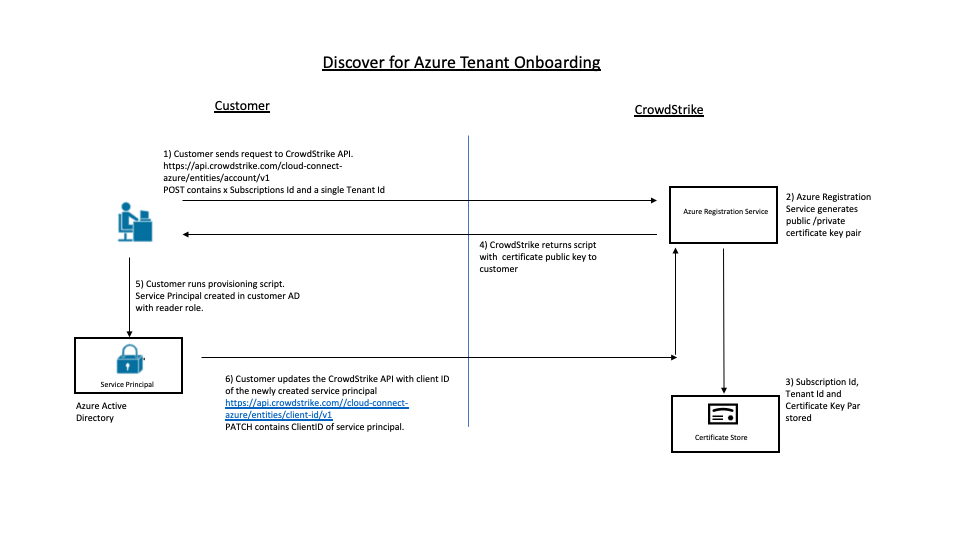

# Discover for Azure

## Overview

Provides insight into your Azure virtual machine footprint, so you can secure all workloads, uncover and mitigate risks and reduce the attack surface.

Discover for Azure utilises Azure Resource Graph 

Azure Resource Graph, provides the following capabilities
•	Access the properties returned by resource providers without needing to make individual calls to each resource provider.
•	View the last 14 days of change history made to the resource to see what properties changed and when. 

When an Azure resource is updated, Resource Graph is notified by Resource Manager of the change. Resource Graph then updates its database. Resource Graph also does a regular full scan. This scan ensures that Resource Graph data is current if there are missed notifications or when a resource is updated outside of Resource Manager.

CrowdStrike runs two periodic tasks that will query the Azure Resource Graph API.

Baseline Task (Daily)

The baseline task runs every 24 hours and invokes a ResourceGraph API request to capture snapshot of the all events and its attributes relevant to Discover for Azure.  Currently CrowdStrike will query the ResourceGraph API for the following resource types
•	AzureVirtualMachine
•	AzureDisk
•	AzureVirtualNetwork
•	AzureNetworkSecurityGroup
•	AzureFirewall

Change Task (xx Minutes)
The change task runs every xx minutes cadence and invokes a resourceChange API request to capture the resource changes made throughout the day for resources relevant to Discover for Azure.

 
# Authentication Roles and Permissions
The CrowdStrike Discover for Cloud service will use an Azure Service Principal to discover resources and monitor changes to those resources over time. 

An Azure service principal is an identity created for use with applications, hosted services, and automated tools to access Azure resources. This access is restricted by the roles assigned to the service principal, giving you control over which resources can be accessed and at which level.

The Account Onboarding process involves the creation of a service principal for each Azure tenant.  The service principal has the “READER” role assigned to it and uses certificate-based authentication. 
“az ad sp create-for-rbac --name CrowdStrikeCSPM --cert XXXX”

A tenant will contain one or more subscriptions. 
The “READER” role should be assigned to each subscription under the tenant.

az role assignment create --role acdd72a7-3385-48ef-bd42-f606fba81ae7 --assignee ${CLIENT_ID} --subscription xxxxxxx

az role assignment create --role acdd72a7-3385-48ef-bd42-f606fba81ae7 --assignee ${CLIENT_ID} --subscription yyyyyyy

Note:  In order to create a service principal, the user or process must be authenticated with Azure and have “GLOBAL ADMINISTRATOR” permissions. 
https://docs.microsoft.com/en-us/azure/active-directory/users-groups-roles/directory-assign-admin-roles#company-administrator-permissions

 
# Account Onboarding Workflow

 

1)	Customer sends an API POST request to https://api.crowdstrike.com/cloud-connect-azure/entities/account/v1.	
2)	CrowdStrike Azure registration service generates a public/private certificate key pair.
3)	Subscription ID, Tenant ID and certificate public/private key pair stored
4)	API response returned with provisioning script containing public key of generated cert
5)	Customer runs script and Service Principal created
6)	Customer sends an API PATCH request to https://api.crowdstrike.com//cloud-connect-azure/entities/client-id/v1 with ClientID of service principal.¬¬¬¬

