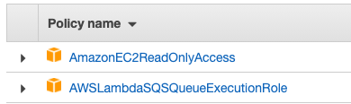
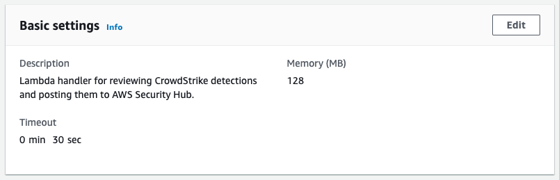
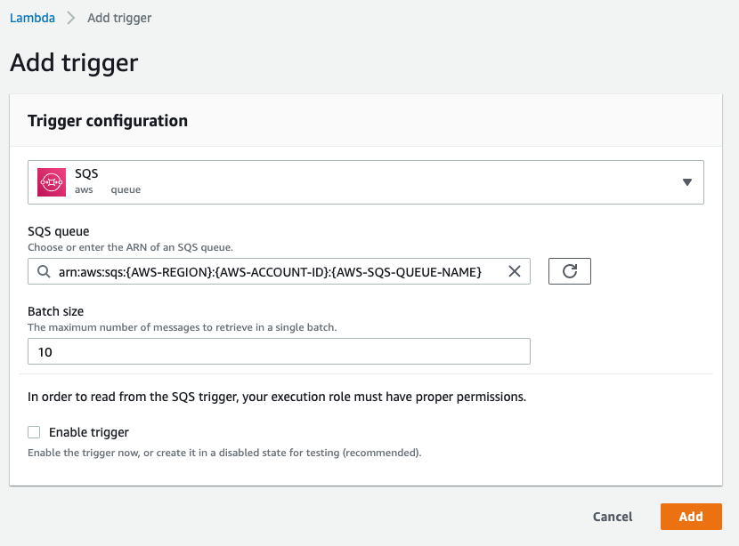
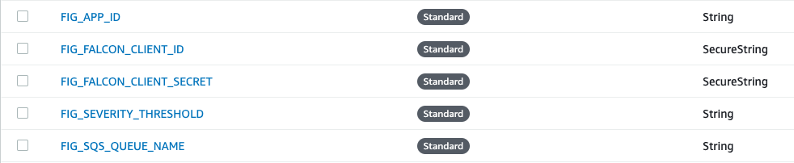

# Falcon Integration Gateway (FIG) v.2.0.x
The Falcon Integration Gateway publishes detections identified by CrowdStrike Falcon for instances
residing within Amazon Web Services (AWS) to AWS Security Hub.

## Table of Contents
+ [Overview](#overview)
    + [Architecture](#architecture)
    + [Data Flow](#data-flow)
+ [Installation](#installation)
    - [Installing the SQS queue](#installing-the-fig-detections-sqs-queue)
    - [Installing the findings publishing lambda](#installing-the-fig-publishing-lambda-handler)
    - [Installing the service application](#installing-the-fig-service-application)
    - [Configuring the application](#configuring-the-application)
+ [Troubleshooting](#troubleshooting)

## Overview
This solution makes use of small EC2 instances to consume detections published to the CrowdStrike Falcon _event-stream_ API and then publishes detection events that align
to instances that exist within AWS to a pre-existing SQS queue. A lambda function consumes these messages, confirms that the detection matches a valid instance in a valid
AWS region, and then publishes the detection as a new finding in AWS Security Hub.

There are several benefits to this architecture:
+ Reduced compute cost as a large portion of the compute cycles are consumed as on-demand lambda function executions
+ Easily scalable depending upon need
+ Can be deployed quickly

### Architecture 


### Data Flow
1. Falcon Integration Gateway contacts the CrowdStrike Falcon API to request a list of available event streams.
2. A connection is opened to each available event stream. As new events are received within CrowdStrike, these events are published to the event stream, which are then consumed by the Falcon Integration Gateway.
3. Detection events are reviewed, with requests to the CrowdStrike Falcon API being performed to confirm these instances are deployed to AWS.
4. Detection events that meet severity threshold settings and are initially confirmed to exist within AWS are published to a SQS queue.
5. A lambda function is triggered that reviews the detection, and identifies the region the instance is located in. The instance is confirmed by matching the mac address to the address reported in the detection.
6. Confirmed detections that are positively identified as attached to valid instances are then published as a finding to AWS Security Hub.
---

## Installation
The Falcon Integration Gateway is intended to be deployed as a service on a Linux instance. 
The solution can be run stand-alone, but is not recommended for production deployments.
> When executed within a Mac OS or Windows environment, FIG will assume it is running in stand-alone mode.

### Pre-requisites
+ Falcon Complete 
+ Falcon Discover
+ API keys for your Falcon environment
+ An AWS environment with the following:
    + Available VPC with properly defined subnets
    + An available private subnet within this VPC
    + A NAT gateway attached to this VPC and set as the default route for the selected private subnet
+ Permissions to perform the following actions within AWS:
    + Create EC2 instance
        + Amazon Linux 2
            - Python 3
            - Boto3 client
            - Requests client
    + Create Lambda function
    + Create SQS queue
    + Create IAM role
    + Create SSM parameters
+ If you are not using SSM parameters to store application settings then you will also need a properly formatted _[config.json](#configjson)_ file.

### Installing the FIG detections SQS queue
FIG leverages the AWS Simple Queue Service to handle message queuing for detections identified by the CrowdStrike Falcon API. This allows for signicant scaling capacity without impacting the size of the FIG service application instance and provides a secure mechanism for delivering these detections from our AWS EC2 instance over to our AWS Lambda function.

Two queues will be created as part of this deployment, a primary detections queue, and a dead-letter queue for malformed message traffic.

#### Creating the dead-letter queue (DLQ)
The dead-letter queue is the repository for messages received by our primary queue that are either malformed, have timed out or are incapable of being handled. Messages arrive in this queue after first failing processing within our primary detection queue. Messages retained in the dead-message queue are available for up to 7 days after failing. (This setting can be changed within the dead-letter queue message retention configuration.)

The dead-letter queue can have any name, and should have the following characteristics:
+ Type: __Standard__
+ Dead-letter queue: __Disabled__

The following characteristics can be customized per deployment requirements:
+ Maximum message size: __256 KB__
+ Default visibility timeout: __30 Seconds__
+ Message retention period: __7 days__
+ Delivery delay: __0 Seconds__
+ Receive message wait time: __0 Seconds__

#### Creating the primary detections queue
The primary detections queue is the repository for detections identified by FIG as potentially active within your AWS environment. These messages are consumed by a lambda function that further confirms the instance's region and MAC address and then publishes the finding to AWS Security Hub.

The primary detection queue can have any name, and should have the following characteristics:
+ Type: __Standard__
+ Dead-letter queue: __*ARN of the queue defined above*__

The following characteristics can be customized per deployment requirements:
+ Maximum message size: __256 KB__
+ Default visibility timeout: __30 Seconds__
+ Message retention period: __4 hours__
+ Delivery delay: __0 Seconds__
+ Receive message wait time: __0 Seconds__

### Installing the FIG publishing lambda handler

#### Lambda IAM role execution permissions
Basic lambda execution permissions
```json
{
    "Version": "2012-10-17",
    "Statement": [
        {
            "Effect": "Allow",
            "Action": "logs:CreateLogGroup",
            "Resource": "arn:aws:logs:{AWS-REGION}:{AWS-ACCOUNT-ID}:*"
        },
        {
            "Effect": "Allow",
            "Action": [
                "logs:CreateLogStream",
                "logs:PutLogEvents"
            ],
            "Resource": [
                "arn:aws:logs:{AWS-REGION}:{AWS-ACCOUNT-ID}:log-group:/aws/lambda/{AWS-LAMBDA-FUNCTION-NAME}:*"
            ]
        }
    ]
}
```

Security hub related permissions
```json
{
    "Version": "2012-10-17",
    "Statement": [
        {
            "Effect": "Allow",
            "Action": [
                "securityhub:BatchUpdateFindings",
                "securityhub:BatchImportFindings"
            ],
            "Resource": [
                "arn:aws:securityhub:{AWS-REGION}:{AWS-ACCOUNT-ID}:hub/default",
                "arn:aws:securityhub:{AWS-REGION}:{AWS-ACCOUNT-ID}:product/*/*"
            ]
        },
        {
            "Action": "securityhub:*",
            "Resource": "arn:aws:securityhub:{AWS-REGION}:{AWS-ACCOUNT-ID}:/findings",
            "Effect": "Allow"
        },
        {
            "Action": "securityhub:*",
            "Resource": "arn:aws:securityhub:{AWS-REGION}:{AWS-ACCOUNT-ID}:hub/default",
            "Effect": "Allow"
        }
    ]
}
```

Additional policy attachments



#### Lambda function settings




#### Uploading the source code


#### Creating the SQS trigger
You must add a SQS trigger to your lambda in order for it to consume messages from the queue. Open your lambda function in the AWS console and click the _Add Trigger_ button.


Select _SQS_ for the service, you should then be able to select the primary detection queue you created previously from the drop down labeled **SQS queue**. 

You may choose to create the trigger without enabling it by clearing the **Enable trigger** checkbox. Doing so will prevent new messages from being consumed until the trigger is enabled.


### Installing the FIG service application
To expedite setup, a service application installer has been developed and is detailed below. For users that wish to deploy the service manually, several steps must be performed:
1. Create the EC2 instance
2. Assign the necessary IAM permissions
3. Create the FIG user account
4. Install Python 3
5. Install the boto3 and request client packages
6. Install the FIG service application files
7. Confirm service account permissions
8. Configure the FIG service in systemd 
9. Start the service

> The FIG service application has been tested to function on Amazon Linux 2, and should run on CentOS 7.

#### Creating the FIG instance IAM role


#### Creating the FIG instance and installing the service application
The FIG service application was developed to run efficiently as a service on a small Linux EC2 instance. 
> This instance can be scaled up as necessary. 

The minimum requirements for this instance are:
+ t2.micro (or better) - 1 vCPU, 2 GB RAM
    - 20 GB or greater EBS volume
+ Amazon Linux 2 or CentOS 7
+ Python 3 and PIP3 installed
    - boto3 client library installed via PIP (--user)
    - requests client library installed via PIP (--user)
+ The necessary IAM permissions to access SSM parameters and publish messages to our SQS queue
+ A route to the Internet

> If you wish to use the automated service installer, either during instance creation or manually afterwards, skip to [Automated Installation Documentation](#installing-the-fig-service-during-instance-creation).

After your instance is created (or during initial setup) assign the instance IAM role you created previously.

###### Creating the user account
The fig user account is used for running the service only. While it does have a home directory and profile, it does not need to have a password. This user account can be named whatever meets the requirements for deployment but if it is named anything other than _fig_ than the service definition file described later in this documented should be updated to reflect this change.

Execute the following commands to create the user account.
```bash
$ sudo groupadd fig

$ sudo adduser -g fig fig
```

###### Installing Python 3 and necessary packages
FIG requires Python 3, the boto3 package and the requests package in order to be able to run. These can be installed with the following commands.
```bash
$ sudo yum -y install python3

$ sudo -u fig pip3 install --user requests

$ sudo -u fig pip3 install --user boto3
```

###### Copying files and necessary permissions
By default, FIG installs to the _/usr/share/fig_ folder. This can be changed during installation, but the service definition you will create later will need to be updated to reflect the new location. 

If you are installing from source, copy the files located in the [source folder](src) to your installation folder on your new instance.

In order to execute properly, FIG will need to own and be able to write to this installation folder. An example of setting the necessary permissions can be seen below.

```bash
$ sudo chown -R fig:fig /usr/share/fig

$ sudo chmod 644 /usr/share/fig/*.py
```


##### Installing the FIG service during instance creation
This solution provides an installer that supports execution via a User Data script, which allows for deployment via CloudFormation or Terraform.
> Since User Data scripts execute as the root user, this script should not include references to _sudo_.

> It is recommended you use the latest version of the installer as shown below. Older versions are available within this repository should you need to install a previous version.

###### Example
```bash
#!/bin/bash
# version 3.0
# This is the userdata script for newly created EC2 instances. 
cd /var/tmp
wget -O fig-2.0.latest-install.run https://raw.githubusercontent.com/CrowdStrike/Cloud-AWS/master/Falcon-Integration-Gateway/install/fig-2.0.latest-install.run
chmod 755 fig-2.0.latest-install.run
./fig-2.0.latest-install.run --target /usr/share/fig
```
##### Running the FIG service automated installer
If necessary, the FIG service automated installer can be executed from the command line directly. When doing so, you should make use of _sudo_ so that the installer has the necessary permissions to create the folder, user and service. 

Executing the installer can be performed with the following command:
```bash
$ ./{FIG_INSTALLER_FILE} --target {TARGET_DIRECTORY}
```
Where {FIG_INSTALLER_FILE} is the filename for the installer you've uploaded to your instance and {TARGET_DIRECTORY} is the directory where you wish to install the service.
###### Example
```bash
$ ./fig-2.0.latest-install.run --target /usr/share/fig
```
###### Running the installer without setting up the service
If you want to execute the installer _without_ executing the post-installation script that creates users and sets up the service within systemd, then pass the _--noexec_ flag as follows:
```bash
./{FIG_INSTALLER_FILE} --target {TARGET_DIRECTORY} --noexec
```

> For security reasons, it is recommended the FIG service run under a stand-alone user account. This user account is created automatically if you are using the installer package, and is called _fig_. If this user exists, an error may be thrown during installation, but the service should still operate properly as long as the fig user has permissions to the service application folder.

##### Manual installation of the FIG service
The service automated installer uses systemd to create and manage the FIG service. The following steps can be performed to install the service manually.

###### Create the service definition
First create the service definition file. The service file used in the installer is shown below. If you install FIG to a location other than _/usr/share/fig_, then you will need to update the directory listed in the ExecStart line to point to the new location.

The file should be named _fig.service_ and saved in /lib/systemd/system.
```bash
[Unit]
Description=Falcon Integration Gateway
After=multi-user.target

[Service]
WorkingDirectory=/usr/share/fig
User=fig
Type=idle
ExecStart=/usr/bin/python3 /usr/share/fig/main.py &> /dev/null
Restart=always

[Install]
WantedBy=multi-user.target
```
Once you have created the service definition file, execute the two following commands.

Reload the system deamons.
```bash
$ sudo systemctl daemon-reload
```
Enable the service
```bash
$ sudo systemctl enable fig
```

### Configuring the application
The FIG service application allows for customer configuration via application parameters that can be provided in multiple ways. These parameters control
several aspects of the service application's behavior. This includes; the credentials utilized to access the CrowdStrike Falcon API, the application ID utilized 
to connect to the CrowdStrike Falcon API, the severity threshold used to filter out unwanted detections, the SQS queue to target for alerts being published,
and the AWS Region to report to.

#### Parameters
The Falcon Integration Gateway service application requires six parameters be defined in order to successfully operate.
+ `falcon_client_id` - The API client ID for the API key used to access your Falcon environment.
+ `falcon_client_secret` - The API client secret for the API key used to access your Falcon environment.
+ `app_id` - A unique string value that describes the name of the application you are connecting to Falcon. Most string values are supported.
+ `severity_threshold` - An integer representing the threshold for detections you want published to AWS Security Hub.
+ `sqs_queue_name` - Name of the SQS queue to publish detections to. This must reside in the region specified below.
+ `region` - The region we will be publishing to in AWS Security Hub. This will need to match the region the SQS queue resides in. For deployments leveraging SSM, this parameter does not need to be specified. 

> Even though detections are published to AWS Security Hub within a single AWS region, they represent detections for instances found within _all_ AWS regions.

##### Using AWS Systems Manager _Parameter Store_
By default, service application configuration parameters are stored within AWS Systems Manager _Parameter Store_ but can be overridden by using a config.json file. 

> SSM Parameter Store parameters are _case-sensitive_ and must reside within the same region as the FIG instance you are configuring. Please note the naming convention of the
parameters displayed below, as the variable names must match exactly. (All upper case, spaces are underscores, precursed with "**FIG_**").

###### Parameter Store Example


For more detail regarding [creating parameters](https://docs.aws.amazon.com/systems-manager/latest/userguide/parameter-create-console.html) within the 
AWS Systems Manager Parameter Store, check the [AWS Systems Manager Parameter Store documentation](https://docs.aws.amazon.com/systems-manager/latest/userguide/systems-manager-parameter-store.html).

##### config.json
Service application parameter values can also be specified within a _config.json_ file. This file **must** reside within the same directory the FIG application is installed. When present, values stored within a config.json file _take precedence_ over values provided via the AWS Systems Manager Parameter Store.
> For deployments running multiple instances of FIG on the same instance, you _must_ use a config.json file.
```json
{
    "falcon_client_id":"FALCON_CLIENT_ID_GOES_HERE",
    "falcon_client_secret":"FALCON_CLIENT_SECRET_GOES_HERE",
    "app_id":"FIG_APP_ID",
    "severity_threshold":3,
    "sqs_queue_name":"SQS_QUEUE_NAME_SAME_REGION_AS_BELOW",
    "region":"REGION_GOES_HERE"
}
```

---

## Troubleshooting
When deploying manually, there are several aspects where an error could prevent FIG from operating as expected. Since FIG is intended to run as a service, you have all of the standard Linux server troubleshooting tools (Example: _journalctl -xe_) available to you. In order to assist with resolving issues that cannot be readily solved using Linux-native tools, the solution provides debug logs for review.

### Checking service status
The FIG service can be checked directly from the instance by issuing the following command:
```bash
$ sudo service fig status
```
This is actually a redirection to the systemctl utility. This function can also be performed with the command:
```bash
$ sudo systemctl status fig
```
This should result in a display similar to the following:


### Log files
+ `fig-service.log` - The FIG service log contains debug information related to the startup of the service and loading of credentials. Review this log for failures related to the starting and stopping of the service application.
+ `{app_id}_{partition_number}.log` - Each stream opened by FIG has it's own rotating log that contains details regarding the detections discovered. Review this log to confirm detections are being discovered within the event stream and are properly formatted / meeting severity threshold requirements. This file is named after the value used for the __*app_id*__ parameter and the partition number.

### Offsets
Your current position within the event stream is referred to as your _offset_. FIG tracks your offset per stream in a file maintained within the FIG directory. This file is hidden and named after the value used for the __*app_id*__ parameter and the partition number. (Example: _.fig-demo_0.offset_)

You can read this file to find your position within the event stream. If you wish to reset your positions in the event stream, remove this file.

### Lambda debugging
When your lambda function was created, basic logging was enabled to CloudTrail as a stand-alone log group, named after the name of your lambda function. Successful submissions and regular events are tracked in this log. 

If you wish to increase log verbosity, you may do so by creating the DEBUG environmental variable on your lambda.


### Running the service in stand-alone mode
You may run FIG in stand-alone mode to review any errors that are sent to stdout. To do so, navigate to the FIG service application folder and execute the following command.
```bash
$ sudo -u fig python3 main.py
```


