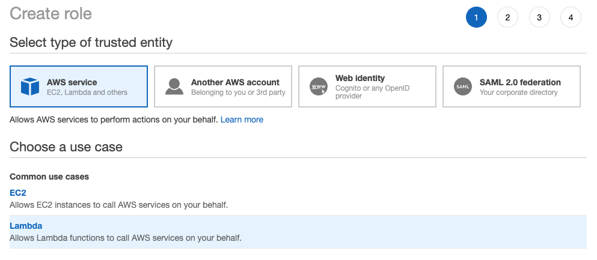
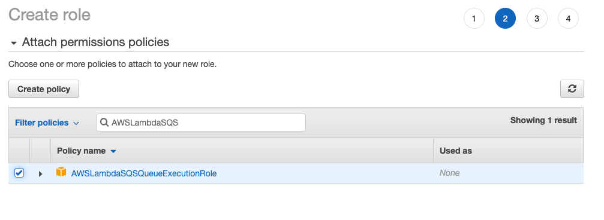
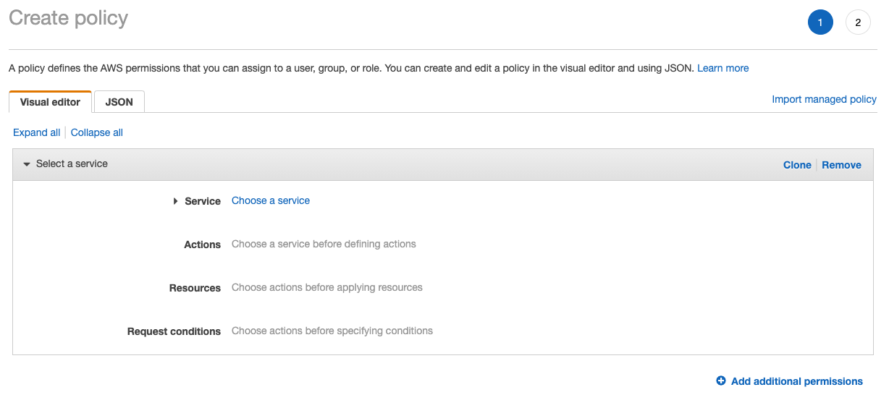
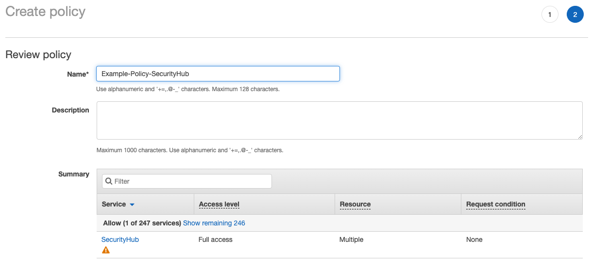
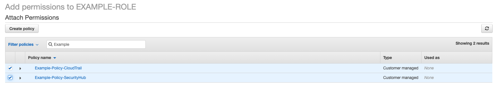
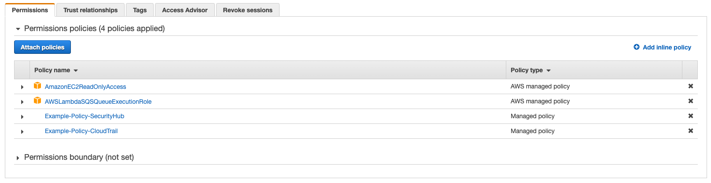
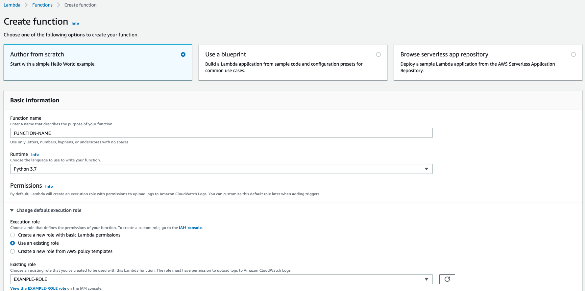

# Installing the FIG publishing lambda handler
The Falcon Integration Gateway detections handler is deployed to AWS as a Lambda function. 

If you wish to use Terraform to deploy this function, you may follow the instructions [here](terraform/lambda).

## Permissions
In order to be able to execute and access resources properly, your Lambda function will make use of an IAM role
to set execution permissions. The role and custom policies may be named anything as long as they are attached to
the Lambda function properly.

For this walkthrough, we will be creating the IAM role first, and then attaching it to a newly created function.

### Lambda execution permissions - IAM role
Follow this procedure to create the Lambda execution role for the function.

#### Step 1 
Login to the AWS console and navigate to the IAM / Roles service. Click the "Create Role" button to begin. On the next
page, select "AWS service" as the type and "Lambda" as the use case.



#### Step 2 
You will then be provided an opportunity to attach policies to the role. These policy can pre-exist or be created at this point in time. We will be attaching two AWS managed policies, and creating two for this example. The first two policies to attach are the **AmazonEC2ReadOnlyAccess** and **AWSLambdaSQSQueueExecutionRole** policies.




#### Step 3 
Click the "Create Policy" button to create our first of the two custom policies. The Create Policy page will first display the visual editor. Click the "JSON" tab to swap over to JSON input.



#### Step 4 
Copy / paste the following policy document into this policy, making sure to update __{AWS_REGION}__, __{AWS_ACCOUNT_ID}__ and __{FUNCTION_NAME}__ to point to the correct values. When you have finished save your policy.

##### Basic lambda execution permissions
```json
{
    "Version": "2012-10-17",
    "Statement": [
        {
            "Effect": "Allow",
            "Action": "logs:CreateLogGroup",
            "Resource": "arn:aws:logs:{AWS-REGION}:{AWS-ACCOUNT-ID}:*"
        },
        {
            "Effect": "Allow",
            "Action": [
                "logs:CreateLogStream",
                "logs:PutLogEvents"
            ],
            "Resource": [
                "arn:aws:logs:{AWS-REGION}:{AWS-ACCOUNT-ID}:log-group:/aws/lambda/{AWS-LAMBDA-FUNCTION-NAME}:*"
            ]
        }
    ]
}
```


#### Step 5 
Repeat this process with the following policy document. Again, make sure to update __{AWS_REGION}__ and __{AWS_ACCOUNT_ID}__ to reflect the correct values. When finished, save the policy as shown below.

##### Security hub related permissions
```json
{
    "Version": "2012-10-17",
    "Statement": [
        {
            "Effect": "Allow",
            "Action": [
                "securityhub:*"
            ],
            "Resource": [
                "arn:aws:securityhub:*:{AWS-ACCOUNT-ID}:hub/default",
                "arn:aws:securityhub:*:{AWS-ACCOUNT-ID}:product/crowdstrike/crowdstrike-falcon",
                "arn:aws:securityhub:*:{AWS-ACCOUNT-ID}:/findings"
            ]
        }
    ]
}
```




#### Step 6 
Now that the custom policies have been created, you can swap back to your role tab and click the "Refresh" icon.  Search for the two policies you created and attach them as shown below.






## Creating the function
Now we are ready to create our function. Navigate to _Lambda_ within the AWS console and click the "Create Function" button.
You may name your function anything you want. You should select Python 3.7 for the Runtime value. 

Expand the "Change default execution role" section, and select the second option, "Use an existing role". 

Select the role you created in the steps above.



When finished, click the "Create Function" button and the initial Lambda will be generated.

## Lambda function settings
In order to execute properly, the function needs the following additional configuration changes.

Change the Handler to read **main.lambda_handler**.


Confirm the timeout is **30 seconds** or greater.


## Uploading the source code
You are now ready to upload the source code for the function.  Click actions button and select "Upload a .zip file". When prompted, provide the 
[lambda trigger source code archive](install/fig-identify-detections_lambda.zip) contained in the [install](install) folder of this repository.


Once your code has been uploaded, click the "Deploy" button to deploy it to your environment.

## Creating the SQS trigger
You must add a SQS trigger to your lambda in order for it to consume messages from the queue. 

If you wish to use Terraform to deploy the SQS trigger, you may review the instructions [here](terraform/lambda-sqs).

Open your lambda function in the AWS console and click the _Add Trigger_ button.


Select _SQS_ for the service, you should then be able to select the primary detection queue you created previously from the drop down labeled **SQS queue**. 

You may choose to create the trigger without enabling it by clearing the **Enable trigger** checkbox. Doing so will prevent new messages from being consumed until the trigger is enabled.

