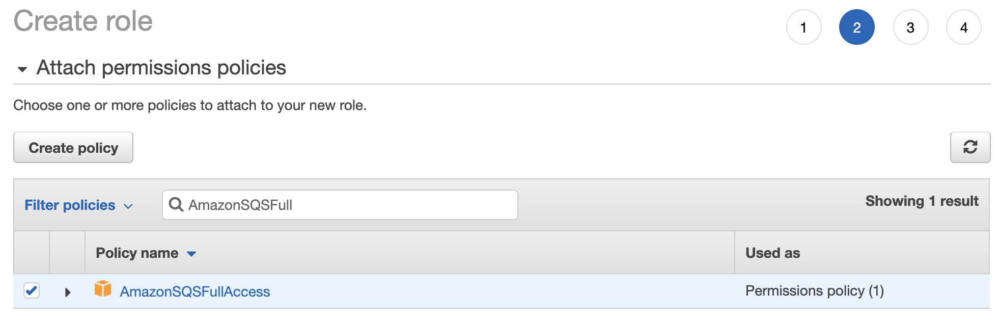
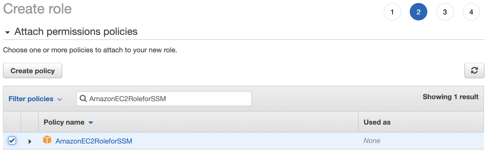
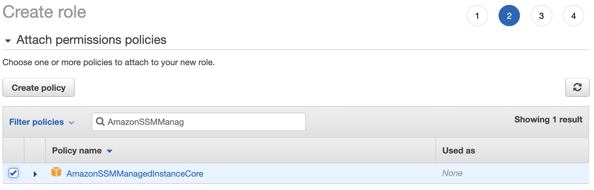

# Manual installation
In order to install manually, you will need to create each component and the required permissions in order.

- [Installing the SQS queue](sqs-install.md)
- [Installing the findings publishing lambda](lambda-install.md)
- [Creating the FIG instance](#creating-the-fig-instance)

If you are interested in utilizing Terraform to perform this installation, review the documentation [here](terraform).

## Pre-requisites
+ Falcon Complete 
+ Falcon Discover
+ API keys for your Falcon environment
+ An AWS environment with the following:
    + Available VPC with properly defined subnets
    + An available private subnet within this VPC
    + A NAT gateway attached to this VPC and set as the default route for the selected private subnet
+ Permissions to perform the following actions within AWS:
    + Access the AWS console or CLI
    + Create EC2 instance
        + Amazon Linux 2
    + Create Lambda function
    + Create SQS queue
    + Create IAM roles and policies
    + Create SSM parameters
+ If you are not using SSM parameters to store application settings then you will also need a properly formatted _[config.json](./#configjson)_ file.

## Creating the FIG instance 
The FIG service application was developed to run efficiently as a service on a small Linux EC2 instance. 
> This instance can be scaled up as necessary. 

### Creating the FIG instance IAM role
First, we will create an IAM role to assign permissions to the instance. Login to the AWS console and navigate to the IAM / Roles service. Click the "Create Role" button to begin. On the next page, select "AWS service" as the type and "EC2" as the use case.


You will then be provided an opportunity to attach policies to the role. These policy can pre-exist or be created at this point in time. We will be attaching three AWS managed policies, **AmazonSQSFullAccess**, **AmazonEC2RoleforSSM** and **AmazonSSMManagedInstanceCore** policies.







Once all three policies have been attached, click "Create Role" button to save the new role.


## Creating the FIG instance and installing the service application
The minimum requirements for this instance are:
+ t2.micro (or better) - 1 vCPU, 2 GB RAM
    - 20 GB or greater EBS volume
+ Amazon Linux 2 or CentOS 7
+ Python 3 and PIP3 installed
    - boto3 client library installed via PIP (--user)
    - requests client library installed via PIP (--user)
+ The necessary IAM permissions to access SSM parameters and publish messages to our SQS queue
+ A route to the Internet

> If you wish to use the automated service installer, either during instance creation or manually afterwards, skip to [Automated Installation Documentation](#installing-the-fig-service-during-instance-creation).

After your instance is created (or during initial setup) assign the instance IAM role you created previously.

### Installing the FIG service application
To expedite setup, a service application installer has been developed and is detailed below. For users that wish to deploy the service manually, several steps must be performed:
1. Create the EC2 instance
2. Assign the necessary IAM permissions
3. Create the FIG user account
4. Install Python 3
5. Install the boto3 and request client packages
6. Install the FIG service application files
7. Confirm service account permissions
8. Configure the FIG service in systemd 
9. Start the service

> The FIG service application has been tested to function on Amazon Linux 2, and should run on CentOS 7.

#### Creating the user account
The fig user account is used for running the service only. While it does have a home directory and profile, it does not need to have a password. This user account can be named whatever meets the requirements for deployment but if it is named anything other than _fig_ than the service definition file described later in this documented should be updated to reflect this change.

Execute the following commands to create the user account.
```bash
$ sudo groupadd fig

$ sudo adduser -g fig fig
```

#### Installing Python 3 and necessary packages
FIG requires Python 3, the boto3 package and the requests package in order to be able to run. These can be installed with the following commands.
```bash
$ sudo yum -y install python3

$ sudo -u fig pip3 install --user requests

$ sudo -u fig pip3 install --user boto3
```

#### Directory permissions
By default, FIG installs to the _/usr/share/fig_ folder. This can be changed during installation, but the service definition you will create later will need to be updated to reflect the new location. 

In order to execute properly, FIG will need to own and be able to write to this installation folder. An example of setting the necessary permissions can be seen below.

```bash
$ sudo chown -R fig:fig /usr/share/fig

$ sudo chmod 644 /usr/share/fig/*
```

### Running the FIG service automated installer
If necessary, the FIG service automated installer can be executed from the command line directly. When doing so, you should make use of _sudo_ so that the installer has the necessary permissions to create the folder, user and service. 

Executing the installer can be performed with the following command:
```bash
$ ./{FIG_INSTALLER_FILE} --target {TARGET_DIRECTORY}
```
Where {FIG_INSTALLER_FILE} is the filename for the installer you've uploaded to your instance and {TARGET_DIRECTORY} is the directory where you wish to install the service.
#### Example
```bash
$ ./fig-2.0.latest-install.run --target /usr/share/fig
```
#### Running the installer without setting up the service
If you want to execute the installer _without_ executing the post-installation script that creates users and sets up the service within systemd, then pass the _--noexec_ flag as follows:
```bash
./{FIG_INSTALLER_FILE} --target {TARGET_DIRECTORY} --noexec
```

> For security reasons, it is recommended the FIG service run under a stand-alone user account. This user account is created automatically if you are using the installer package, and is called _fig_. If this user exists, an error may be thrown during installation, but the service should still operate properly as long as the fig user has permissions to the service application folder.

### Manual installation of the FIG service
The service automated installer uses systemd to create and manage the FIG service. The following steps can be performed to install the service manually.

#### Create the service definition
First create the service definition file. The service file used in the installer is shown below. If you have installed the FIG application to a location other than _/usr/share/fig_, then you will need to update the directory listed in the WorkingDirectory and ExecStart lines to point to the new location.

If you are using a user account named something other than _fig_ you will need to update the User line to reflect this change.

The file should be named _fig.service_ and saved in /lib/systemd/system.
```bash
[Unit]
Description=Falcon Integration Gateway
After=multi-user.target

[Service]
WorkingDirectory=/usr/share/fig
User=fig
Type=idle
ExecStart=/usr/bin/python3 /usr/share/fig/main.py &> /dev/null
Restart=always

[Install]
WantedBy=multi-user.target
```
Once you have created the service definition file, execute the two following commands.

Reload the system deamons.
```bash
$ sudo systemctl daemon-reload
```
Enable the service
```bash
$ sudo systemctl enable fig
```

### Starting the FIG service
Once all configuration and installation steps have been performed, you may start and stop the fig service with the following commands.

Starting the service
```bash
$ sudo service fig start
```
or
```bash
$ sudo systemctl start fig
```
Stopping the service
```bash
$ sudo service fig stop
```
or
```bash
$ sudo systemctl stop fig
```

## Installing the FIG service during instance creation
This solution provides an installer that supports execution via a User Data script, which allows for deployment via CloudFormation or Terraform.
> Since User Data scripts execute as the root user, this script should not include references to _sudo_.

> It is recommended you use the latest version of the installer as shown below. Older versions are available within this repository should you need to install a previous version.

#### Example
```bash
#!/bin/bash
cd /var/tmp
wget -O fig-2.0.latest-install.run https://raw.githubusercontent.com/CrowdStrike/Cloud-AWS/master/Falcon-Integration-Gateway/install/fig-2.0.latest-install.run
chmod 755 fig-2.0.latest-install.run
./fig-2.0.latest-install.run --target /usr/share/fig
```