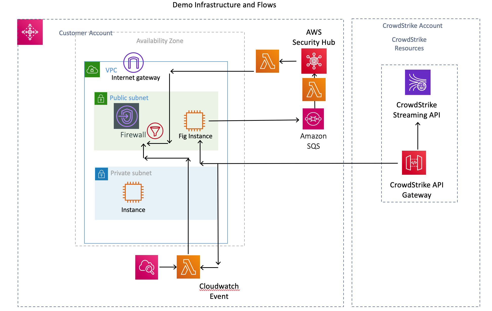
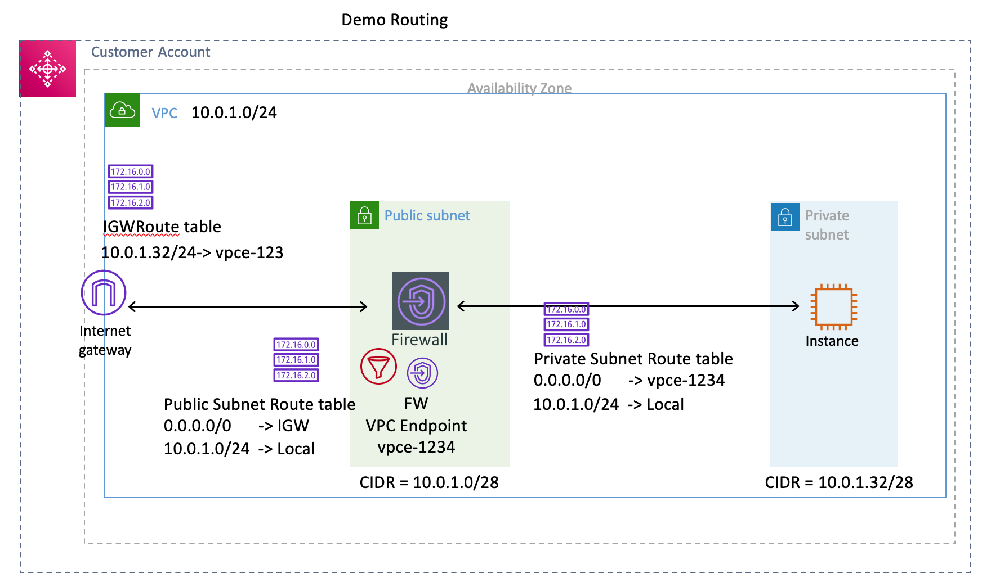
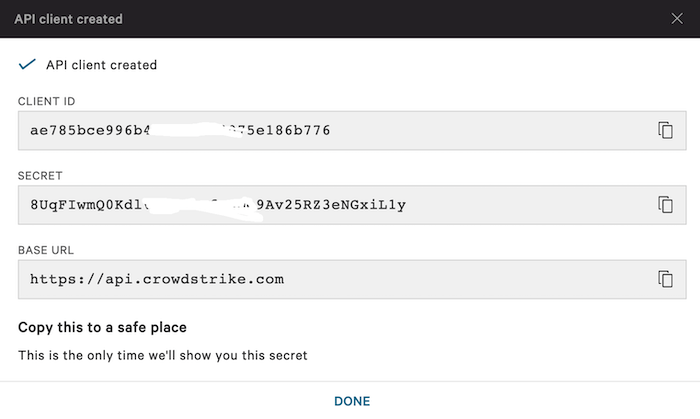
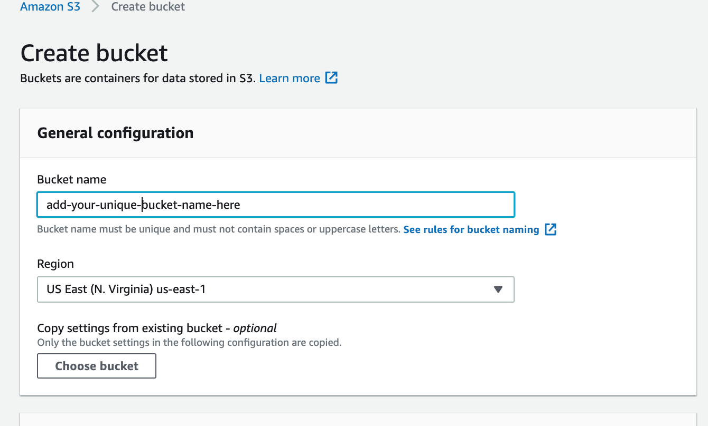
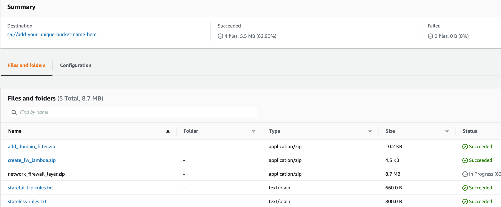
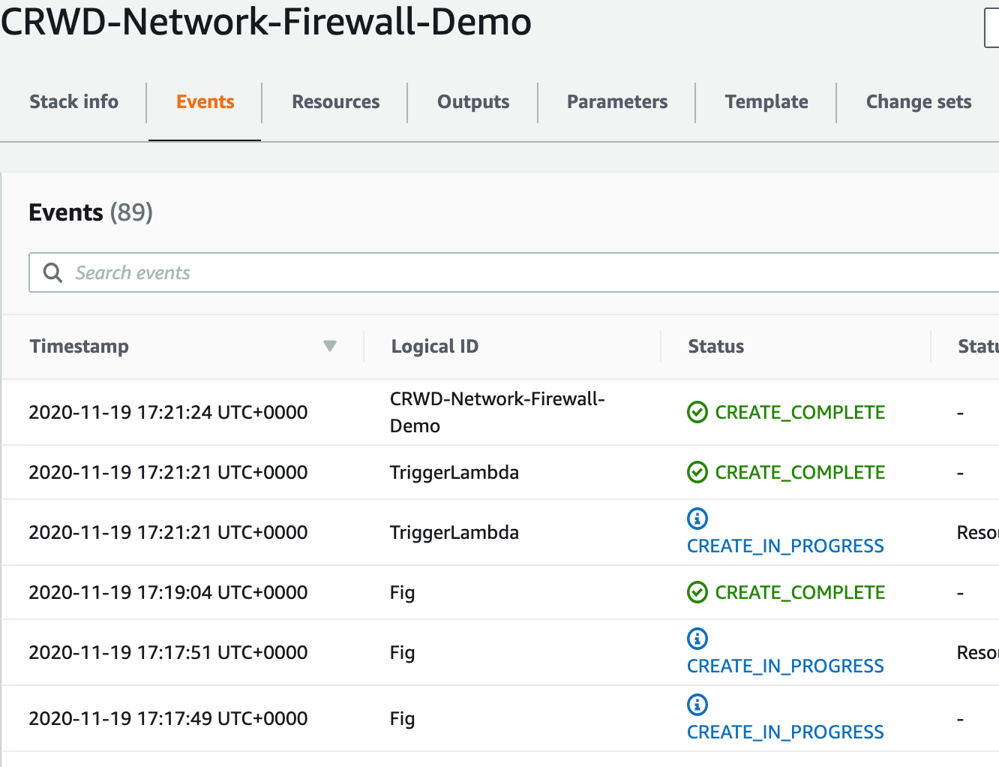
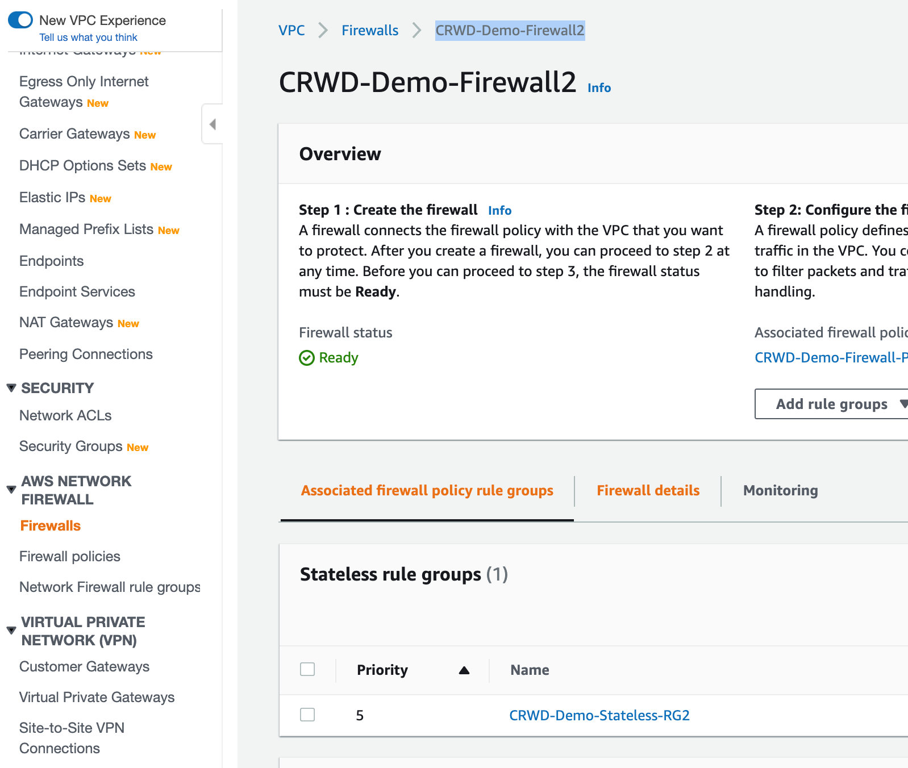
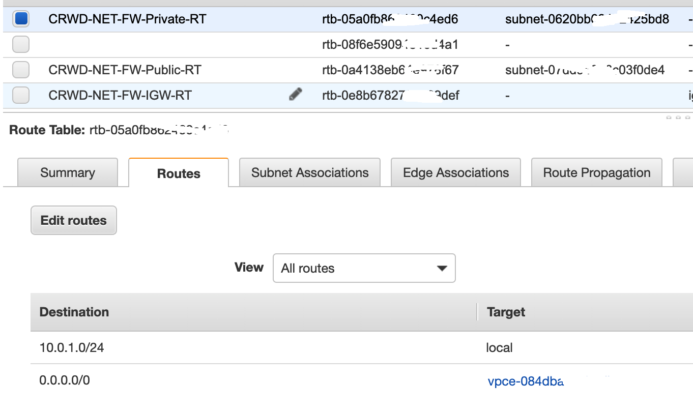
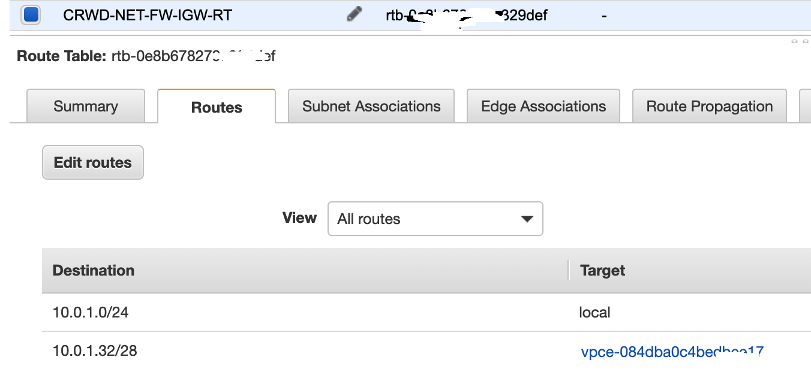
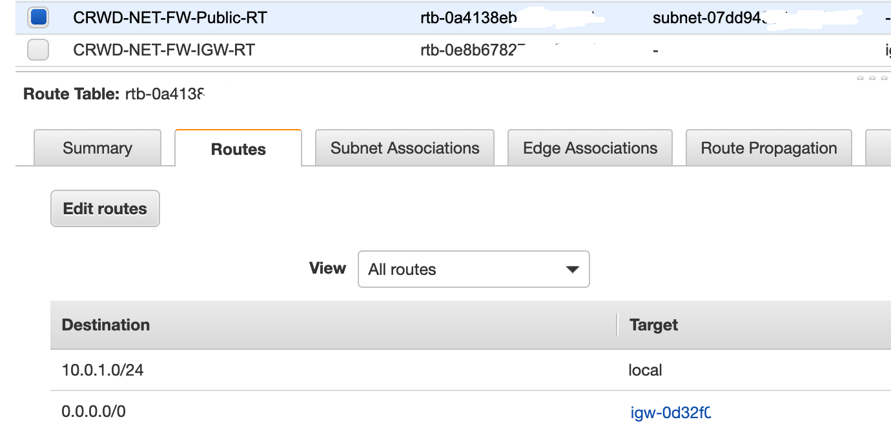

# Deployment

Please note the following when running the demo.

* _*This Template will take 15-20mins to fully deploy in your VPC*_

* _*It can take 15 minutes for CrowdStrike detections to appear in Security Hub*_

## Prerequisites

1. You must install the template in a region that currently supports the AWS Network Firewall. You can check the latest [here](https://aws.amazon.com/about-aws/global-infrastructure/regional-product-services/?p=ngi&loc=4).

    _(Currently US East (N. Virginia), US West (Oregon), and Europe (Ireland) Regions)_

2. You must have security hub enabled in the region where you are testing.

3. The demo will require the following CrowdStrike subscriptions 
   * Falcon Prevent
   * Falcon X

4. You must have the ability to create OAuth2 API keys in the falcon console

5. The demo will use the following AWS services.  You must have the ability to run these services in your account. 
   * Security Hub
   * EC2 Amazon Linux 2
   * Lambda
   * SQS
   * Systems Manager
   
## Demo Description
The diagram below shows the infrastructure deployed by the cloudformation template and the flows involved.  The demo will allow you to evaluate the two integration scenarios discussed in the [overview](overview.md) 

The Cloudformation template will setup the following in a new VPC 

* Windows EC2 Instance in a private subnet

    The windows instance is used to generate a detection related to a suspicious domain. 
 
* Linux EC2 Instance in a public subnet
    
    The EC2 linux instance runs the security hub integration process that pulls detections from the CrowdStrike API and sends them them as "findings" to AWS security hub.  Note an SQS queue and lambda function are also deployed to assist with the process. See the Security Hub Integration (FIG) documentation for more information. 

* Internet GW

* VPC 
    - 2 x Subnets (Public + Private)
    - 3 x Route tables (Public + Private + IGW)
    
* 1 x SQS Queue
    Security Hub Integration 

* 4 x Lambda Functions - 
    
    - Function to deploy the Network Firewall
    
    - Security Hub (FIG) function required for security hub integration 
    
    - Function that is triggered by a security hub custom action to extract the domain information from the finding and 
    push it to the Network Firewall rule. 
    
    - Function that is triggered by a cloudwatch event to update a domain list with current IOC's from Falcon X

### Routing Setup
The diagram below shows the setup of the VPC

When the Network Firewall is created a VPC endpoint is created in each AZ.  The vpc endpoint is then used as the next 
hop in the routing tables of subnets that are to be protected by the network firewall.

#### Private Subnet
The private route table is associated with the private subnet (protected subnet) and has one additional route table entry
 - default route 0.0.0.0/0 with next hop as the firewall vpc endpoint (vpce)

#### Firewall Subnet
The Firewall route table is associated with the firewall subnet and has one additional route table entry
 - default route 0.0.0.0/0 with next hop as IGW

#### IGW Subnet
The Gateway route table has an edge association with the Internet Gateway and has one additional route table entry
 - 10.0.1.32/28(the protected subnet) with next hop as the firewall vpc endpoint (vpce)

## Deployment Steps
1. Create CrowdStrike API keys
Create an OAuth2 key pair with permissions for the Streaming API and Hosts API
    
    | Service                           | Read | Write |
    | -------                           |----- | ----- |
    | Detections                        | x    |       |
    | Hosts                             | x    |       |
    | Detections                        | x    |       |
    | Actors (Falcon X)                 | x    |       |
    | Indicators (Falcon X)             | x    |       |  
    | Host groups                       | x    |       |  
    | Incidents                         | x    |       |  
    | IOCs (Indicators of Compromise)   | x    |       |
    | Sensor Download                   | x    |       |
    | Event Streams                     | x    |       | 

    Screenshot from key creation. Copy the CLIENT ID and SECRET values for use later as input parameters to the cloudformation template.
    
    
    
    Make a note of your customer ID (CCID)
    
2. Download the following files
    * network-firewall-demo.yaml file from the cloudformation folder
    * All files in the s3-bucket folder

3. Create an S3 bucket in the region where you will be deploying the template.
    The bucket files will be accessed by a lambda function that is created by the template. No other access is required.
    
    

4. Upload the files from the s3-bucket folder to the new bucket you created in the previous step.

    _The contents of this folder may change over time.  The screenshot is not a definitive list of files_
    
    

5. Load the CloudFormation Template 
   
   Add the required Parameters

    | Parameters | Description | Default | User Input Required |
    | :--- | :--- | :---- | :----: | 
    | CCID    | CrowdStrike Customer ID    |  | *Yes* |
    | FalconClientId    | Falcon OAuth2 Client ID.    |    | *Yes*   |  
    | FalconSecret    | Falcon Oath2 API secret.    |     | *Yes*    | 
    | FWConfigBucket    |  S3 Bucket containing firewall policy config files    |     | *Yes* |
    | Owner    | Owner/Creator of resource    |     |  *Yes* |
    | Reason    | Reason for Deployment eg Testing    |     |  *Yes* |
    | AvailabilityZones    | Availability Zone to use for the subnets in the VPC |     | *Yes* | 
    | KeyPairName    | Public/private key pairs allow you to securely connect to your instance after it launches | |*Yes* |
    | DomainRGName | Domain Rule Group Name | Default: CRWD-Demo-Domain-RG | No |
    | StatefulRGName | Stateful Rule Group Name | CRWD-Demo-Stateful-RG | No |
    | PolicyName | Firewall Policy Name | CRWD-Demo-Firewall-Policy | No |
    | FirewallName | Firewall Name | CRWD-Demo-Firewall| No |
    | StatelessRGName    | Stateless Rule Group Name    | CRWD-Demo-Domain-RG    | No |
    | DomainRGName    | Domain Rule Group Name    | CRWD-Demo-Domain-RG    | No    | 
    | StatefulRGName    | Stateful Rule Group Name    | CRWD-Demo-Stateful-RG    | No    | 
    | PolicyName    | Firewall Policy Name    | CRWD-Demo-Firewall-Policy    | No    | 
    | FirewallName    | Firewall Name.    | CRWD-Demo-Firewall    | No    | 
    | FirewallDescription    | Crowdstrike demo firewall name.    | Crowdstrike demo firewall    | No  | 
    | PrivateSubnetCIDR    | CIDR block parameter must be in the form x.x.x.x/16-28    | 10.0.1.32/28     | No |
    | PublicSubnetCIDR    | CIDR Block for the public DMZ subnet for secure administrative entry       | 10.0.1.0/28     |No|
    | trustedSource    | CIDR from which access to bastion is to be permitted    | 0.0.0.0/0    | No |
    | VPCCIDR    | CIDR Block for the VPC    | 10.0.1.0/24 | No|
    | LatestLinuxAMI    | /aws/service/ami-amazon-linux-latest/amzn2-ami-hvm-x86_64-gp2 | | No |
    | LatestWindowsAMI    | /aws/service/ami-windows-latest/Windows_Server-2016-English-Full-Base | | No |
    | WindowsInstanceType    | AllowedValues: t2.small t2.micro | t2.small    | No |
    | LinuxInstanceType    | AllowedValues: t2.small t2.micro | t2.small    | No |
    | FigFileName  | The FIG is the process that integrates that Falcon Console with Security Hub |  fig-2.0.8-install.run | No |
    
    
6. The template will take 15-20 minutes to fully deploy (Please be patient)  

## Verify Deployment  

After 15-20 mins the stack deployment should be complete
 

1. Verify that you have a Firewall in your newly created VPC.  Verify the firewall rule groups associated with the firewall policy.

2. Verify that you have a route entry in the route table associated with the private subnet that has a next hop of the firewall vpce.

3. Verify that you have a route entry in the route table with and edge association of the internet gateway. 

2. Verify that you have a route entry in the route table associated with the public subnet that has a next hop of the firewall vpce.

