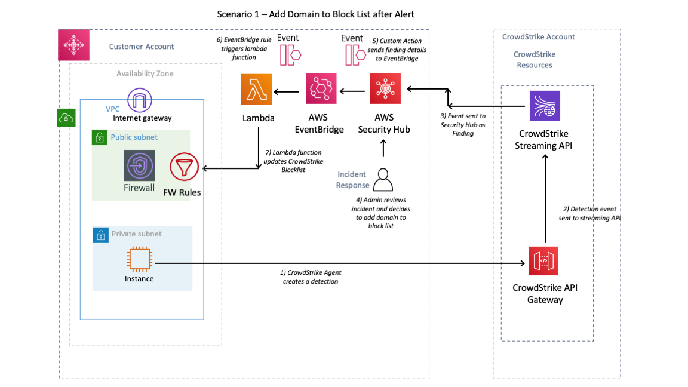
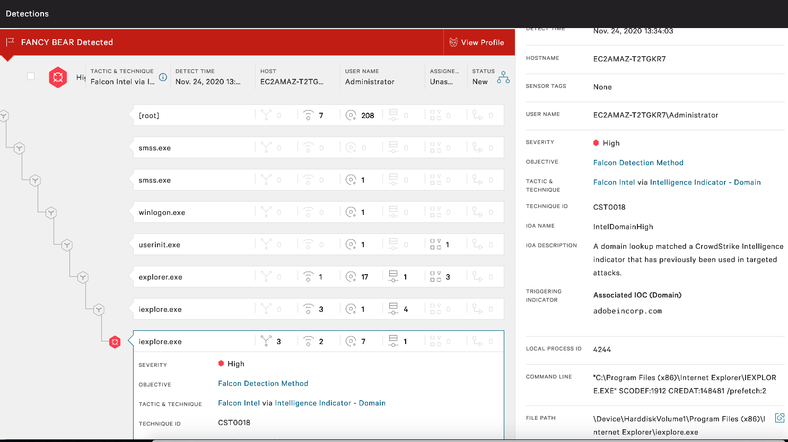
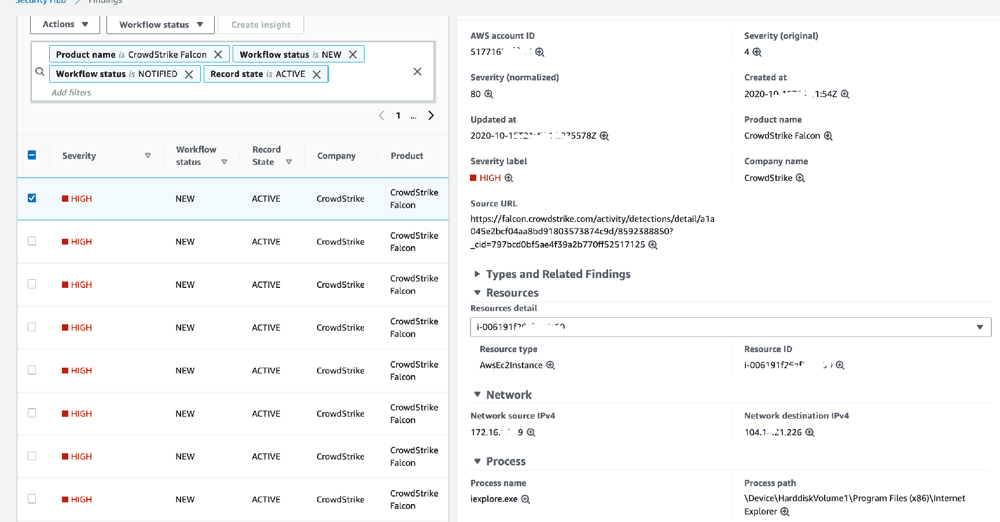
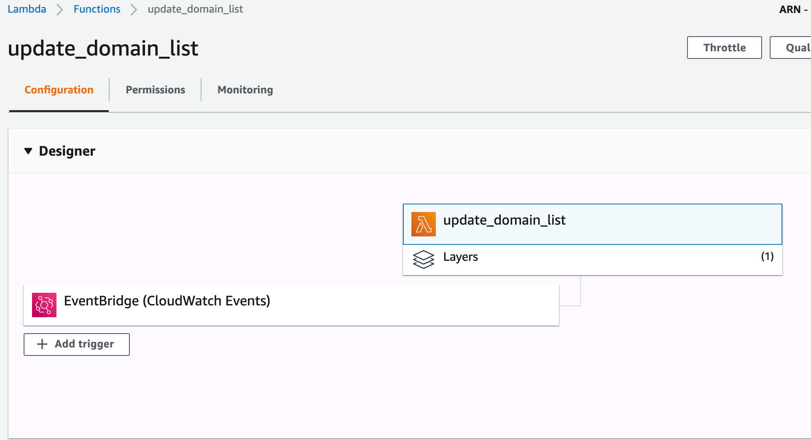
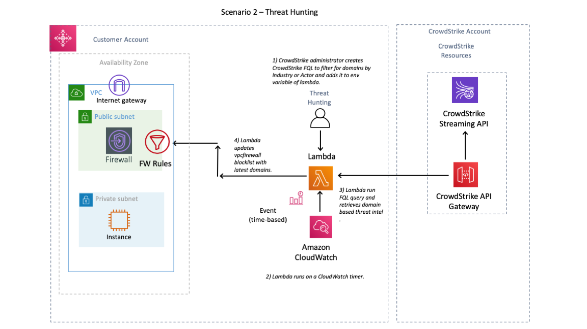
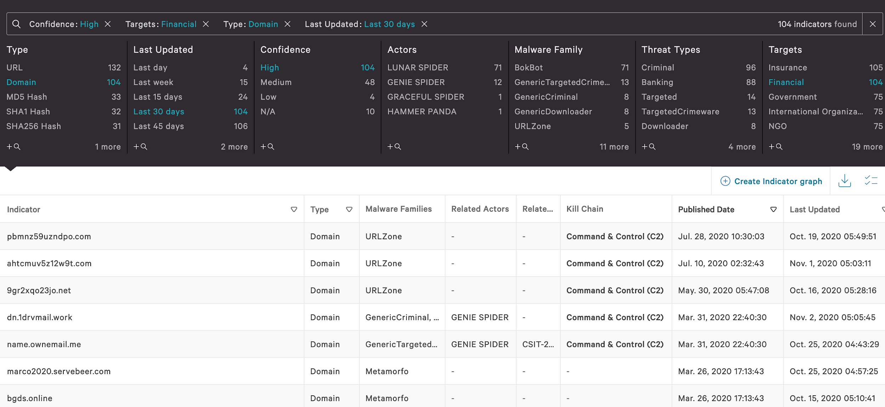

# AWS Network Firewall with CrowdStrike

## About AWS Network Firewall

For security and compliance purposes, customers often have to control ingress and egress traffic related to Amazon EC2 instances and containers.  Previously, in order to achieve domain filtering, customers would have used a combination of NAT gateways and Squid or third party firewalls.  Stateful TCP/IP and UDP inspection was performed using Security Groups.   AWS Network Firewall extends the ability to monitor and control ingress and egress network traffic with its integration with AWS Firewall Manager and its ability to scale automatically.   

The CrowdStrike threat intelligence feed is already seamlessly integrated with Amazon GuardDuty. Clients of Amazon GuardDuty already gain the benefits of CrowdStrike's use of sophisticated signatureless artificial intelligence/machine learning and indicators of attack (IOA) to alert on connections to and from suspicious domains.  The AWS Network Firewall provides exciting opportunities for its customers to enhance their cloud network security capabilities using its native services. 

# Integrations
We continue to evaluate the AWS Network Firewall for the purposes of providing additional integration between it and the CrowdStrike Cloud Security Solutions.   Soon after launch we will provide a Cloudformation template that will allow you to evaluate the service and our integration.   We have developed the template to demonstrate two ways in which we think our customers might use the integration.

### Scenario - 1  Add Domain to Block List After Alert

In this scenario a workload running the Falcon agent detects suspicious activity related to a domain,  we receive the alert and wish to quickly block all traffic related to the domain to disrupt the adversary.   Here, we are using [AWS Security Hub](https://aws.amazon.com/security-hub/?aws-security-hub-blogs.sort-by=item.additionalFields.createdDate&aws-security-hub-blogs.sort-order=desc) to view findings.  AWS Security Hub reduces the effort of collecting and prioritising security findings across accounts, from AWS services, and AWS partner tools.  We leverage Security Hubs native automation capabilities to respond to the incident.   

 

The diagram above shows the steps involved in the process.

1. The Falcon agent detects suspicious activity related to a domain and generates a “detection” which then appears in the falcon console.    

    
2. The incident is forwarded to AWS security hub which is presented as a CrowdStrike Finding

   

3) CrowdStrike provides a lambda function that is added as a custom action to Security Hub that will extract the suspicious domain information from the finding and add it to a domain block list in the AWS Network Firewall.  
    
     
    

### Scenario - 2  Threat hunting based on CrowdStrike domain based IOAs

[CrowdStrike Falcon offers a powerful set of features that can be used to hunt for threat activity in your environment](https://www.crowdstrike.com/blog/tech-center/hunt-threat-activity-falcon-endpoint-protection/). We believe that the AWS Network Firewall can also assist in the task of proactive threat hunting. 

The AWS Network Firewall can be deployed so that it has full visibility of network traffic entering and leaving a VPC. In this scenario we use CrowdStrike Falcon X to generate lists of domains that we wish to alert on in order to hunt for activity related to specific threat actors, or industry vertical. The diagram below shows the dataflow and the processes involved. 

   

1. We wish to scan our AWS environment for any network connections to domains of interest. Using the Falcon Console we generate a query and validate that it returns the required results. 
    

2. We convert the query to a [Falcon Query Language](https://falcon.crowdstrike.com/support/documentation/45/falcon-query-language-fql) (FQL) query string.    We then add the FQL string to the lambda function as an environment variable.   
    
        
3. The lambda function continuously updates the AWS Network Firewall based on a CloudWatch timer.
    

