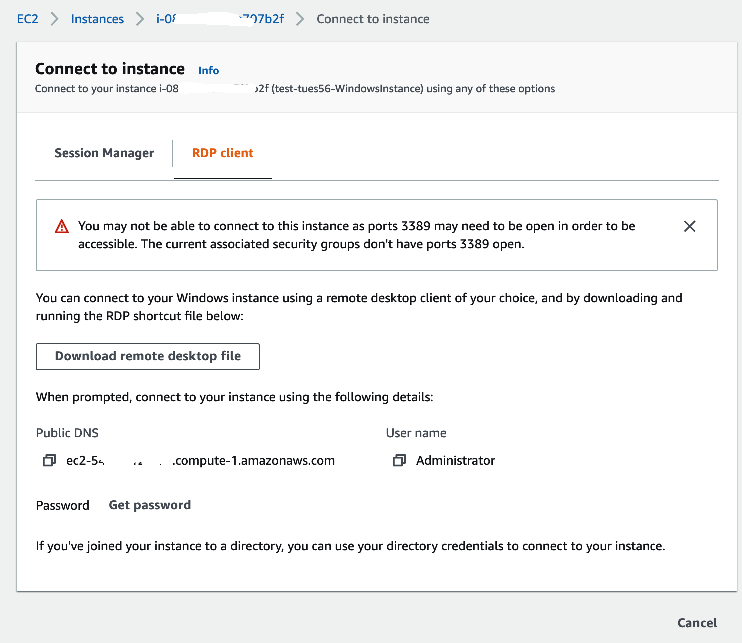
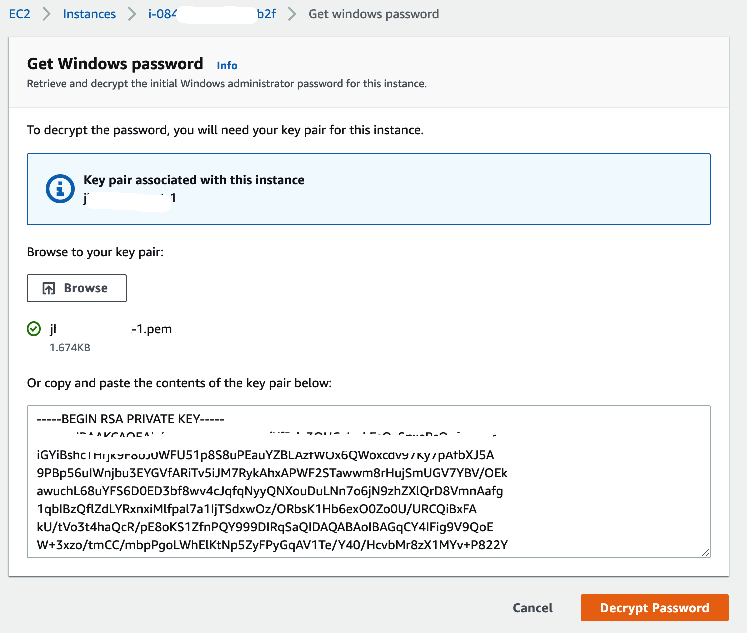
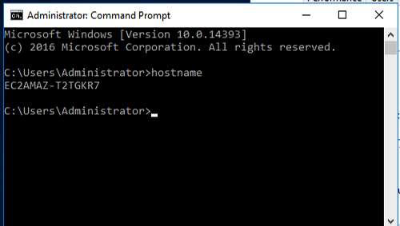
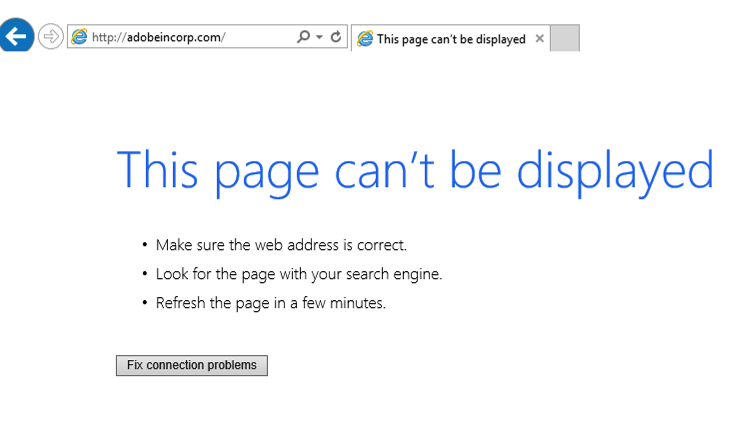
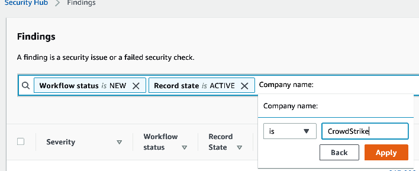
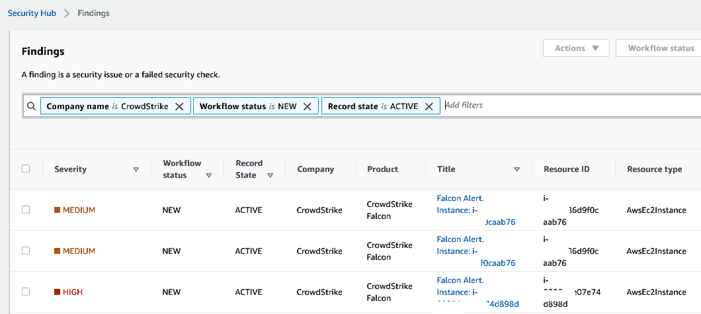
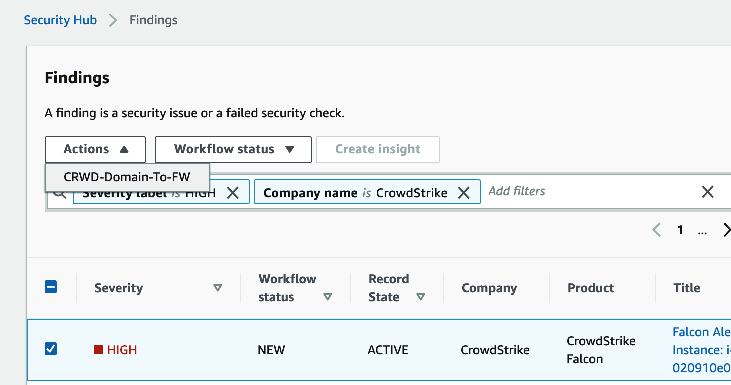
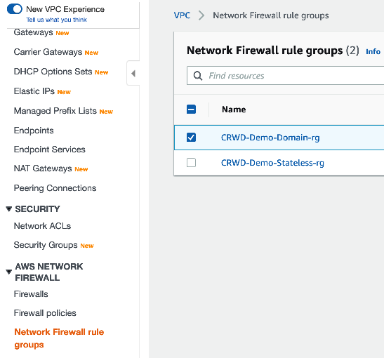
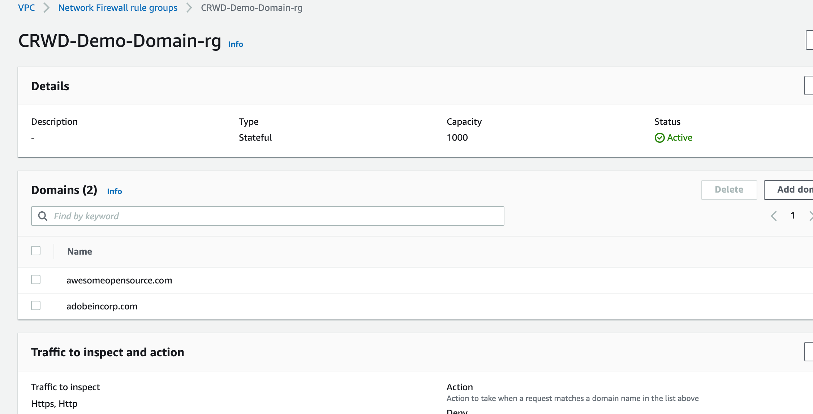

# Running the Demo

1. Find the Windows instance that has been deployed

    

    Download the remote desktop file.  The RDP file contains the connection details for the host.  You will need to 
    decrypt the password using the "Get password" link. 

2. Decrypt the password 
    
    

3. Connect to the windows instance and verify that the CrowdStrike agent is installed.
    
    Run the command *'sc query csagent'*
    
    
    
4. Verify from the Windows hostname that the agent is connected to the console and that a policy is applied.

    
    
    Check the falcon console  Got the the Hosts console and search for the hostname shown in the console output.
    
    
   
5. Open a browser and try the connect to http://adobeincorp.com

    The connection should fail but it will be sufficient to generate a detection in the console.
    
    
    
    

6. Verify the detection in the CrowdStrike console
     
     Observe the "Triggering Indicator" and "command line" fields in the detection providing information about how the 
     detection was triggered. 
     
    
    
    
    
7. Check the Security Hub console

    
    
    Search the security hub console for a finding related to the detection.  *(It may take up to 10 minutes for the 
    detection to appear in security hub as a finding")*
    
    Search by _**"Company name: is CrowdStrike"**_
    
    
    
    Select the finding of interest
    
    
    
    
    
8. Select the finding 
    
    
    
    Select the action _*"CRWD-Domain-To-FW"*_
    
    This action will trigger a lambda function which will add the domain to the firewall domain rule group.

9. Goto the Network Firewall Rule Group settings in the AWS console

    
    
    Verify that the domain has been added to the rule group
    
     
    
    
    
    
    
    
    
