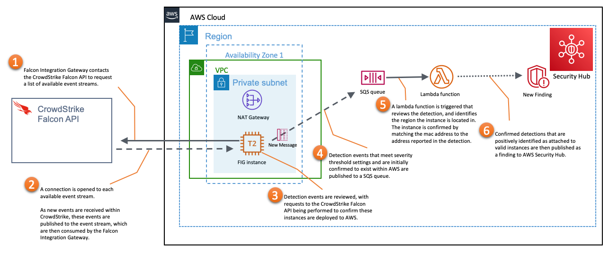
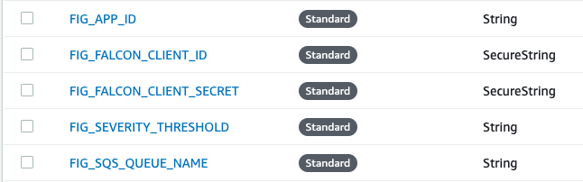
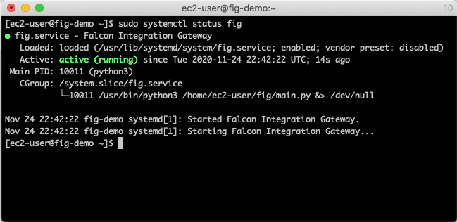
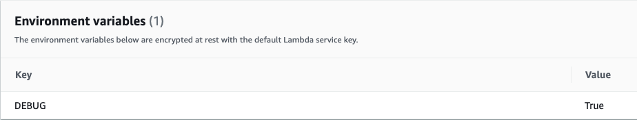

# AWS Security Hub Integration
This solution publishes detections identified by CrowdStrike Falcon for instances
residing within Amazon Web Services (AWS) to AWS Security Hub.

> If you wish to publish detections to somewhere other than AWS Security Hub, please review the [Falcon Integration Gateway](https://github.com/CrowdStrike/Falcon-Integration-Gateway) repository.

## Table of Contents
+ [Overview](#overview)
    + [Architecture](#architecture)
    + [Data Flow](#data-flow)
+ [Installation](#installation)
+ [Configuration](#configuring-the-application)
+ [Troubleshooting](#troubleshooting)

## Overview
This solution makes use of small EC2 instances to consume detections published to the CrowdStrike Falcon _event-stream_ API and then publishes detection events that align to instances that exist within AWS to a pre-existing SQS queue. A lambda function consumes these messages, confirms that the detection matches a valid instance in a valid AWS region, and then publishes the detection as a new finding in AWS Security Hub.

There are several benefits to this architecture:
+ Reduced compute cost as a large portion of the compute cycles are consumed as on-demand lambda function executions
+ Easily scalable depending upon need
+ Can be deployed quickly

### Architecture 
This solution consists of three primary components
+ Python application running within AWS for ingesting detections from the CrowdStrike API
    > This application is sometimes referred to as _fig_, and may contain references to this which reflects the legacy solution name.
+ AWS SQS queue for storing alerts that meet notification threshold settings
+ Lambda function for reviewing queued alerts and submitting valid findings to AWS Security Hub



### Data Flow
1. The service application contacts the CrowdStrike Falcon API to request a list of available event streams.
2. A connection is opened to each available event stream. As new events are received within CrowdStrike, these events are published to the event stream, which are then consumed by the service application.
3. Detection events are reviewed, with requests to the CrowdStrike Falcon Hosts API being performed to confirm these instances are deployed to AWS.
4. Detection events that meet severity threshold settings and are initially confirmed to exist within AWS are published to a SQS queue.
    > Provider confirmation can be disabled using a configuration flag.
5. A lambda function is triggered that reviews the detection, and identifies the region the instance is located in. The instance is confirmed by matching the MAC address to the address reported in the detection.
    > Instance existence confirmation can be disabled using a Lambda environment variable. This option is available for MSSP scenarios where the account that is running the service application does not have access to the AWS account where the instance with the detection resides.
6. Confirmed detections are then published as a finding to AWS Security Hub.
---

## Installation
+ Installing via CloudFormation
+ [Installing via Terraform](terraform)
+ [Installing manually](manual-install.md)

The service application is intended to be deployed as a service on a Linux instance. 
The solution can be run stand-alone, but is not recommended for production deployments.

### Required CrowdStrike API access
In order to function, this solution needs to make use of a CrowdStrike Falcon API key that provides:
+ Event Streams API - __READ__
+ Hosts API - __READ__
+ Sensor Download API - __READ__

## Configuring the application
The service application allows for customer configuration via parameters that can be provided in multiple ways. These parameters control several aspects of the service application's behavior. This includes; the credentials utilized to access the CrowdStrike Falcon API, the application ID utilized to connect to the CrowdStrike Falcon API, the severity threshold used to filter out unwanted detections, the SQS queue to target for alerts being published, and the AWS Region to report to.

### Parameters
There are six required parameters that must be defined in order for the Falcon Integration Gateway to successfully operate.
+ `base_url` - The API Endpoint for your CrowdStrike Account. This is shown during API Key Creation.
+ `falcon_client_id` - The API client ID for the API key used to access your Falcon environment.
+ `falcon_client_secret` - The API client secret for the API key used to access your Falcon environment.
+ `app_id` - A unique string value that describes the name of the application you are connecting to Falcon. Most string values are supported.
+ `severity_threshold` - An integer representing the threshold for detections you want published to AWS Security Hub.
+ `sqs_queue_name` - Name of the SQS queue to publish detections to. This must reside in the region specified below.
+ `region` - The region we will be publishing to in AWS Security Hub. This will need to match the region the SQS queue resides in. For deployments leveraging SSM, this parameter does not need to be specified. 

The seventh parameter is not required and defaults to __True__.
+ `confirm_provider` [__NOT REQUIRED__] - Should the service application only submit detections that have AWS listed as the service provider?

> Even though detections are published to AWS Security Hub within a single AWS region, they represent detections for instances found within _all_ AWS regions.

#### Using AWS Systems Manager _Parameter Store_
By default, service application configuration parameters are stored within AWS Systems Manager _Parameter Store_ but can be overridden by using a config.json file. 

> SSM Parameter Store parameters are _case-sensitive_ and must reside within the same region as the FIG instance you are configuring. Please note the naming convention of the parameters displayed below, as the variable names must match exactly. (All upper case, spaces are underscores, precursed with "**FIG_**").

##### Parameter Store Example


For more detail regarding [creating parameters](https://docs.aws.amazon.com/systems-manager/latest/userguide/parameter-create-console.html) within the AWS Systems Manager Parameter Store, check the [AWS Systems Manager Parameter Store documentation](https://docs.aws.amazon.com/systems-manager/latest/userguide/systems-manager-parameter-store.html).

#### config.json
Application parameter values can also be specified within a _config.json_ file. This file **must** reside within the same directory the FIG application is installed. When present, values stored within a config.json file _take precedence_ over values provided via the AWS Systems Manager Parameter Store.
> For deployments running multiple instances of FIG on the same instance, you _must_ use a config.json file.
```json
{
    "base_url":"https://api.crowdstrike.com",
    "falcon_client_id":"FALCON_CLIENT_ID_GOES_HERE",
    "falcon_client_secret":"FALCON_CLIENT_SECRET_GOES_HERE",
    "app_id":"FIG_APP_ID",
    "severity_threshold":3,
    "sqs_queue_name":"SQS_QUEUE_NAME_SAME_REGION_AS_BELOW",
    "region":"REGION_GOES_HERE",
    "confirm_provider": true,
    "ssl_verify": true
}
```

## Troubleshooting
When deploying manually, there are several aspects where an error could prevent the service application from operating as expected. Since the application is intended to run as a service, you have all of the standard Linux server troubleshooting tools (Example: _journalctl -xe_) available to you. In order to assist with resolving issues that cannot be readily solved using Linux-native tools, the solution provides debug logs for review.

### Checking service status
The service can be checked directly from the instance by issuing the following command:
> Note: The service is called __fig__.
```bash
$ sudo service fig status
```
This is actually a redirection to the systemctl utility. This function can also be performed with the command:
```bash
$ sudo systemctl status fig
```
This should result in a display similar to the following:


### Log files
+ `fig-service.log` - The application service log contains debug information related to the startup of the service and loading of credentials. Review this log for failures related to the starting and stopping of the service application.
+ `{app_id}_{partition_number}.log` - Each stream opened by the application has it's own rotating log that contains details regarding the detections discovered. Review this log to confirm detections are being discovered within the event stream and are properly formatted / meeting severity threshold requirements. This file is named after the value used for the __*app_id*__ parameter and the partition number.

### Offsets
Your current position within the event stream is referred to as your _offset_. The application tracks your offset per stream in a file maintained within the installation directory. This file is hidden and named after the value used for the __*app_id*__ parameter and the partition number. (Example: _.sechub-demo_0.offset_)

You can read this file to find your position within the event stream. If you wish to reset your positions in the event stream, remove this file.

### Lambda debugging
When your lambda function was created, basic logging was enabled to CloudTrail as a stand-alone log group, named after the name of your lambda function. Successful submissions and regular events are tracked in this log. 

If you wish to increase log verbosity, you may do so by creating the __DEBUG__ environmental variable on your lambda.



If you wish to disable instance confirmation, you may do so be creating the __CONFIRM_INSTANCES__ environmental variable on your lambda and settings it's value to False.

### Running the service in stand-alone mode
You may run the service application in stand-alone mode to review any errors that are sent to stdout. To do so, navigate to the service application installation folder and execute the following command.

```bash
$ sudo -u fig python3 main.py
```

> This command executes under the _fig_ user account, which depending on your installation may be the only user account with access to the installation folder and the necessary python libraries.


