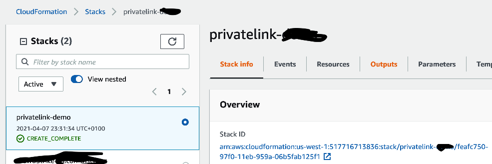

# PrivateLink Demo
## Overview
The template included here demonstrates the use of AWS PrivateLink to provide provide private connectivity to the 
CrowdStrike sensor proxy and download API.

The template creates a CrowdStrike Shared Services VPC and a test VPC containing a test linux instance.
The VPCs are connected over an AWS transit gateway and a private hosted domain is created that references the VPC 
endpoints and shared with the test VPC. 

## Setup

1) Create an S3 bucket in the region where you wish to deploy the demo.

   
2) Copy the files from the s3bucket folder to the newly created S3 bucket.
   
   
3) Load the cloudformation template (create-vpc-endpoint-r53-tgw-attachment.yaml).

4) Verify that the cloudformation template has been created successfully.

   

5) Connect to the instance and verify that the private hosted domain has been shared with the Test VPC.

6) Download and install the CrowdStrike sensor.