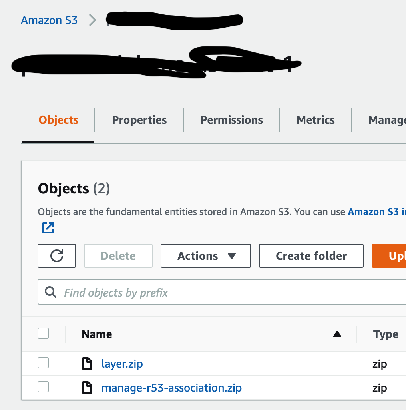
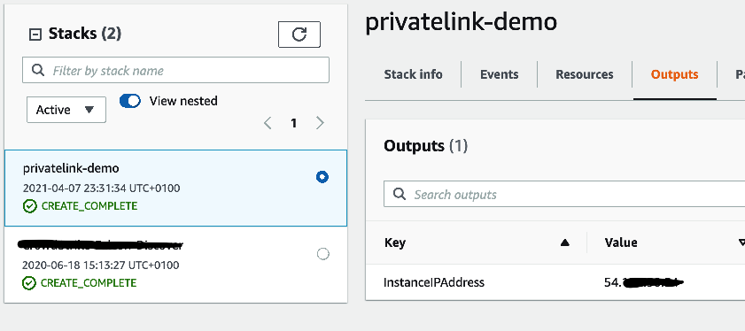
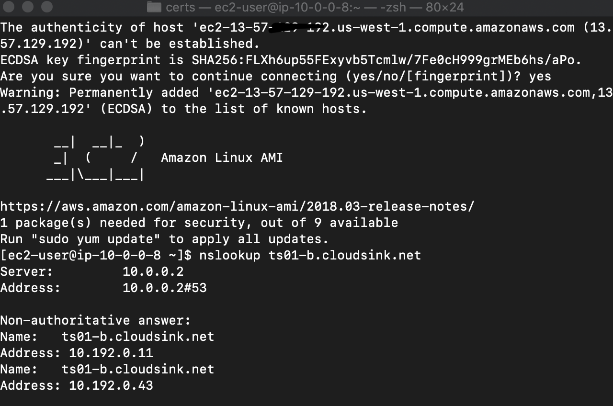

# Leverage AWS PrivateLink to provide private connectivity between your CrowdStrike-protected workloads and the CrowdStrike cloud

## Overview

With the power of AWS PrivateLink, you can create a private communication channel between the CrowdStrike Falcon Sensor and the CrowdStrike cloud. This secure connection allows for the transfer of **Sensor Proxy** data (such as sensor events) and **Sensor Download** content (including channel files, sensor update files, and more).

Please be aware that this setup is specifically designed for sensor-related traffic. As such, it does not support API communication over AWS PrivateLink.

## Region Compatibility and Metadata Details

In the process of setting up an AWS PrivateLink connection, it's mandatory to align the configuration with the region where your Falcon Customer ID (CID) is housed. To illustrate, if your CID is stationed in `US-1`, your AWS PrivateLink connection needs to be established in the corresponding `us-west-1` region.

Should you require communication across multiple regions, a Transit Gateway configuration will be necessary to facilitate the traffic routing throughout the AWS regions. We've provided a sample deployment for your reference in the [Quick Start](#quick-start-overview) section below.

For your convenience, we have compiled a table of supported region mappings and their corresponding metadata. Please refer to this resource to ensure your configuration aligns with your region's specific requirements.

### Falcon US-1

| DNS Name                  | Service Name    | VPC Endpoint Service Name                               | AWS Region |
| ------------------------- | --------------- | ------------------------------------------------------- | ---------- |
| ts01-b.cloudsink.net      | Sensor Proxy    | com.amazonaws.vpce.us-west-1.vpce-svc-08744dea97b26db5d | us-west-1  |
| lfodown01-b.cloudsink.net | Download Server | com.amazonaws.vpce.us-west-1.vpce-svc-0f9d8ca86ddcb7106 | us-west-1  |

### Falcon US-2

| DNS Name                             | Service Name    | VPC Endpoint Service Name                               | AWS Region |
| ------------------------------------ | --------------- | ------------------------------------------------------- | ---------- |
| ts01-gyr-maverick.cloudsink.net      | Sensor Proxy    | com.amazonaws.vpce.us-west-2.vpce-svc-08a5bb05d337fd834 | us-west-2  |
| lfodown01-gyr-maverick.cloudsink.net | Download Server | com.amazonaws.vpce.us-west-2.vpce-svc-0e11def2d8620ae74 | us-west-2  |

### Falcon EU-1

| DNS Name                             | Service Name    | VPC Endpoint Service Name                                 | AWS Region   |
| ------------------------------------ | --------------- | --------------------------------------------------------- | ------------ |
| ts01-lanner-lion.cloudsink.net       | Sensor Proxy    | com.amazonaws.vpce.eu-central1.vpce-svc-0eb7b6ca4b7271385 | eu-central-1 |
| lfodown01-lanner-lion. cloudsink.net | Download Server | com.amazonaws.vpce.eu-central1.vpce-svc-0340142b9ab8fc564 | eu-central-1 |

## Quick Start Overview

The CloudFormation template provided in this quick start sets up two VPCs: the `CrowdStrike Services VPC`, which has the AWS PrivateLink connection, and the `Test VPC`, which houses a Linux virtual machine. The `CrowdStrike Services VPC` functions as a shared service VPC, enabling other VPCs to transitively route their CrowdStrike sensor-related traffic. While this template is designed to deploy everything within a single region, the underlying principles can be applied for cross-region communication.

The VPCs are interconnected via an AWS Transit Gateway and are configured for DNS resolution. A Route53 private hosted zone is established for the `cloudsink.net` domain and linked to the `Test VPC`. This private hosted zone contains `A` records that create an alias for the VPC endpoints associated with the region in which your Falcon CID is deployed.

### Reference Diagram

### Prerequisites

- You will need to create a ticket with CrowdStrike support to have your AWS account whitelisted, enabling the AWS PrivateLink connection with your CrowdStrike account.
- You must deploy this template in the same AWS account that has been whitelisted, and in the corresponding region of your Falcon CID, to ensure the `CrowdStrike Services VPC` is provisioned without errors.

### Configuration

1. Start by creating an S3 bucket in your desired deployment region.

1. Next, [copy the following files](https://github.com/CrowdStrike/Cloud-AWS/tree/main/aws-privatelink/s3bucket) into the S3 bucket you just created.
   

1. Set up a CloudFormation Stack using the [provided template](https://github.com/CrowdStrike/Cloud-AWS/blob/main/aws-privatelink/cloudformation/create-vpc-endpoint-r53-tgw-attachment.yaml).

1. Ensure the successful creation of the CloudFormation template.
   

1. Establish a connection to the Linux EC2 instance and validate the sharing of the private-hosted domain with the Test VPC. To achieve this, retrieve the DNS name of one of the two endpoints from the [table above](#region-compatibility-and-metadata-details). For instance, if your CID is in `US-1`, use `ts01-b.cloudsink.net`.
   - Execute the command below, substituting the domain name with one corresponding to your deployment: `nslookup ts01-b.cloudsink.net`

     

1. Install the CrowdStrike sensor on the virtual machine using your usual methods and verify its reporting to the Falcon console under `Host Management`.
   - Take note that you will need to install the agent via a binary package, as the Sensor Download API will not be accessible over the AWS PrivateLink connection.
