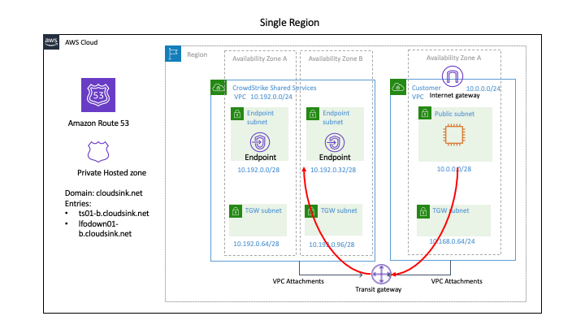

### *Utilize AWS PrivateLink to provide provide private connectivity between your CrowdStrike Falcon protected workloads and the CrowdStrike cloud.*
---

## Overview
Utilizing AWS Private Link, it is possible to establish private connectivity between the CrowdStrike Falcon Sensor (running inside your workloads) and the CrowdStrike Cloud. 

Additionally, API calls to the CrowdStrike Cloud are also routed through AWS Private Link (for example, to download the Falcon sensor).

The templates provided in this project demonstrate how to configure this functionality. The templates create the following resources:

| Resource | Description |
|:-|:-|
| Linux Virtual Machine | A sample workload to install the CrowdStrike Falcon Sensor into. |
| Test VPC | Simulates real-world deployment scenario of workloads being protected in a project-specific VPC. |
| CrowdStrike Shared Services VPC | Demonstrates the use of AWS PrivateLink to provide private connectivity to the CrowdStrike Cloud. |

The VPCs are connected over an AWS transit gateway and a private hosted domain is created that references the VPC 
endpoints and shared with the test VPC. 

For visualization purposes, here is a reference diagram showing the AWS architectural components and network traffic flow:

## Configuration
1. Create an S3 bucket in the region where you wish to deploy the demo.

2. Copy the files from [https://github.com/CrowdStrike/Cloud-AWS/tree/master/aws-privatelink/s3bucket](https://github.com/CrowdStrike/Cloud-AWS/tree/master/aws-privatelink/s3bucket)  to the newly created S3 bucket. 
  

   
3) Load the cloudformation template by running the CloudFormation template at [https://github.com/CrowdStrike/Cloud-AWS/blob/master/aws-privatelink/cloudformation/create-vpc-endpoint-r53-tgw-attachment.yaml](https://github.com/CrowdStrike/Cloud-AWS/blob/master/aws-privatelink/cloudformation/create-vpc-endpoint-r53-tgw-attachment.yaml).

4) Verify that the CloudFormation template has been created successfully.
  

5) Connect to the linux virtual machine instance and verify that the private hosted domain has been shared with the Test VPC.
  

6) Download and install the CrowdStrike sensor.