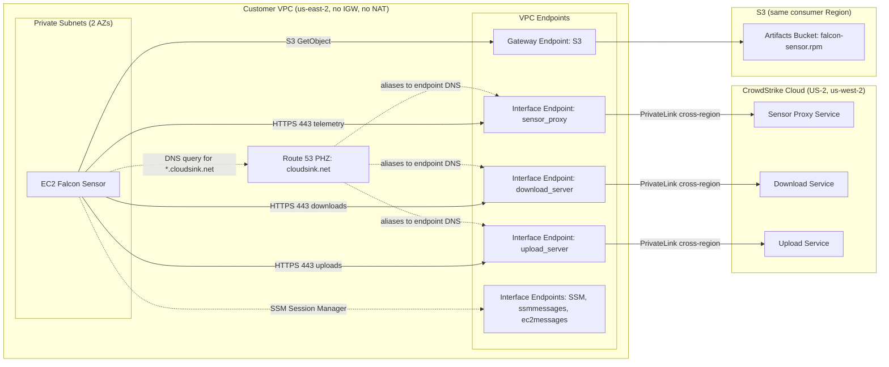

# Architecture 01 - Per-VPC endpoints

The baseline topology. A single workload VPC stands up its own CrowdStrike
interface endpoints, its own `cloudsink.net` private hosted zone, its own S3
gateway endpoint, and one private Amazon Linux 2023 test host. There is no
shared network infrastructure between VPCs.

This Terraform example deploys in one consumer Region, `us-east-2` by
default, with two Availability Zones. For a US-2 Falcon CID, the VPC endpoints
are created in `us-east-2` and connect to the CrowdStrike endpoint service in
`us-west-2` over cross-region PrivateLink.

## Table of contents

- [Prerequisites](#prerequisites)
- [Architecture](#architecture)
- [When to pick this](#when-to-pick-this)
- [What this deployment creates](#what-this-deployment-creates)
- [Deployment](#deployment)
  - [Export credentials](#export-credentials)
  - [Apply](#apply)
  - [Pick a different consumer Region](#pick-a-different-consumer-region)
- [Teardown](#teardown)
- [Operational notes](#operational-notes)
- [Verification](#verification)

## Prerequisites

Before deploying:

- CrowdStrike has whitelisted this AWS account for the consumer Region and the
  matching Falcon cloud endpoint services.
- The AWS identity running Terraform can create VPCs, endpoints, IAM roles, S3
  buckets, SSM parameters, and EC2 instances in the consumer Region.
- The AWS identity and any relevant SCP allow cross-region PrivateLink creation,
  including `vpce:AllowMultiRegion`.
- `uv` is on your `PATH`.
- You have a CrowdStrike Falcon API client ID and secret with
  `Sensor Download: Read`.

## Architecture



Terraform derives the endpoint service home Region from `var.falcon_cloud`.
When `var.region` differs from that home Region, the CrowdStrike
`aws_vpc_endpoint` resources use the Terraform `service_region` argument to
target the remote endpoint service. The S3 gateway endpoint and SSM endpoints
remain local to the consumer Region.

## When to pick this

- You want the simplest end-to-end lab.
- You have a small number of AWS accounts or VPCs running Falcon.
- Each workload VPC can own its own CrowdStrike interface endpoints and DNS.
- You can tolerate one CrowdStrike account-whitelisting request per account and
  Region.

If account-whitelisting volume or endpoint sprawl becomes the main concern,
compare the Shared VPC and TGW labs.

## What this deployment creates

Per Terraform apply:

- 1 VPC with two private subnets, no internet gateway, and no NAT gateway.
- 3 CrowdStrike interface endpoints: sensor proxy, download, and upload.
- 3 SSM interface endpoints for Session Manager.
- 1 S3 gateway endpoint for the staged sensor RPM and AL2023 package access.
- 1 Route 53 private hosted zone for `cloudsink.net`.
- 1 S3 bucket with `falcon-sensor.rpm`.
- 2 SSM parameters for the Falcon CID and Falcon cloud.
- 1 IAM role and instance profile for SSM, S3, and SSM Parameter Store access.
- 1 private AL2023 EC2 instance with IMDSv2 and the Falcon sensor installed on
  first boot.

The Falcon API is called once from the Terraform workstation to download the
AL2023 sensor RPM and fetch the tenant CID. The RPM is then staged into the
lab S3 bucket so the test host can install without internet egress.

## Deployment

### Export credentials

```bash
export AWS_PROFILE=...                           # or any other AWS auth method
export TF_VAR_falcon_client_id='...'             # CrowdStrike API client ID
export TF_VAR_falcon_client_secret='...'         # CrowdStrike API secret
export TF_VAR_owner_email='you@example.com'      # required owner tag
```

Using `TF_VAR_*` avoids writing secrets into a `.tfvars` file.

### Apply

```bash
cd examples/01-per-vpc
terraform init
terraform apply
```

On first apply, Terraform will:

1. Run `scripts/fetch_sensor.py` through `uv run` to download the latest
   AL2023 sensor RPM and fetch your tenant CID.
2. Create the VPC, private subnets, CrowdStrike endpoints, SSM endpoints, S3
   gateway endpoint, private hosted zone, S3 bucket, IAM role, and SSM
   parameters in the consumer Region.
3. Upload the RPM to the lab bucket.
4. Launch the private EC2 instance, which pulls the RPM from S3, reads the CID
   and cloud from SSM Parameter Store, configures Falcon, and starts the
   sensor.

Expect about 3-5 minutes from `apply complete` to the host appearing in the
Falcon console.

### Pick a different consumer Region

The lab defaults to `us-east-2` because it demonstrates cross-region
connectivity without deploying the consumer VPC in a Falcon home Region.

To change the consumer Region, set:

```hcl
region             = "eu-west-1"
availability_zones = ["eu-west-1a", "eu-west-1b"]
subnet_cidrs       = ["10.50.1.0/24", "10.50.2.0/24"]
```

Avoid the unsupported Regions listed in the root README.

## Teardown

```bash
terraform destroy
```

Before destroying, confirm you no longer need the registered host record in
the Falcon console. The EC2 instance will be terminated, but Falcon host
records can remain visible according to your tenant retention policy.

## Operational notes

- Sensor updates flow over the same CrowdStrike PrivateLink endpoints after
  first boot. The lab bucket is used for initial installation.
- Rotating the Falcon API secret does not automatically force a sensor RPM
  re-download. Delete `.sensor-cache/` if you need Terraform to fetch again.
- This topology scales operationally until per-account/per-Region
  account-whitelisting requests or duplicated endpoints become painful.

## Verification

Run these checks after `terraform apply` completes.

From the workstation, print the SSM command:

```bash
terraform output -json deployment | jq -r '.ssm_start_session_commands[0]'
```

Start the session with the printed command. Then print the host-side
verification commands:

```bash
terraform output -json deployment | jq -r '.verification_commands[]'
```

Inside the SSM session, run the generated commands and confirm:

- **DNS resolution:** `nslookup ts01-<cloud-slug>.cloudsink.net` returns
  private VPC IP addresses, not public internet addresses.
- **TLS handshake:** `curl -v https://ts01-<cloud-slug>.cloudsink.net:443`
  reaches the Falcon endpoint and completes a TLS handshake. An HTTP success
  body is not required for this connectivity check.
- **Sensor AID:** `sudo /opt/CrowdStrike/falconctl -g --aid` returns a
  non-empty AID after the sensor registers.
- **Service status:** `sudo systemctl status falcon-sensor --no-pager` shows
  the service running or recently started successfully.
- **Bootstrap log:** `sudo cat /var/log/falcon-bootstrap.log` shows the RPM
  copied from S3, installed with `dnf`, configured with `falconctl`, and the
  service started.

Topology-specific check from the workstation:

```bash
terraform output -json deployment | jq '.crowdstrike_endpoint_dns'
```

Confirm all three CrowdStrike endpoint keys exist: `sensor_proxy`,
`download_server`, and `upload_server`.

If endpoints stay in `pendingAcceptance`, the usual cause is missing
CrowdStrike account whitelisting or missing supported-Region enablement. If
DNS returns public IPs, check the private hosted zone association and the
`cloudsink.net` alias records.
