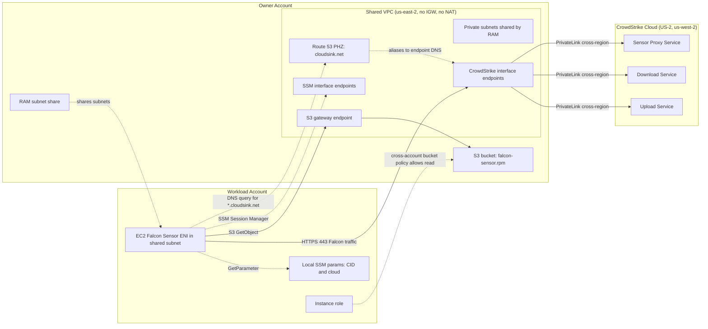

# Architecture 02 - Shared VPC

This lab shows a centralized subnet-sharing pattern. An owner account creates
the VPC, CrowdStrike interface endpoints, `cloudsink.net` private hosted zone,
S3 gateway endpoint, SSM endpoints, and sensor RPM bucket. A workload account
launches the private AL2023 test host directly into RAM-shared private subnets
inside that owner VPC.

The example deploys one owner account and one workload account in one consumer
Region, `us-east-2` by default. The RAM subnet share is same-region; deploy one
shared VPC per consumer Region if you need this pattern in multiple Regions.

## Table of contents

- [Prerequisites](#prerequisites)
- [Architecture](#architecture)
- [When to pick this](#when-to-pick-this)
- [What this deployment creates](#what-this-deployment-creates)
- [Deployment](#deployment)
  - [Export credentials](#export-credentials)
  - [Apply](#apply)
- [Teardown](#teardown)
- [Operational notes](#operational-notes)
- [Verification](#verification)

## Prerequisites

Before deploying:

- CrowdStrike has whitelisted the owner account for the consumer Region and
  matching Falcon cloud endpoint services.
- The owner and workload AWS CLI profiles are authenticated.
- The owner account can create VPC, endpoint, Route 53, RAM, S3, IAM, and EC2
  supporting resources.
- The workload account can create EC2, IAM, security group, and SSM Parameter
  Store resources in the shared VPC/subnets.
- The AWS identities and relevant SCPs allow cross-region PrivateLink creation,
  including `vpce:AllowMultiRegion`.
- You know the workload account's 12-digit account ID.
- `uv` is on your `PATH`.
- You have a CrowdStrike Falcon API client ID and secret with
  `Sensor Download: Read`.

## Architecture



The key difference from a workload-owned VPC is that the workload ENI is inside
the owner VPC. Because DNS resolution and security groups are VPC-scoped, the
workload host inherits the owner VPC's `cloudsink.net` private hosted zone and
can reference endpoint security groups in the same VPC even though the EC2
instance is owned by another account.

Terraform still targets the Falcon cloud home Region on the CrowdStrike
interface endpoints when the consumer Region differs from the Falcon home
Region. The workload account does not need its own CrowdStrike endpoints.

## When to pick this

- You have multiple workload accounts in the same consumer Region.
- Workloads are allowed to run in centrally owned shared subnets.
- You want one CrowdStrike account-whitelisting request for the owner account
  and Region, rather than one per workload account.
- You do not need a TGW path for CrowdStrike traffic.

Do not use this topology when workload teams must own their VPCs, when shared
subnets are not acceptable, or when you need one owner VPC to serve multiple
consumer Regions. RAM subnet sharing is regional.

## What this deployment creates

In the owner account:

- 1 VPC with two private subnets, no internet gateway, and no NAT gateway.
- 3 CrowdStrike interface endpoints.
- 3 SSM interface endpoints.
- 1 S3 gateway endpoint.
- 1 Route 53 private hosted zone for `cloudsink.net`.
- 1 S3 bucket with `falcon-sensor.rpm` and a bucket policy allowing the
  workload instance role to read the RPM.
- 1 endpoint security group with ingress from the workload instance security
  group.
- 1 RAM resource share for the private subnets.

In the workload account:

- 1 EC2 instance security group in the shared VPC.
- 1 IAM role and instance profile for SSM, S3 read, and local SSM Parameter
  Store access.
- 2 local SSM parameters for the Falcon CID and Falcon cloud.
- 1 private AL2023 EC2 instance launched into the shared subnet.

## Deployment

### Export credentials

```bash
export TF_VAR_owner_profile='my-sso-owner'
export TF_VAR_workload_profile='my-sso-workload'
export TF_VAR_workload_account_id='111122223333'
export TF_VAR_owner_email='you@example.com'
export TF_VAR_falcon_client_id='...'
export TF_VAR_falcon_client_secret='...'
```

Refresh both profiles before applying:

```bash
aws sso login --profile "$TF_VAR_owner_profile"
aws sso login --profile "$TF_VAR_workload_profile"
```

### Apply

```bash
cd examples/02-shared-vpc
terraform init
terraform apply
```

A single Terraform state coordinates both accounts through provider aliases.
On first apply, Terraform will:

1. Run `scripts/fetch_sensor.py` through `uv run` to download the latest
   AL2023 sensor RPM and fetch your tenant CID.
2. Create the owner VPC, subnets, endpoints, private hosted zone, bucket,
   bucket policy, endpoint security group, and RAM share.
3. Create the workload instance security group, IAM role, local SSM
   parameters, and EC2 test host in the shared subnet.
4. Install and start the Falcon sensor on first boot.

Expect about 3-5 minutes from `apply complete` to the workload host appearing
in the Falcon console.

## Teardown

```bash
terraform destroy
```

Destroy removes the workload account resources first, then the owner account
RAM share, endpoints, VPC, and bucket. Before destroying, confirm no unmanaged
workload ENIs are still attached to the shared subnets.

## Operational notes

- Adding workload accounts means adding RAM principals, workload provider
  aliases, sensor-host module calls, endpoint security group ingress, and
  bucket policy principals.
- For more than a few workload accounts, consider replacing explicit role ARN
  bucket access with an organization-scoped bucket policy managed by your
  security team.
- This topology reduces CrowdStrike account-whitelisting volume because the
  owner account is the PrivateLink consumer account for the CrowdStrike
  endpoints.
- Sensor updates flow over the CrowdStrike PrivateLink endpoints after first
  boot. The owner bucket is only used for initial installation.

## Verification

Run these checks after `terraform apply` completes.

From the workstation, print the workload profile and SSM command:

```bash
WORKLOAD_PROFILE=$(terraform output -json deployment | jq -r '.workload_profile')
CMD=$(terraform output -json deployment | jq -r '.ssm_start_session_commands[0]')
echo "$CMD --profile $WORKLOAD_PROFILE"
```

Start the SSM session with the printed command. Then print the host-side
verification commands:

```bash
terraform output -json deployment | jq -r '.verification_commands[]'
```

Inside the SSM session, run the generated commands and confirm:

- **DNS resolution:** `nslookup ts01-<cloud-slug>.cloudsink.net` returns
  private IP addresses from the owner VPC.
- **TLS handshake:** `curl -v https://ts01-<cloud-slug>.cloudsink.net:443`
  reaches the Falcon endpoint and completes a TLS handshake.
- **Sensor AID:** `sudo /opt/CrowdStrike/falconctl -g --aid` returns a
  non-empty AID after registration.
- **Service status:** `sudo systemctl status falcon-sensor --no-pager` shows
  the service running or recently started successfully.
- **Bootstrap log:** `sudo cat /var/log/falcon-bootstrap.log` shows the RPM
  copied from the owner bucket, installed, configured, and started.

Topology-specific checks from the workstation:

```bash
aws ram get-resource-shares --profile "$TF_VAR_owner_profile" \
  --resource-owner SELF \
  --query 'resourceShares[?name==`demo-cs-privatelink-shared-subnets`].[name,status]' \
  --output table

terraform output -json deployment | jq -r '.sensor_bucket'
```

Confirm the RAM share is active and the bootstrap log references the owner
bucket printed by Terraform. If S3 access fails with `403`, check that the
owner bucket policy includes the workload instance role ARN. If DNS returns
public addresses, check that the instance is actually launched in the
RAM-shared owner VPC subnets.
