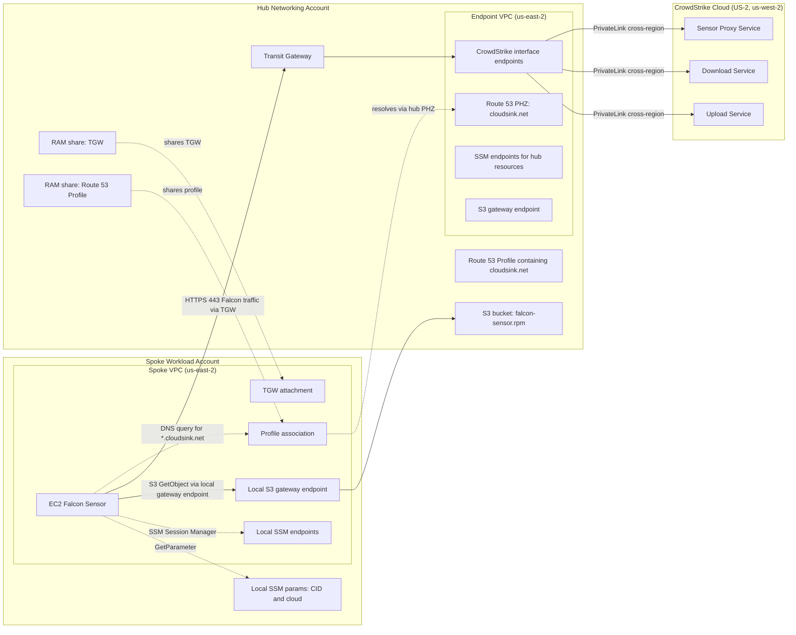

# Architecture 03 - TGW + Route 53 Profiles

This lab shows a hub-and-spoke landing-zone pattern. A hub networking account
creates an endpoint VPC with the CrowdStrike interface endpoints, a Transit
Gateway, and a Route 53 Profile that shares `cloudsink.net` DNS with spoke
VPCs. The spoke account keeps its own VPC and routes Falcon sensor traffic to
the same-region hub endpoint VPC over TGW.

The example deploys one hub account and one spoke account in one consumer
Region, `us-east-2` by default. Cross-region PrivateLink is used between the
hub endpoint VPC and the CrowdStrike endpoint service home Region. TGW is used
only for same-region spoke-to-hub routing in the customer environment.

## Table of contents

- [Prerequisites](#prerequisites)
- [Architecture](#architecture)
- [What cross-region PrivateLink changes for TGW](#what-cross-region-privatelink-changes-for-tgw)
- [Route 53 Profiles](#route-53-profiles)
- [When to pick this](#when-to-pick-this)
- [What this deployment creates](#what-this-deployment-creates)
- [Deployment](#deployment)
  - [Export credentials](#export-credentials)
  - [Apply](#apply)
- [Teardown](#teardown)
- [Operational notes](#operational-notes)
- [Verification](#verification)

## Prerequisites

Before deploying:

- CrowdStrike has whitelisted the hub account for the consumer Region and
  matching Falcon cloud endpoint services.
- The hub and spoke AWS CLI profiles are authenticated.
- The hub account can create VPC, endpoint, Route 53, RAM, TGW, S3, IAM, and
  EC2 supporting resources.
- The spoke account can create VPC, endpoint, route table, TGW attachment,
  Route 53 Profile association, EC2, IAM, security group, and SSM resources.
- The AWS identities and relevant SCPs allow cross-region PrivateLink creation,
  including `vpce:AllowMultiRegion`.
- You know the spoke account's 12-digit account ID.
- `uv` is on your `PATH`.
- You have a CrowdStrike Falcon API client ID and secret with
  `Sensor Download: Read`.

## Architecture



## What cross-region PrivateLink changes for TGW

Large AWS estates commonly centralize VPC-to-VPC connectivity through Transit
Gateway. Before native cross-region PrivateLink, that pattern still needed a
regional anchor for Falcon PrivateLink. For a US-2 Falcon CID, for example,
customers typically created an endpoint VPC in `us-west-2`, connected workload
Regions back to it with inter-region TGW or VPC peering, propagated routes for
the endpoint VPC CIDRs, and made DNS resolve the Falcon hostnames to that
remote endpoint VPC.

At scale, every additional workload Region increased the amount of customer
networking to manage: regional TGWs, peering attachments, route table entries,
return paths, security group or CIDR rules, and DNS sharing across Regions.
The resulting architecture worked, but the Falcon traffic path was shaped by
the Falcon home Region rather than by where the workloads actually ran.

With cross-region PrivateLink, the endpoint VPC can live in the same consumer
Region as the spokes. Spokes still route Falcon traffic to the hub over the
same-region TGW, but the customer no longer needs inter-region routing just to
reach the Falcon home Region. From the hub endpoint VPC, PrivateLink connects
privately to the remote CrowdStrike endpoint service.

In Terraform, the endpoint-vpc module expresses that remote target with the
`service_region` argument on the CrowdStrike `aws_vpc_endpoint` resources.
That Terraform detail is intentionally local to the lab implementation; the
architecture concept is "consumer endpoints in one Region connect to an
endpoint service hosted in the Falcon cloud home Region."

## Route 53 Profiles

Route 53 Profiles avoid a per-spoke private hosted zone association workflow.
The hub account creates the `cloudsink.net` private hosted zone, adds it to a
Route 53 Profile, and RAM-shares the Profile to the spoke account. The spoke
then associates the Profile with its VPC.

That gives spoke workloads the same private Falcon hostname resolution without
creating a Route 53 association authorization for every spoke VPC. Profiles
are regional, so a multi-Region rollout creates one Profile per consumer
Region.

## When to pick this

- You already run TGW as a hub-and-spoke backbone.
- Workloads must remain in workload-owned VPCs.
- A central networking account should own the CrowdStrike endpoints and DNS.
- You want one CrowdStrike account-whitelisting request for the hub account and
  Region, rather than one per spoke account.

Do not introduce TGW only for this guide if you do not already need
hub-and-spoke routing. The Shared VPC lab is simpler when workloads can run in
shared subnets.

## What this deployment creates

In the hub account:

- 1 endpoint VPC with two private subnets.
- 3 CrowdStrike interface endpoints.
- 3 SSM interface endpoints and 1 S3 gateway endpoint for hub-side support.
- 1 Route 53 private hosted zone for `cloudsink.net`.
- 1 S3 bucket with `falcon-sensor.rpm` and bucket policy access for the spoke
  instance role.
- 1 endpoint security group with CIDR-based ingress from the spoke VPC.
- 1 Transit Gateway with explicit hub and spoke route tables.
- 1 hub VPC TGW attachment and hub route table entry for the spoke CIDR.
- 1 Route 53 Profile containing the `cloudsink.net` private hosted zone.
- RAM shares for the Transit Gateway and Route 53 Profile.

In the spoke account:

- 1 spoke VPC with two private subnets.
- 1 TGW VPC attachment to the RAM-shared TGW.
- 1 spoke route table entry for the hub CIDR.
- 3 local SSM interface endpoints.
- 1 local S3 gateway endpoint.
- 1 Route 53 Profile association to the spoke VPC.
- 1 IAM role and instance profile for SSM, S3 read, and local SSM Parameter
  Store access.
- 2 local SSM parameters for the Falcon CID and Falcon cloud.
- 1 private AL2023 EC2 test host with the Falcon sensor installed on first
  boot.

## Deployment

### Export credentials

```bash
export TF_VAR_hub_profile='my-sso-hub'
export TF_VAR_spoke_profile='my-sso-spoke'
export TF_VAR_spoke_account_id='111122223333'
export TF_VAR_owner_email='you@example.com'
export TF_VAR_falcon_client_id='...'
export TF_VAR_falcon_client_secret='...'
```

Refresh both profiles before applying:

```bash
aws sso login --profile "$TF_VAR_hub_profile"
aws sso login --profile "$TF_VAR_spoke_profile"
```

### Apply

```bash
cd examples/03-tgw-profiles
terraform init
terraform apply
```

A single Terraform state coordinates both accounts through provider aliases.
On first apply, Terraform will:

1. Run `scripts/fetch_sensor.py` through `uv run` to download the latest
   AL2023 sensor RPM and fetch your tenant CID.
2. Create the hub endpoint VPC, CrowdStrike endpoints, private hosted zone,
   bucket, TGW, TGW route tables, hub attachment, Route 53 Profile, and RAM
   shares.
3. Create the spoke VPC, local SSM and S3 endpoints, TGW attachment, Route 53
   Profile association, IAM role, SSM parameters, and EC2 test host.
4. Install and start the Falcon sensor on first boot.

Expect about 5-8 minutes from `apply complete` to the spoke host appearing in
the Falcon console. TGW attachment provisioning adds time compared with the
first two labs.

## Teardown

```bash
terraform destroy
```

Terraform should destroy spoke resources first, then hub RAM shares, TGW
resources, endpoint VPC resources, and the bucket. Before destroying, confirm
no unmanaged spokes are attached to the TGW or associated with the shared Route
53 Profile.

If a TGW-related destroy fails during dependency cleanup, re-run
`terraform destroy` after Terraform refreshes state.

## Operational notes

- Adding spokes means adding RAM principals, spoke provider aliases, TGW
  attachments, route-table association/propagation, spoke CIDR ingress on the
  hub endpoints security group, and bucket access for the new spoke role.
- Existing TGW environments should adapt the route-table associations and
  propagations to their central networking model rather than copying the lab
  one-for-one.
- Existing Route 53 Profile environments can add `cloudsink.net` to an existing
  Profile instead of creating a dedicated lab Profile.
- Multi-Region deployments repeat this pattern per consumer Region. Each
  Region has its own endpoint VPC, TGW routing, Route 53 Profile, and
  CrowdStrike account-whitelisting workflow.

## Verification

Run these checks after `terraform apply` completes.

From the workstation, print the spoke profile and SSM command:

```bash
SPOKE_PROFILE=$(terraform output -json deployment | jq -r '.spoke_profile')
CMD=$(terraform output -json deployment | jq -r '.ssm_start_session_commands[0]')
echo "$CMD --profile $SPOKE_PROFILE"
```

Start the SSM session with the printed command. Then print the host-side
verification commands:

```bash
terraform output -json deployment | jq -r '.verification_commands[]'
```

Inside the SSM session, run the generated commands and confirm:

- **DNS resolution:** `nslookup ts01-<cloud-slug>.cloudsink.net` returns
  private IP addresses in the hub endpoint VPC CIDR, `10.70.0.0/16` by
  default.
- **TLS handshake:** `curl -v https://ts01-<cloud-slug>.cloudsink.net:443`
  reaches the Falcon endpoint and completes a TLS handshake.
- **Sensor AID:** `sudo /opt/CrowdStrike/falconctl -g --aid` returns a
  non-empty AID after registration.
- **Service status:** `sudo systemctl status falcon-sensor --no-pager` shows
  the service running or recently started successfully.
- **Bootstrap log:** `sudo cat /var/log/falcon-bootstrap.log` shows the RPM
  copied from the hub bucket, installed, configured, and started.

Topology-specific checks from the workstation:

```bash
aws ram get-resource-shares --profile "$TF_VAR_hub_profile" \
  --resource-owner SELF \
  --query 'resourceShares[?starts_with(name, `demo-cs-privatelink-tgw`)].[name,status]' \
  --output table

aws route53profiles list-profile-associations --profile "$TF_VAR_spoke_profile" \
  --query 'ProfileAssociations[?contains(Name, `demo-cs-privatelink-tgw`)].[Name,Status,ResourceId]' \
  --output table

terraform output -json deployment | jq '{tgw_id, hub_vpc_id, spoke_vpc_id, profile_id}'
```

Confirm the RAM shares are active, the Route 53 Profile association is active,
and the DNS result points at the hub endpoint VPC rather than the spoke VPC or
public internet. If DNS fails, check the Profile share and association. If DNS
works but TLS fails, check the spoke route to the hub CIDR, TGW attachment
state, hub return route to the spoke CIDR, and hub endpoint security group
CIDR ingress.
