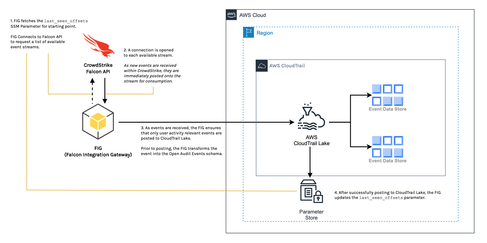

# AWS CloudTrail Lake Integration
AWS and CrowdStrike teamed to deliver this integration for AWS CloudTrail Lake that allows you to simplify and streamline the process of consolidating user activity data from CrowdStrike Falcon. With this integration, you gain unparalleled visibility into all user-relevant security activity within the Falcon console, including user creation, deletion, or modification, role changes, and authentication failures.

## Table of Contents
- [Overview](#overview)
  - [Architecture](#architecture)
  - [Data Flow](#data-flow)
- [Getting Started](#getting-started)
  - [Prerequisites](#prerequisites)
  - [Deployment](#deployment)
    - [Step 1: Create Falcon API Secrets in AWS Secrets Manager](#step-1-create-falcon-api-secrets-in-aws-secrets-manager)
    - [Step 2: Download the CloudFormation Template](#step-2-download-the-cloudformation-template)
    - [Step 3: Launch Stack w/ CloudFormation Template](#step-3-launch-stack-w-cloudformation-template)
    - [Step 4: Verify Deployment](#step-4-verify-deployment)
  - [Other Deployment Options](#other-deployment-options)
    - [Step 1: Create IAM Managed Policy](#step-1-create-iam-managed-policy)
    - [Step 2: Choose Deployment Option](#step-2-choose-deployment-option)
      - [Deployment to EKS](#deployment-to-eks)
      - [Manual Deployment](#manual-deployment)

## Overview
This integration provides CrowdStrike Falcon and AWS CloudTrail Lake consumers the ability to log and store
user activity data from CrowdStrike Falcon using AWS CloudTrail Open Audit Events. This is accomplished by tapping
into the CrowdStrike Falcon *event-stream* API, watching for relevant user activity events, and then publishing
these events to AWS CloudTrail Lake.

### Architecture
The AWS CloudTrail Lake integration consists of the following components:
- The Falcon Integration Gateway Python application used for ingesting events from the CrowdStrike API
  > This application is commonly referred to as the FIG
- AWS SSM Parameter Store
  > This is used to keep track of event offsets with the `last_seen_offsets` parameter. This parameter
  will be created for you and used to prevent sending duplicate events.
- AWS CloudTrail Lake - Event Data Store(s)
  > The FIG requires a Channel ARN in order to route the events to the correct EDS.



### Data Flow
1. The FIG application fetches the `last_seen_offsets` SSM parameter to ensure duplicate events aren't sent. The FIG then contacts the CrowdStrike Falcon API to request a list of available event streams.
    > If the `last_seen_offsets` SSM parameter does not exist, it will be created the first time it is ran.
1. A connection is opened to each available event stream. As new events are received within CrowdStrike,
these events are published to the event stream, which are then consumed by the FIG application.
1. The FIG application:
    1. Filters events as they are received.
        > Only events designated as user activity data is passed through.
    1. Transforms events into the AWS CloudTrail Open Audit Events schema.
    1. Publishes transformed events into AWS CloudTrail Lake.
        > The destination is determined by the *Channel* resource from creating an Event Data Store in
        AWS CloudTrail Lake.
1. As events are successfully published to CloudTrail Lake, the FIG updates the `last_seen_offsets` SSM parameter.
----------

## Getting Started
### Prerequisites
- Have a current CrowdStrike Subscription
- Have appropriate AWS permissions to run CloudFormation and create resources
- The Channel ARN from the CrowdStrike Partner Integration in AWS CloudTrail Lake
  > This sets up the Channel used to ingest events.
- Have a CrowdStrike API Key Pair

    This key pair will be used to read falcon events and supplementary information from CrowdStrike Falcon.
    > If you need to create a new API key pair, review our docs: [CrowdStrike Falcon](https://falcon.crowdstrike.com/support/api-clients-and-keys).

    Make sure to assign only the following permissions to the key pair:
    * Event streams: READ

### Deployment
The quickest deployment option is to deploy the Falcon Integration Gateway application via AWS ECS. With one CloudFormation template,
we can take advantage of the serverless architecture via ECS Fargate to run our containerized application.
> For more ways to deploy the FIG, see [Other Deployment Options](#other-deployment-options) below.

#### Step 1: Create Falcon API Secrets in AWS Secrets Manager
> :warning: Skip this step if you already have your API credentials stored in AWS Secrets Manager. Retrieve and save the *Secret ARN* for later use.

It's important to safeguard your API credentials for authenticating to the Falcon platform. By leveraging AWS' Secrets Manager, we can
ensure our credentials are safely stored.
> For more information on AWS Secrets Manager, see [AWS Secrets Manager](https://docs.aws.amazon.com/secretsmanager/latest/userguide/intro.html).

The example workflow below uses the following values, but you can use your own:
- *Secret Name*: `falcon-fig-api`<br>
- *Key Name for Client ID*: `client_id`<br>
- *Key Name for Client Secret*: `client_secret`

##### Step 1.1: Create Secret
1. Navigate to the [AWS Secrets Manager](https://console.aws.amazon.com/secretsmanager/home) console.
1. Select *Store a new secret*
1. Select *Other type of secrets*
1. Under *Key/Value*, enter the following:
    * *Key*: `client_id`
    * *Value*: `<Falcon Client ID>`
    * *Key*: `client_secret`
    * *Value*: `<Falcon Client Secret>`
1. Select *Next*
1. Under *Configure secret*, enter the following:
    * *Secret name*: `falcon-fig-api`
    * *Description*: `Falcon API Credentials`
1. Select *Next*
1. Select *Next*
1. Select *Store*

##### Step 1.2: Retrieve Secret ARN
1. Select the recently created secret
1. Copy and save the *Secret ARN* for later use

#### Step 2: Download the CloudFormation Template
Right Click [here](./assets/fig-ecs-lake-deployment.yaml?raw=1) and *Save Link As..*.
> :exclamation: Ensure you save the file with .yaml or .yml extension

#### Step 3: Launch Stack w/ CloudFormation Template

#### Parameters to Provide
* `VPC ID`: VPC where to run the FIG container
* `Subnet ID`: The Subnet ID where the FIG will be deployed
* `Falcon API Secrets Manager secrets ARN`: The ARN of the AWS Secrets Manager secret containing the Falcon API credentials created in Step 1.2
  * `Falcon API Client ID Key`: The key name for the Falcon API Client ID
  * `Falcon API Client Secret Key`: The key name for the Falcon API Client Secret
* `CloudTrail Lake Channel ARN`: The ARN of the CloudTrail Lake Channel created in the CrowdStrike Partner Integration
* `CloudTrail Lake Region`: The region where the CloudTrail Lake Channel was created

1. Navigate to the [AWS CloudFormation](https://console.aws.amazon.com/cloudformation/home) console.
1. Ensure you are in the correct region
   > :exclamation: CloudFormation is a regional service. This should be the region where your VPC/Subnet and Secrets Manager secret are located.
1. Select *Create stack*
   1. Select *With new resources (standard)*
1. Select *Upload a template file*
   1. Select *Choose file* and select the CloudFormation template you downloaded in Step 2
   1. Select *Next*
1. Give the stack a name and fill out the parameters with your appropriate values
   1. Select *Next*
1. Select *Next*
1. Select *I acknowledge that AWS CloudFormation might create IAM resources.*
   1. Select *Submit*

> This will take a few minutes to deploy. You can monitor the progress in the CloudFormation console.

#### Step 4: Verify Deployment
From the CloudFormation console, you can view the status of the stack deployment. Once the stack is in a *CREATE_COMPLETE* state, we can take advantage of the CloudWatch logs set by ECS to verify the FIG is running successfully.
1. In the AWS CloudFormation console, select the stack you just created.
1. Select the *Outputs* tab
   1. Copy and save the `FIGLakeLogGroup` value
1. Navigate to the [AWS CloudWatch](https://console.aws.amazon.com/cloudwatch/home) console.
1. Select *Logs* -> *Log groups*
   1. Paste the `FIGLakeLogGroup` value from the CloudFormation Outputs into the search bar and select the log group
   1. Under *Log streams*, select the most recent log stream

A successful deployment will have a similar log output:
```log
--------------------------------------------------------------------------------------------------------------------------------------------------------------------------
|   timestamp   |                                                                        message                                                                         |
|---------------|--------------------------------------------------------------------------------------------------------------------------------------------------------|
| 1674782681224 | 2023-01-27 01:24:41 fig MainThread INFO     AWS CloudTrail Lake Backend is enabled.                                                                    |
| 1674782681809 | 2023-01-27 01:24:41 fig MainThread INFO     SSM parameter last_seen_offsets does not exist. Creating...                                                |
| 1674782681907 | 2023-01-27 01:24:41 fig MainThread INFO     Enabled backends will only process events with types: {'AuthActivityAuditEvent'}                           |
| 1674782682522 | 2023-01-27 01:24:42 fig cs_stream  INFO     Opening Streaming Connection                                                                               |
| 1674782682882 | 2023-01-27 01:24:42 fig cs_stream  INFO     Established Streaming Connection: 200 OK                                                                   |
| 1674782683429 | 2023-01-27 01:24:43 fig worker-2   INFO     Processing user activity event: userAuthenticate ID: 0_42593                                               |
| 1674782683430 | 2023-01-27 01:24:43 fig worker-3   INFO     Processing user activity event: userAuthenticate ID: 0_42594                                               |
| 1674782683431 | 2023-01-27 01:24:43 fig worker-0   INFO     Processing user activity event: userAuthenticate ID: 0_42595                                               |
| 1674782683432 | 2023-01-27 01:24:43 fig worker-1   INFO     Processing user activity event: twoFactorAuthenticate ID: 0_42596                                          |
| 1674782684119 | 2023-01-27 01:24:44 fig worker-1   INFO     Successfully sent event ID: 0_42596 to CloudTrail Lake. (Request ID: 7e576b02-df2b-46c7-9a33-b288c93813a3) |
| 1674782684212 | 2023-01-27 01:24:44 fig worker-0   INFO     Successfully sent event ID: 0_42595 to CloudTrail Lake. (Request ID: a3909162-f47e-4d4d-8e23-eca930a931f3) |
| 1674782684214 | 2023-01-27 01:24:44 fig worker-3   INFO     Successfully sent event ID: 0_42594 to CloudTrail Lake. (Request ID: 95f12445-3518-4c1d-9b5c-d5f3350dd5dd) |
| 1674782684216 | 2023-01-27 01:24:44 fig worker-2   INFO     Successfully sent event ID: 0_42593 to CloudTrail Lake. (Request ID: 12a1175f-9f44-4d34-9a16-ccf4d959d011) |
| 1674782684217 | 2023-01-27 01:24:44 fig worker-1   INFO     Updated last seen offset for stream feed: 0 to: 42596                                                      |
| 1674782684217 | 2023-01-27 01:24:44 fig worker-1   INFO     Processing user activity event: twoFactorAuthenticate ID: 0_42599                                          |
| 1674782684315 | 2023-01-27 01:24:44 fig worker-3   INFO     Processing user activity event: userAuthenticate ID: 0_48643                                               |
| 1674782684499 | 2023-01-27 01:24:44 fig worker-1   INFO     Successfully sent event ID: 0_42599 to CloudTrail Lake. (Request ID: 38b97996-de9f-4c8b-aec8-18b9328dd2c3) |
| 1674782684545 | 2023-01-27 01:24:44 fig worker-1   INFO     Updated last seen offset for stream feed: 0 to: 42599                                                      |
| 1674782684668 | 2023-01-27 01:24:44 fig worker-3   INFO     Successfully sent event ID: 0_48643 to CloudTrail Lake. (Request ID: de4e7646-1897-4995-90fe-9fa3a59e72da) |
| 1674782684726 | 2023-01-27 01:24:44 fig worker-3   INFO     Updated last seen offset for stream feed: 0 to: 48643                                                      |
--------------------------------------------------------------------------------------------------------------------------------------------------------------------------
```


### Other Deployment Options
In order to use this integration with other deployment options, create an IAM Managed Policy that grants the FIG application access to the SSM Parameter Store and ability to send events to the CloudTrail Lake Channel ARN.

#### Step 1: Create IAM Managed Policy

Below are 2 ways to accomplish this:
- Launch a CloudFormation Stack using the [CloudFormation template](./assets/cs-integration-policy.yaml)
    > The Policy ARN is an output
- Or, you can manually create a Managed Policy with the following permissions:
    ```json
    {
        "Version": "2012-10-17",
        "Statement": [
            {
                "Action": "cloudtrail-data:PutAuditEvents",
                "Resource": "<Channel ARN>",
                "Effect": "Allow"
            },
            {
                "Action": [
                    "ssm:PutParameter",
                    "ssm:GetParameter"
                ],
                "Resource": "*",
                "Effect": "Allow"
            }
        ]
    }
    ```

    > **Make note of the Policy ARN after policy is created**

#### Step 2: Choose Deployment Option
Regardless of which deployment method you choose, the following values should be known ahead of time:

- ***Falcon API Credentials***:
    - Falcon Client ID
    - Falcon Client Secret
    - Falcon Client Region
- ***CloudTrail Lake***:
    - Channel ARN
    - AWS Region associated with the Channel
- ***Policy ARN***

**Prior to Deployment, please familiarize yourself with the available FIG [Configuration](https://github.com/CrowdStrike/falcon-integration-gateway/tree/main/config/config.ini) options.**


##### [Deployment to EKS](https://github.com/CrowdStrike/falcon-integration-gateway/tree/main/docs/cloudtrail-lake/eks)
> Deploy FIG on EKS with Helm chart or Kube spec
##### [Manual Deployment](https://github.com/CrowdStrike/falcon-integration-gateway/tree/main/docs/cloudtrail-lake/manual)
> Deploy FIG via Docker
