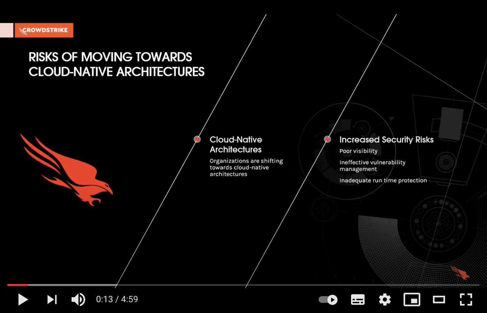

# CrowdStrike Container Security

## Runtime Protection
To protect container and Kubernetes workloads choose between the following approaches. Either install traditional Falcon Container Sensor for Linux on each node of your cluster, or set-up Falcon Container Sensor to be deployed as a sidecar to each of your pods.

Note: In Kubernetes clusters where kernel module loading is supported by the worker node OS, we recommend using Falcon sensor for Linux to secure both worker nodes and containers with a single sensor.

 - Falcon Sensor for Linux - deploying kernel-mode agent directly to the nodes
   - [Implementation Guide - Using Helm Charts in microk8s](kernel-microk8s-implementation-guide.md)
   - [Implementation Guide - Using Helm Charts in EKS](kernel-eks-implementation-guide.md)
 - Falcon Container Sensor - setting up cluster to deploy user space agent to each pod
   - [Implementation Guide for AWS EKS / Fargate](eks-implementation-guide.md)

## Additional Resources
 - CrowdStrike Container Security: [Product Page](https://www.crowdstrike.com/products/cloud-security/falcon-cloud-workload-protection/container-security/)
 - So You Think Your Containers Are Secure? Four Steps to Ensure a Secure Container Deployment: [Blog Post](https://www.crowdstrike.com/blog/four-steps-to-ensure-a-secure-containter-deployment/)
 - Container Security With CrowdStrike: [Blog Post](https://www.crowdstrike.com/blog/tech-center/container-security/)
 - To learn more about Falcon Container Sensor for Linux: [Deployment Guide](https://falcon.crowdstrike.com/support/documentation/146/falcon-container-sensor-for-linux), [Release Notes](https://falcon.crowdstrike.com/support/news/release-notes-falcon-container-sensor-for-linux)
