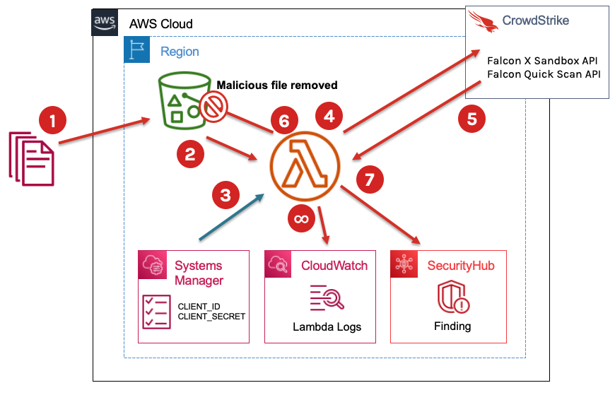

[](https://twitter.com/CrowdStrike)

# CrowdStrike Falcon S3 Bucket Protection

+ [Overview](#overview)
+ [Solution components](#solution-components)
+ [Demonstration](#demonstration)
+ [On-demand scanning](#on-demand-scanning)
+ [Deploying to an existing bucket](#deploying-to-an-existing-bucket)

## Overview
This solution integrates CrowdStrike Falcon Quick Scan with AWS S3, AWS Security Hub and AWS Systems Manager (Parameter Store), allowing for files to be scanned and threats remediated as objects are added to the bucket.

### Process diagram


### Process
1. Files are uploaded to the bucket.
2. Bucket triggers the lambda function.
3. Lambda function reads in Falcon API credentials from Systems Manager Parameter Store.
4. Lambda function uploads file to Falcon X Sandbox for analysis.
5. Lambda function retrieves the scan results.
6. Malicious files are immediately removed from the bucket.
7. A finding is generated in Security Hub for all malicious uploads.

> All lambda activity is also logged to Amazon CloudWatch.


## Solution components
This solution leverages an S3 bucket trigger to call AWS Lambda for processing. 
The serverless lambda function leverages the CrowdStrike [FalconPy SDK](https://github.com/CrowdStrike/falconpy) to
interact with the CrowdStrike Falcon API to scan the files as the are uploaded to the bucket.

+ [AWS S3](#aws-s3)
+ [AWS Lambda](#aws-lambda)
+ [AWS IAM](#aws-iam)
+ [AWS Systems Manager](#aws-systems-manager)

### AWS S3 
Any bucket can be protected by enabling the bucket notification trigger to call the lambda function.
- Bucket
- Bucket notification `s3:ObjectCreated:*` -> Lambda trigger

### AWS Lambda
A single serverless function is deployed for this solution.

#### Lambda function
- Python 3
- Must contain a `crowdstrike-falconpy` layer
- [Policy statement](#policy-statement)
- [Execution role](#lambda-execution-role)
- [Environment variables](#environment-variables)

##### Policy statement
- Statement ID: `AllowExecutionFromS3Bucket`
- Principal: `s3.amazonaws.com`
- Effect: `Allow`
- Action: `lambda:InvokeFunction`
- Conditions
  ```json
  {
      "ArnLike": {
          "AWS:SourceArn": "arn:aws:s3:::{LAMBDA_FUNCTION_NAME}"
      }
  }
  ```

##### Environment variables
- `base_url`: CrowdStrike API base URL (only required for GovCloud users.)
- `CLIENT_ID_PARAM`: Name of the Parameter store parameter containing the CrowdStrike API Key.
- `CLIENT_SECRET_PARAM`: Name of the Parameter store parameter containing the CrowdStrike API Secret.
- `MITIGATE_THREATS`: Boolean representing if identified threats should be removed from the bucket. Set to `FALSE` to disable mitigation, defaults to `TRUE`.

### AWS IAM
IAM is utilized to store execution permissions for our Lambda function.

#### Lambda execution role
The execution role for the Lambda function contains policies for SecurityHub, Systems Manager, S3 and CloudWatch.

+ [Security Hub](#security-hub-policy)
+ [S3](#s3-policy)
+ [Systems Manager](#systems-manager-policy)
+ [CloudWatch](#cloudwatch-policy)

##### Security Hub policy
```json
{
    "Statement": [
        {
            "Action": "securityhub:GetFindings",
            "Effect": "Allow",
            "Resource": "arn:aws:securityhub:{REGION}:{ACCOUNT_ID}:hub/default",
            "Sid": ""
        },
        {
            "Action": "securityhub:BatchImportFindings",
            "Effect": "Allow",
            "Resource": "arn:aws:securityhub:{REGION}:517716713836:product/crowdstrike/*",
            "Sid": ""
        }
    ],
    "Version": "2012-10-17"
}
```
> Note: The resource ARN for `securityhub:BatchImportFindings` must use the account ID specified above.

##### S3 policy
```json
{
    "Statement": [
        {
            "Action": [
                "s3:GetObjectVersion",
                "s3:GetObject",
                "s3:DeleteObjectVersion",
                "s3:DeleteObject"
            ],
            "Effect": "Allow",
            "Resource": "arn:aws:s3:::{BUCKET_NAME}/*",
            "Sid": ""
        }
    ],
    "Version": "2012-10-17"
}
```
##### Systems Manager policy
```json
{
    "Statement": [
        {
            "Action": [
                "ssm:GetParametersByPath",
                "ssm:GetParameters",
                "ssm:GetParameterHistory",
                "ssm:GetParameter"
            ],
            "Effect": "Allow",
            "Resource": "arn:aws:ssm:{REGION}:{ACCOUNT_ID}:parameter/*",
            "Sid": ""
        }
    ],
    "Version": "2012-10-17"
}
```
##### CloudWatch policy
```json
{
    "Statement": [
        {
            "Action": "logs:CreateLogGroup",
            "Effect": "Allow",
            "Resource": "arn:aws:logs:{REGION}:{ACCOUNT_ID}:*",
            "Sid": ""
        },
        {
            "Action": [
                "logs:PutLogEvents",
                "logs:CreateLogStream"
            ],
            "Effect": "Allow",
            "Resource": "arn:aws:logs:{REGION}:{ACCOUNT_ID}:log-group:/aws/lambda/{LAMBDA_FUNCTION_NAME}:*",
            "Sid": ""
        }
    ],
    "Version": "2012-10-17"
}
```

### AWS Systems Manager
Systems Manager Parameter Store is utilized to securely store our CrowdStrike API credentials.

#### Parameter Store parameters
- CrowdStrike API Key (SecureString)
- CrowdStrike API Secret (SecureString)


## Demonstration
A demonstration has been developed for this integration. This demonstration creates a new bucket, implements S3 Bucket Protection on that bucket, and then deploys an instance with several test scripts and sample files for testing the integration in a real environment. You may access this demonstration by executing the `demo.sh` script.

For more details regard this demonstration, review the content located [here](demo).

## On-demand scanning
For scenarios where you either do not want to implement real-time protection, or where you are wanting to confirm the contents of a bucket before implementing protection, an on-demand scanning solution is provided as part of this integration.

This solution leverages the same APIs and logic that is implemented by the serverless handler that provides real-time protection.

The read more about this component, review the documentation located [here](on-demand).

## Deploying to an existing bucket
A helper routine is provided as part of this integration that assists with deploying protection to an existing bucket. This helper leverages Terraform, and can be started by executing the `existing.sh` script.

For more details about deploying protection to a pre-existing bucket, review the documentation located [here](existing).