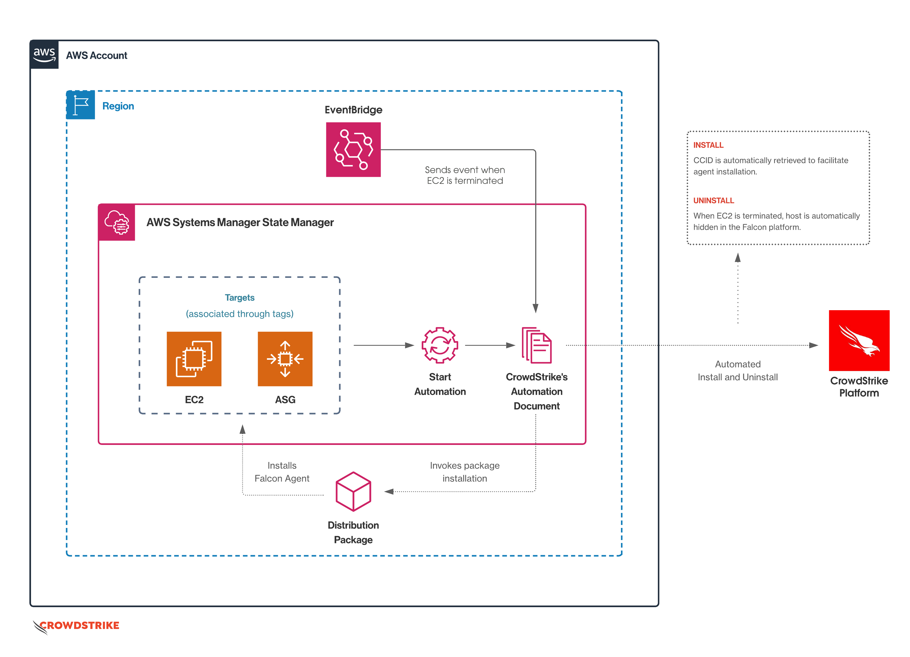
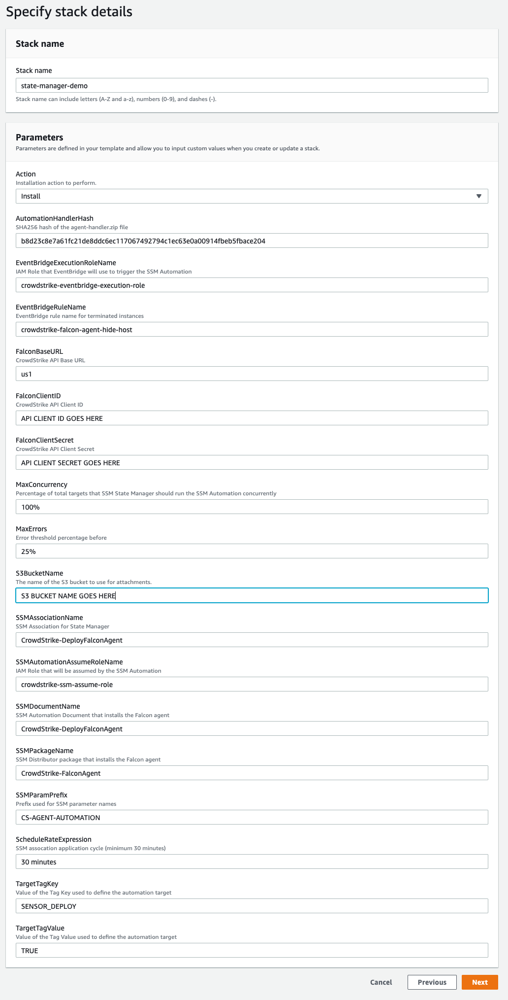
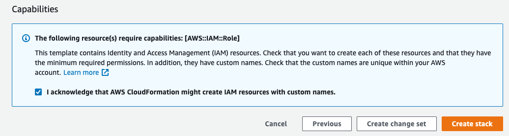
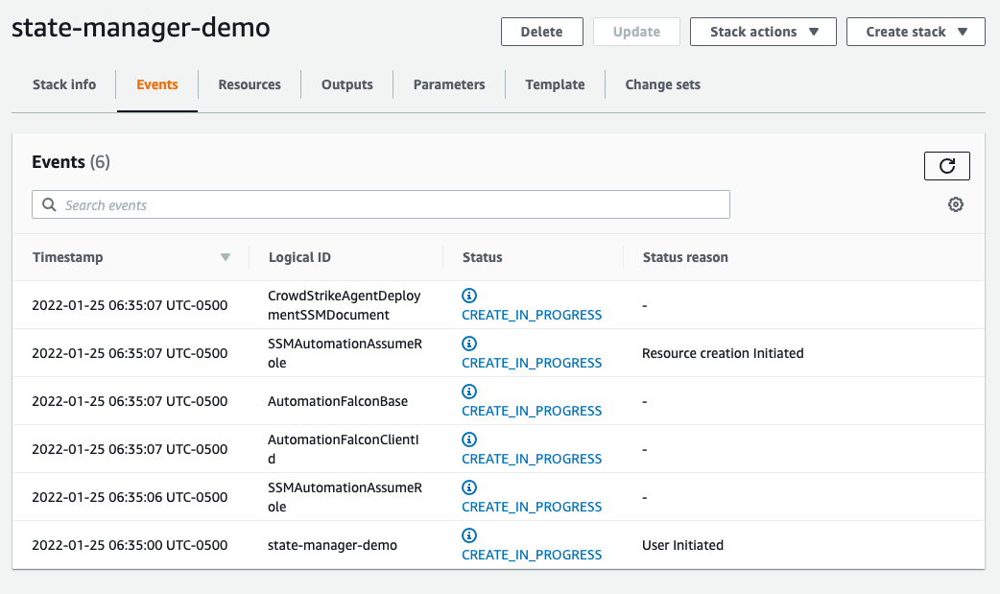
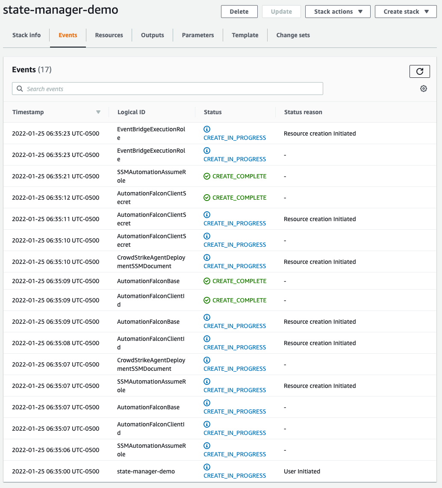
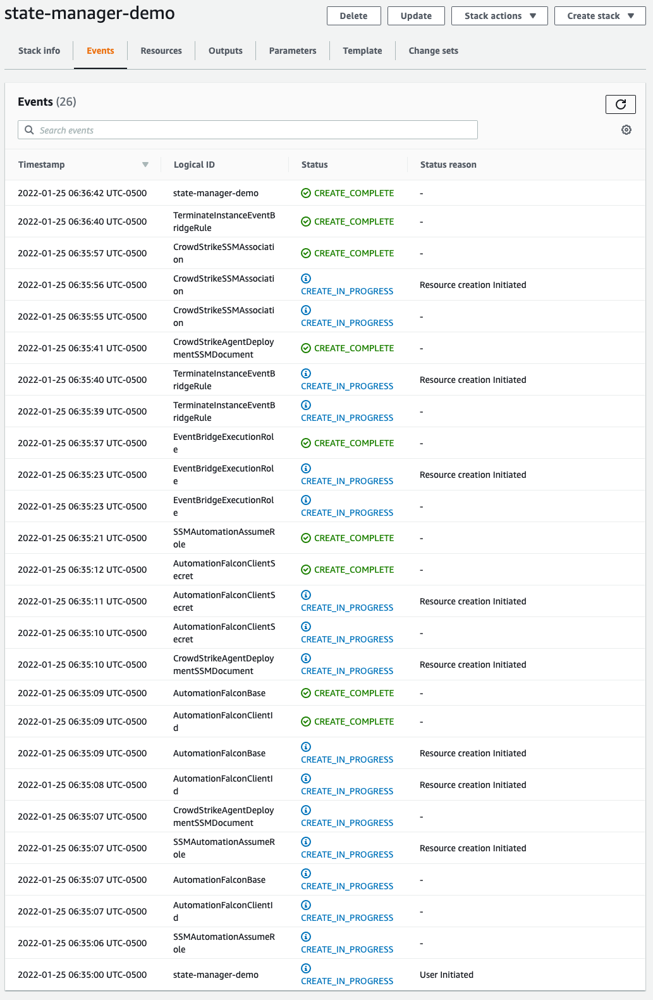

# Falcon Agent deployment using EventBridge and State Manager


- [Overview](#overview)
  + [Architecture Diagram](#architecture-diagram)
  + [Process](#process)
  + [Solution benefits](#solution-benefits)
  + [Additional notes](#additional-notes)
- [Solution Components](#solution-components)
  + [AWS EventBridge](#aws-eventbridge)
    - [Event pattern](#event-pattern)
  + [AWS IAM](#aws-iam)
    - [Execution Role](#execution-role)
      * [AmazonSSMAutomationRole](#amazonssmautomationrole)
      * [Allow Read EC2 access](#allow-read-ec2-access)
  + [AWS S3](#aws-s3)
  + [AWS Systems Manager](#aws-systems-manager)
    - [AWS Automation](#aws-automation)
    - [AWS Distributor](#aws-distributor)
    - [AWS Parameter Store](#aws-parameter-store)
    - [AWS State Manager](#aws-state-manager)
  + [CrowdStrike FalconPy](#crowdstrike-falconpy)
- [Implementation Steps](#implementation-steps)
  + [Prerequisites](#prerequisites)
  + [Helper Scripts](#helper-scripts)
  + [Deployment Steps](#deployment-steps)
    - [Step 1. Clone this repository](#step-1-clone-this-repository)
    - [Step 2. Create the SSM Distributor Package](#step-2-create-the-ssm-distributor-package)
    - [Step 3. Helper upload](#step-3-helper-upload)
    - [Step 4. Deploy the stack via CloudFormation](#step-4-deploy-the-stack-via-cloudformation)
      * [Parameters](#parameters)
      * [Deployment](#deployment)
        + [AWS CLI Deployment](#aws-cli-deployment)
        + [AWS Console Deployment](#aws-console-deployment)


## Overview
This solution leverages [The CrowdStrike Python SDK](#crowdstrike-falconpy), AWS EventBridge, and AWS Systems Manager ([AWS Automations](https://docs.aws.amazon.com/systems-manager/latest/userguide/systems-manager-state.html), AWS Distributor, and [AWS State Manager](https://docs.aws.amazon.com/systems-manager/latest/userguide/systems-manager-state.html)) to manage CrowdStrike Falcon agent deployment for EC2 instances. Upon instance termination, agents are automatically removed from the Falcon Console.

### Architecture Diagram



### Process

> _Process overview here_

### Solution benefits

- Automated agent deployment as part of instance lifecycle management
    - Support for all instances, regardless of infrastructure deployment patterns. (Standalone, Load-balanced, ASG, etc.)
    - Supports ephemeral instances
    - Addresses configuration drift
    - Removes terminated instances from the Falcon Console

### Additional notes

- AWS State Manager assocations apply on a scheduled basis, which can be overridden using the helper script (`apply_association.py`) provided. 
- This solutions provides support in the specific region where you deploy. If you're running multi-region workloads, deploy this solution across all regions you wish to manage.
- This solution demonstrates using **Tags** as a `Target Type`, and only supports one value due to AWS solution requirements. To learn more about the various types of targets available to you, read [SSM State Manager Association Target Types](#ssm-state-manager-association-target-types).

## Solution Components

> _Components detail here_

- [AWS EventBridge](#aws-eventbridge)
- [AWS IAM](#aws-iam)
- [AWS S3](#aws-s3)
- [AWS Systems Manager](#aws-systems-manager)
- [CrowdStrike FalconPy](#crowdstrike-falconpy)

### AWS EventBridge
AWS EventBridge is used to trigger the SSM Automation deployment document when instances are moved to the `terminated` status. This is handled using an EventBridge rule.

#### Event pattern
```json
{
  "detail-type": ["EC2 Instance State-change Notification"],
  "source": ["aws.ec2"],
  "detail": {
    "state": ["terminated"]
  }
}
```


### AWS IAM
IAM is utilized to store execution permissions for the automation.

#### Execution Role
This role is used to provide execution permissions to the SSM Automation document. There are two policies attached.

##### AmazonSSMAutomationRole
This is an AWS provided policy.

```json
{
    "Version": "2012-10-17",
    "Statement": [
        {
            "Effect": "Allow",
            "Action": [
                "lambda:InvokeFunction"
            ],
            "Resource": [
                "arn:aws:lambda:*:*:function:Automation*"
            ]
        },
        {
            "Effect": "Allow",
            "Action": [
                "ec2:CreateImage",
                "ec2:CopyImage",
                "ec2:DeregisterImage",
                "ec2:DescribeImages",
                "ec2:DeleteSnapshot",
                "ec2:StartInstances",
                "ec2:RunInstances",
                "ec2:StopInstances",
                "ec2:TerminateInstances",
                "ec2:DescribeInstanceStatus",
                "ec2:CreateTags",
                "ec2:DeleteTags",
                "ec2:DescribeTags",
                "cloudformation:CreateStack",
                "cloudformation:DescribeStackEvents",
                "cloudformation:DescribeStacks",
                "cloudformation:UpdateStack",
                "cloudformation:DeleteStack"
            ],
            "Resource": [
                "*"
            ]
        },
        {
            "Effect": "Allow",
            "Action": [
                "ssm:*"
            ],
            "Resource": [
                "*"
            ]
        },
        {
            "Effect": "Allow",
            "Action": [
                "sns:Publish"
            ],
            "Resource": [
                "arn:aws:sns:*:*:Automation*"
            ]
        }
    ]
}
```

##### Allow Read EC2 access
A limited read scope policy allows the automation to retrieve EC2 tags.

```json
{
    "Version": "2012-10-17",
    "Statement": [
        {
            "Action": [
                "ec2:DescribeInstances",
                "ec2:DescribeTags"
            ],
            "Resource": "*",
            "Effect": "Allow"
        }
    ]
}
```

### AWS S3
A single AWS S3 bucket is used to store the AWS Distributor package and the `agent-handler.zip` attachment layer.

### AWS Systems Manager
AWS Systems Manager is used to handle automation and deploy packages.

#### AWS Automation
A single SSM Automation Document is used to handle all agent management logic. This document contains steps for installation and removal of the agent, and includes an attachment containing the necessary helpers for interacting with your tenant within the CrowdStrike cloud.

#### AWS Distributor
A single AWS Distributor package is created, containing manifests and installers for Amazon Linux 2 (x64) and Microsoft Windows (10+/2016+). This is a bundled variation, so the binary installers are included within this distribution as well.

#### AWS Parameter Store
Three AWS Parameter Store parameters are created. These are used to provide credentials to the automation helper in a secure fashion.

#### AWS State Manager
A single AWS State Manager association is created, creating the relationship between our targets (any instances with the correct tag and tag value) and our automation document.

### CrowdStrike FalconPy
The CrowdStrike Python SDK, FalconPy is used to interact with the CrowdStrike API as part of automation steps.

The FalconPy SDK contains a collection of Python classes that abstract CrowdStrike Falcon OAuth2 API interaction, removing duplicative code and allowing developers to focus on just the logic of their solution requirements. 

FalconPy can be installed quickly using the following command:

```shell
python3 -m pip install crowdstrike-falconpy
```

For more details regarding FalconPy, refer to the project [repository](https://github.com/CrowdStrike/falconpy).


## Implementation Steps

### Prerequisites

1. AWS CLI with the appropriate console permissions.
    - EC2
    - EventBridge
    - IAM
    - S3
    - State Manager
2. The [AWS SSM Agent](https://docs.aws.amazon.com/systems-manager/latest/userguide/ssm-agent.html) is installed and configured properly instances you wish to target. ([Troubleshooting the SSM agent](https://aws.amazon.com/premiumsupport/knowledge-center/systems-manager-ec2-instance-not-appear/))
3. The CrowdStrike FalconPy SDK for Python
4. CrowdStrike API credentials with the following scopes:
    - Hosts: READ
    - Sensor Download : READ


### Helper Scripts

The following scripts are provided to assist with deploying and demonstrating this solution.

| Script name | Description |
| :--- | :--- |
| `apply_association.py` | This script will manually apply the SSM State Manager Association to the targets you've defined prior to the schedule you've assigned to your Association, allowing you to force the installation of the Falcon agent to newly created instances. |
| `build-helper.sh` | This script downloads CrowdStrike's latest AWS Lambda Layer for the [CrowdStrike Python SDK](https://github.com/CrowdStrike/falconpy). This layer archive is then updated to contain all of the necessary helper scripts for this integration and saved as `agent-helper.zip`. This file is then used as an attachment to the SSM Deployment document. Running this script is only required if you make changes to `cs_install_automation.py`. If you run this helper, you will need to update the SHA256 parameter provided to the CFT to match. |
| `create-package.sh` | This script downloads the CrowdStrike packager application and a Falcon sensor download sample from GitHub. These scripts are used to download the appropriate versions of the Falcon Sensor (Windows, Amazon Linux) and then packages these binary and installation/uninstallation scripts for each operating system, uploads them to a new or existing S3 bucket you specify, and then creates the AWS SSM Distributor package. This Distributor package is later used by AWS SSM Automation to manage the deployment of the Falcon Agent for the lifecycle of the targeted instance. |
| `cs_install_automation.py` | Collection of python scripts leveraging the [CrowdStrike Python SDK](https://github.com/CrowdStrike/falconpy) to lookup tenant details and delete agents for terminated hosts. This file is bundled within the `agent-handler.zip` file. |
| `helper-sha.sh` | Calculates the SHA256 value for the current version of the `agent-helper.zip` file. Provided if changes are required to `cs_install_automation.py`. |


### Deployment Steps

#### Step 1. Clone this repository
```shell
git clone https://github.com/CrowdStrike/Cloud-AWS/ cs-cloud-aws
cd cs-cloud-aws/state-manager
```

#### Step 2. Create the SSM Distributor Package
1. Navigate to the `ssm-distributor` folder inside this solution.
2. Execute the `create-package.sh` helper script.
    ```shell
    ./create-package..sh [FALCON API CLIENT ID] [FALCON API CLIENT SECRET] [AWS REGION] [SSM PACKAGE NAME] [S3 BUCKET NAME]
    ```
    **Example**
    ```shell
    ./create-package.sh $MY_KEY $MY_SECRET us-east-2 CrowdStrike-Falcon-Agent cs-agent-deployment-my-company
    ```
    > This script will automatically create the S3 bucket if you've passed in a name to a bucket that does not exist.
3. In your AWS Console, navigate to **Systems Manager** -> **Distributor** -> **_Owned by me_** and confirm that the package created successfully.

#### Step 3. Helper upload
Upload the `agent-handler.zip` file to the `script` folder in the S3 bucket.

- Using the AWS CLI.
  ```
  aws s3 cp util/agent-handler.zip s3://{BUCKET_NAME}/script/
  ```

OR
- Navigate to the AWS console and upload the file directly to the `script` folder. Create this folder if it does not exist.

#### Step 4. Deploy the stack via CloudFormation
A CloudFormation template is used to stand up the infrastructure for this solution. You can use deploy this template using the AWS Console or the command line.

##### Parameters
This template consumes the following parameters.

| Parameter | Description |
| :--- | :--- |
| `Action` | _Should be left as `Install`. `Uninstall` is used for event-based decomissioning via EventBridge._ |
| `AutomationHandlerHash` | _SHA256 hash of the `agent-handler.zip` file. This value only needs to be updated if you run the `build-helper.sh` utility. |
| `EventBridgeExecutionRoleName` | _(CloudFormation Resource) - Name of the IAM Role used by EventBridge to trigger the SSM Automation when an EC2 instance is terminated._ |
| `EventBridgeRuleName` | _(CloudFormation Resource) - Name of the EventBridge Rule used to trigger the SSM Automation when an EC2 instance is terminated._ |
| `FalconBaseUrl` | _CrowdStrike Base URL identify. Select either `us1`, `us2`, `eu1` or `usgov1`. (Only required for `usgov1` customers.) |
| `FalconClientID` | _CrowdStrike Falcon API Client ID with the **`Hosts: READ`** and **`Sensor Download: READ`** scopes.<BR/><BR/>**REQUIRED**_ |
| `FalconClientSecret` | _CrowdStrike Falcon API Client Secret.<BR/><BR/>**REQUIRED**_ |
| `MaxConcurrency` | _Percentage of total targets on which the SSM State Manager should run the SSM Automation on concurrently._ |
| `MaxErrors` | _Threshold percentage of failed instances in your Association before SSM State Manager deems the association as a failure._ |
| `S3BucketName` | _Name of the S3 bucket used to store the CrowdStrike Falcon distributor package, and the agent installation helper script.<BR/><BR/>**REQUIRED**_ |
| `SSMAssociationName` | _(CloudFormation Resource) - Name of the SSM State Manager Association used to manage the the lifecycle of the Falcon Agent._ |
| `SSMAutomationAssumeRoleName` | _(CloudFormation Resource) - Name of the IAM Role used by SSM Automation to manage the lifecycle of the Falcon Agent._ |
| `SSMDocumentName` | _(CloudFormation Resource) - Name of the SSM Document used to manage the manage the lifecycle of the Falcon Agent._ |
| `SSMPackageName` | _Name of the SSM Distributor package you created earlier in the guide. Leave this unchanged unless you passed a different value to the `-p` flag._ |
| `SSMParamPrefix` | _Prefix used for SSM parameter names created._ |
| `ScheduleRateExpressions` | _Rate at which SSM State Manager should re-apply the Association, expressed in [Rate Expressions](https://docs.aws.amazon.com/systems-manager/latest/userguide/reference-cron-and-rate-expressions.html). _Associations support the following rate expressions: intervals of 30 minutes or greater and less than 31 days._ |
| `TargetTagKey` | _Name of the tag used for instance targeting._<BR/><BR/>**Default Value: _SENSOR_DEPLOY_**  |
| `TargetTagValue` | _Value of the tag used for instance targeting._<BR/><BR/>**Default Value: _TRUE_** |

##### Deployment

- [AWS CLI deployment](#aws-cli-deployment)
- [AWS Console deployment](#aws-console-deployment)

###### AWS CLI Deployment
```shell
aws cloudformation create-stack --stack-name [STACK-NAME] \
  --template-body file://ssm_agent_deployment_by_tag.yaml \
  --parameters ParameterKey=FalconClientID,ParameterValue=[FalconClientID] \
    ParameterKey=FalconClientSecret,ParameterValue=[FalconClientSecret] \
    ParameterKey=S3BucketName,ParameterValue=[S3BucketName] \
  --region [AWS REGION] --capabilities CAPABILITY_NAMED_IAM
```

###### AWS Console Deployment

1. In your AWS Console, navigate to **CloudFormation -> Create stack -> With new resources (standard)**

2. Under **Specify template**, select **Upload a template file** and upload the `ssm_agent_deployment_by_tag.yaml` included in this solution, then click **Next**
   

3. Provide a **Stack name** and update the **Parameters** if the default values don't match your deployment:
   

4. Apply any additional tags or advanced configuration options necessary for your environment (none are required) and then click **Next**.
   

5. Review your selections, and then on the bottom of the page click the `I acknowledge that AWS CloudFormation might create IAM resources with custom names` check box. After doing so, click the **Create Stack** button.
   

6. Your stack will now start to deploy.
   

   You can click the refresh button to watch as the deployment progresses.
   

   You will be presented with a `CREATE_COMPLETE` message for the stack when the process has finished.
   


