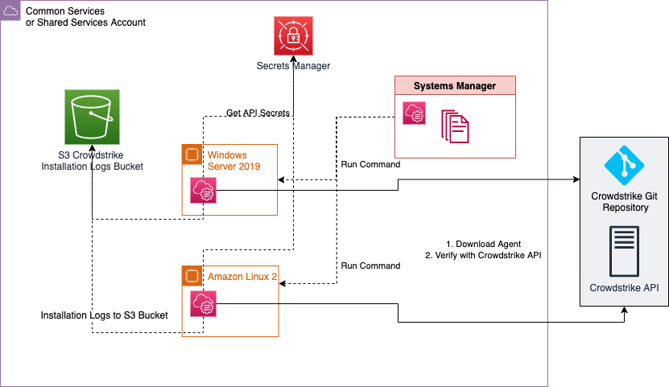

# Systems Manager CrowdStrike Continuous Deployment

Using a combination of [Systems Manager State Manager](https://docs.aws.amazon.com/systems-manager/latest/userguide/systems-manager-state.html), [State Manager Associations](https://docs.aws.amazon.com/systems-manager/latest/userguide/systems-manager-state-manager-targets-and-rate-controls.html), [AWS Secrets Manager](https://aws.amazon.com/secrets-manager/), and an [SSM Document](https://docs.aws.amazon.com/systems-manager/latest/userguide/sysman-ssm-docs.html), you can install [CrowdStrike Falcon EDR](https://www.crowdstrike.com/products/endpoint-security/falcon-insight-edr/) on Systems Manager Managed EC2 Instances and ensure installation of Falcon EDR on all new instances, in an account.

This does not rely on SSM Distributor packages, nor Lambda functions, and therefore supports more operating systems as of February 2023.

See "Prerequisites" for requirements to leverage this pattern. 

## Preqrequisites

### Deploying with CloudFormation

* An AWS Account to deploy the infrastructure within.
* A role within the AWS account that you are able create AWS resources with.
* CrowdStrike Subscription with API Customer ID and Customer Key.
* EC2 Instances with the SSM Agent installed.
* EC2 Instances with internet connectivity, in order to validate with the CrowdStrike API and download and install the CrowdStrike Agent.
* EC2 Instances with an instance profile allowing SSM functionality.

## Limitations 

* This pattern [cURLs](https://curl.se/docs/manpage.html) directly from the [Official CrowdStrike repository](https://github.com/CrowdStrike/Cloud-AWS/) in order to minimize creation of AWS resources to deploy the solution, this requires upstream trust of the integrity of the CrowdStrike repository.
* This pattern only installs CrowdStrike on Windows and Linux Operating Systems with the SSM Agent installed.

## Product versions

Supported Operating Systems:
* All Windows Operating Systems with SSM Agent Installed and [PowerShell](https://learn.microsoft.com/en-us/powershell/scripting/overview?view=powershell-7.3) enabled
* All Linux Operating Systems with SSM Agent Installed and [Bash](https://www.gnu.org/software/bash/manual/html_node/index.html) enabled

## Target technology stack  

* Amazon EC2 Instances
* AWS Systems Manager Inventory
* AWS Systems Manager Compliance Check
* AWS Systems Manager SSM Documents
* Secrets Manager
* Crowstrike Falcon EDR

## Target architecture 



## Automation and scale

* To deploy for scaled use, deploy the solution to one central account, such as “Shared Services/Common Services” from a Control Tower or Landing Zone account model. For most efficient usage of resources, assuming there is only one CrowdStrike account for the environment, the CrowdStrike Secrets should be centralized in a single account, and shared cross account, reducing Secrets Manager cost. Grant consumer accounts permission to access to the Secrets Manager CrowdStrike Secrets, such as with Attribute Based Access Control (ABAC). For example, in Customizations for Control Tower, add permissions to have access to the CrowdStrike Secrets in the Shared Services/Common Services account. 

## FAQ

_Why not "bake" CrowdStrike into an [AMI](https://docs.aws.amazon.com/AWSEC2/latest/UserGuide/AMIs.html) with a Golden Image Pipeline?_

You should, but for scenarios where you do not have one or you need to bring live or orphaned instances into compliance quickly, this solution solves that.

_Why not check instance compliance with a [Custom Config Rule](https://docs.aws.amazon.com/config/latest/developerguide/evaluate-config_develop-rules.html) and a [Lambda function](https://docs.aws.amazon.com/lambda/latest/dg/welcome.html) for the existence of CrowdStrike and remediate only if they do not comply with the config rule?_

This produces a similar end result, but requires moving the code that is in the SSM Document to exist in a Lambda function for the custom config rule, and that Lambda function cannot be used as easily to scale out as an SSM Document. That architecture also requires enablement of AWS Config and requires more resources and cost for customers.

_Why run these against all instances in Systems Manager and not a subset or a set of [untagged instances](https://docs.aws.amazon.com/AWSEC2/latest/UserGuide/Using_Tags.html)?_

This solution is intended for less governed environments, where resources may be untagged or an unknown number of instances may not have endpoint tooling. This is common when you need to govern development or test environments which may have teams spinning up instances which do not follow a standard.

## Deployment steps
### CloudFormation deployment

1. Setup your AWS temporary credentials.

   See if the AWS CLI is installed: 

``` bash
   $ aws --version
   aws-cli/1.16.249 Python/3.6.8...
```

&nbsp;&nbsp;&nbsp;&nbsp;&nbsp;&nbsp;&nbsp;&nbsp;&nbsp;AWS CLI version 1.1 or higher is fine.

&nbsp;&nbsp;&nbsp;&nbsp;&nbsp;&nbsp;&nbsp;&nbsp;&nbsp;If you instead received `command not found` then install the AWS CLI.

2. Run aws configure and provide the following values:
``` bash
 $ aws configure
 AWS Access Key ID [*************xxxx]: <Your AWS Access Key ID>
 AWS Secret Access Key [**************xxxx]: <Your AWS Secret Access Key>
 Default region name: [us-east-1]: <Your desired region for deployment>
 Default output format [None]: <Your desired Output format>
```
3. Clone the repository with HTTPS or SSH

   _HTTPS_
``` bash
git clone https://github.com/CrowdStrike/Cloud-AWS.git
```
&nbsp;&nbsp;&nbsp;&nbsp;&nbsp;&nbsp;&nbsp;&nbsp;&nbsp;_SSH_

``` bash
git clone git@github.com:CrowdStrike/Cloud-AWS.git
```
4. Navigate to the directory containing the CloudFormation before running the commands below:
``` bash
cd Cloud-AWS/systems-manager/cloudformation
```

5. Run the following from the AWS CLI:

``` bash
aws cloudformation create-stack --template-body file://cs_continuous_deploy.yml --stack-name crowdstrike-ssm-cont-deploy \
--parameters ParameterKey=CSAPISecret,ParameterValue="CrowdStrikeAPIKey" ParameterKey=CID,ParameterValue="CrowdStrikeCID" ParameterKey=CSAPIGatewayID,ParameterValue="GatewayAPIID" ParameterKey=CrowdStrikeLogBucket,ParameterValue="example-crowdstrike-logging-bucket-0123" ParameterKey=ComplianceSeverity,ParameterValue="HIGH ParameterKey=CRONExpression,ParameterValue="cron(0 23 23 ? * * *)"
```

6. Run the following AWS CLI command to create the stack.
``` bash
aws cloudformation create-stack --template-body file://cs_continuous_deploy.yml --stack-name crowdstrike-ssm-cont-deploy --parameters file://params.json
```
7. Validate your Stack deployment
After successful completion of your CloudFormation deploy, if provisioning locally, you should see this snippet in your local machine’s terminal:
``` bash
Successfully created/updated stack - crowdstrike-ssm-cont-deploy
```


8. (Optional) Delete the CloudFormation Stack
Teardown the infrastructure with the following commands: The CloudFormation Stack does not force destroy AWS Secrets Manager Secrets, so they must be force destroyed with the second command.
``` bash
aws cloudformation delete-stack \
    --stack-name crowdstrike-ssm-cont-deploy
```
``` bash
aws secretsmanager delete-secret --secret-id crowdstrike/apiKey --force-delete-without-recovery --region <YOUR-DEPLOYMENT-REGION> && aws secretsmanager delete-secret --secret-id crowdstrike/apiClientID --force-delete-without-recovery --region <YOUR-DEPLOYMENT-REGION> && aws secretsmanager delete-secret --secret-id crowdstrike/clientID --force-delete-without-recovery --region <YOUR-DEPLOYMENT-REGION>
```

## Troubleshooting

When running CloudFormation deploy commands from your local machine, you may encounter an error similar to the following:

``` properties
error calling sts:GetCallerIdentity: operation error STS: GetCallerIdentity, https response error StatusCode: 403, RequestID: 123456a9-fbc1-40ed-b8d8-513d0133ba7f, api error InvalidClientTokenId: The security token included in the request is invalid.
```

This error is due to the expiration of the security token for the credentials used in your local machine’s configuration.

See "[Set and View Configuration Settings](https://docs.aws.amazon.com/cli/latest/userguide/cli-configure-files.html#cli-configure-files-methods)" from the AWS Command Line Interface Documentation to resolve.

## References

* [How to get Access to CrowdStrike API](https://www.crowdstrike.com/blog/tech-center/get-access-falcon-apis/)
* [Crowdstrike Falcon EDR Linux Install Repository](https://github.com/CrowdStrike/falcon-scripts/tree/main/bash)
* [Crowstrike Falcon EDR Windows Install Repository](https://github.com/CrowdStrike/falcon-scripts/tree/main/powershell)

## Author

* Mike Saintcross [msntx](https://github.com/msntx)