# CrowdStrike and AWS Systems Manager

**Contents**

- [AWS Systems Manager](#aws-systems-manager)
    * [Monitor -- Monitor resources and applications](#monitor----monitor-resources-and-applications)
    * [Audit -- Audit resource configurations, user access and policy enforcement](#audit----audit-resource-configurations--user-access-and-policy-enforcement)
    * [Manage -- Take operation action on resources](#manage----take-operation-action-on-resources)
    * [Optimise -- Improve efficiency and security posture](#optimise----improve-efficiency-and-security-posture)
- [CrowdStrike and AWS Systems Manager](#crowdstrike-and-aws-systems-manager)
    * [Falcon Agent Installation](#falcon-agent-installation)
- [Package Documents](#package-documents)
- [Overview of the Setup Process.](#overview-of-the-setup-process)
- [Setting up and Using Systems Manager](#setting-up-and-using-systems-manager)
- [Agent Install Process](#agent-install-process)
- [Setup Systems Manager](#setup-systems-manager)
    * [Step 1 - Create your AWS SSM package](#step-1---create-your-aws-ssm-package)
        + [Option A - Creating a Package with the Installer](#option-a---creating-a-package-with-the-installer)
        + [Option B - Creating a Package without the Installer](#option-b---creating-a-package-without-the-installer)
    * [Step 2 - Verify the files in the S3 bucket](#step-2---verify-the-files-in-the-s3-bucket)
    * [Step 3 - Create the Cloudformation Stack](#step-3---create-the-cloudformation-stack)
        + [Deploy the cloudformation template](#deploy-the-cloudformation-template)
- [Installing the CrowdStrike Falcon agent](#installing-the-crowdstrike-falcon-agent)
    * [Installing With the GUI](#installing-with-the-gui)
    * [Installing With the CLI](#installing-with-the-cli)
    * [Installing With Python](#installing-with-python)
- [Troubleshooting](#troubleshooting)
    + [Linux logs](#linux-logs)
    + [Windows logs](#windows-logs)

## AWS Systems Manager

AWS Systems Manager allows you to centralize operational data from multiple AWS services and automate tasks across your
AWS resources.

Systems Manager Capabilities can be separated into four categories.

### Monitor -- Monitor resources and applications

You can create logical groups of resources such as applications, different layers of an application stack, or production
versus development environments. With Systems Manager, you can select a resource group and view its recent API activity,
resource configuration changes, related notifications, operational alerts, software inventory, and patch compliance
status.

Systems Manager uses AWS CloudWatch for monitoring

### Audit -- Audit resource configurations, user access and policy enforcement

Systems Manager uses AWS CloudTrail AWS Config for Audit

### Manage -- Take operation action on resources

AWS Systems Manager allows you to safely automate common and repetitive IT operations and management tasks. With Systems
Manager Automation, you can use predefined playbooks, or you can build, run, and share wiki-style automated playbooks to
enable AWS resource management across multiple accounts and AWS Regions.

### Optimise -- Improve efficiency and security posture

You can also take action on each resource group depending on your operational needs. Systems Manager provides a central
place to view and manage your AWS resources, so you can have complete visibility and control over your operations.

Systems Manager uses AWS Trusted Advisor, AWS Cost and Usage Report and AWS Cost Explorer

## CrowdStrike and AWS Systems Manager

AWS Systems Manager Distributor is a feature that you can use to securely store and distribute software packages, such
as software agents, in your accounts. Distributor integrates with existing Systems Manager features to simplify and
scale the package distribution, installation, and update process.

### Falcon Agent Installation

As part of Systems Manager Management capabilities, the Distributor function provides a mechanism for installing the
Falcon Agent on instance types that support the systems manager agent.

Linux

SSM Agent is installed by default on Amazon Linux, Amazon Linux 2, Ubuntu Server 16.04, and Ubuntu Server 18.04 LTS base
EC2 AMIs.

Windows

SSM Agent is installed by default on instances created from Windows Server 2016 and Windows Server 2019 Amazon Machine
Images (AMIs), and on instances created from Windows Server 2008-2012 R2 AMIs published in November 2016 or later.

The SSM agent is supported on other operating systems but must be installed manually

A complete list of supported systems can be found here.

<https://docs.aws.amazon.com/systems-manager/latest/userguide/prereqs-operating-systems.html>

Systems Manager uses "documents" to perform automation tasks. An AWS Systems Manager document (SSM document) defines the
actions that Systems Manager performs on managed instances. Documents use JavaScript Object Notation (JSON) or YAML, and
they include steps and parameters that you specify.

There are currently six types of document with Systems Manager but only three directly relate to CrowdStrike Falcon
agent.

| **Type** | **Use with** | **Details** |
| --- | --- | --- |
| Command document | [Run Command](https://docs.aws.amazon.com/systems-manager/latest/userguide/execute-remote-commands.html)[State Manager](https://docs.aws.amazon.com/systems-manager/latest/userguide/systems-manager-state.html)[Maintenance Windows](https://docs.aws.amazon.com/systems-manager/latest/userguide/systems-manager-maintenance.html) | Run Command uses command documents to run commands. State Manager uses command documents to apply a configuration. These actions can be run on one or more targets at any point during the lifecycle of an instance. Maintenance Windows uses command documents to apply a configuration based on the specified schedule. |
| Automation document | [Automation](https://docs.aws.amazon.com/systems-manager/latest/userguide/systems-manager-automation.html)[State Manager](https://docs.aws.amazon.com/systems-manager/latest/userguide/systems-manager-state.html)[Maintenance Windows](https://docs.aws.amazon.com/systems-manager/latest/userguide/systems-manager-maintenance.html) | Use automation documents when performing common maintenance and deployment tasks such as creating or updating an Amazon Machine Image (AMI). State Manager uses automation documents to apply a configuration. These actions can be run on one or more targets at any point during the lifecycle of an instance. Maintenance Windows uses automation documents to perform common maintenance and deployment tasks based on the specified schedule. |
| Package document | [Distributor](https://docs.aws.amazon.com/systems-manager/latest/userguide/distributor.html) | In Distributor, a package is represented by an SSM document. A package document includes attached ZIP archive files that contain software or assets to install on managed instances. Creating a package in Distributor creates the package document. |

## Package Documents

A package is a collection of installable software or assets that includes the following.

- A zip file of software per target operating system platform. Each zip file must include the following.

  An install and an uninstall script. Windows Server-based instances require PowerShell scripts (scripts named
  install.ps1 and uninstall.ps1). Linux-based instances require shell scripts (scripts named install.sh and
  uninstall.sh). SSM Agent reads and carries out the instructions in the install and uninstall scripts.


- A JSON-formatted manifest file that describes the package contents. The manifest is not included in the .zip file, but
  it is stored in the same Amazon S3 bucket as the .zip files that form the package. The manifest identifies the package
  version and maps the .zip files in the package to target instance attributes, such as operating system version or
  architecture. For information about how to create the manifest,
  see [Step 2: Create the JSON package manifest](https://docs.aws.amazon.com/systems-manager/latest/userguide/distributor-working-with-packages-create.html#packages-manifest)
  .

After you create a package in Distributor, which creates an AWS Systems Manager document, you can the use automation
documents to deliver the packages to your ec2 instances

- One time by
  using [AWS Systems Manager Run Command](https://docs.aws.amazon.com/systems-manager/latest/userguide/execute-remote-commands.html)
  .

- On a schedule by
  using [AWS Systems Manager State Manager](https://docs.aws.amazon.com/systems-manager/latest/userguide/systems-manager-state.html)
  .

You can use Run Command or State Manager to control which of your managed instances get a package and which version of
that package. Managed instances can be grouped by instance IDs, AWS account numbers, tags, or AWS Regions.

## Overview of the Setup Process.

## Setting up and Using Systems Manager

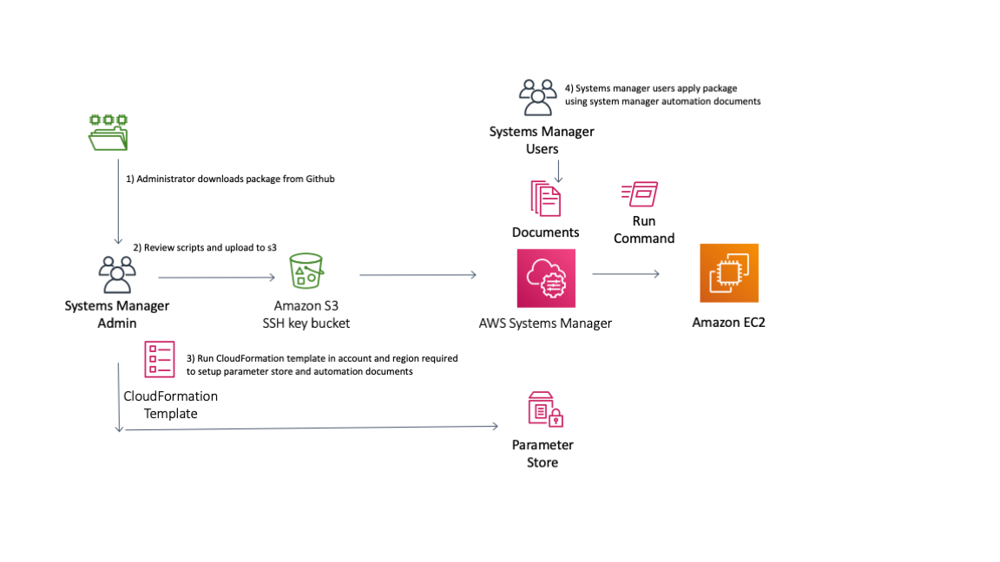
Diagram showing the steps in the setup process.

1) Customer downloads the files in this github repository and reviews the install and uninstall scripts provided.

   Example install and uninstall scripts are included in the folder in the required directory structure. Refer to the
   AWS documentation for more information about creating packages.

   https://docs.aws.amazon.com/systems-manager/latest/userguide/distributor-working-with-packages-create.html#distributor-working-with-packages-create-adv

2) Customer uploads package contents to an S3 bucket.

3) Customer applies a CloudFormation template that sets up the required Parameters in the AWS parameter store. These
   parameters are required by the installation scripts. The cloudformation template will also create the distributor
   package in the customer account.

4) System manager users can now use Run commands to install/uninstall the sensor on the EC2 instance.

## Agent Install Process

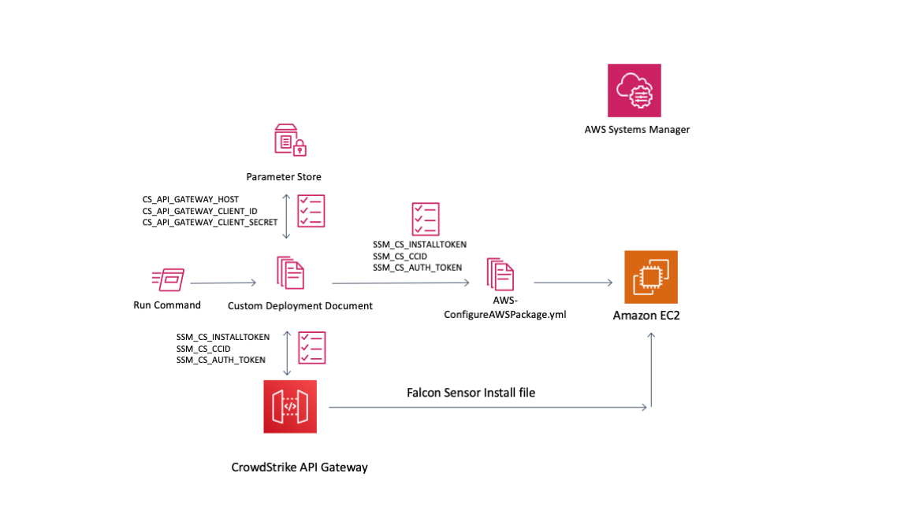

When a Systems manager administrator wishes to install the CrowdStrike sensor on an EC2 distance they will use a
automation document to perform the task. During the agent install process the following tasks are performed.

1) Administrator invokes the automation script via the Systems Manager API, aws cli or Console.


2) The automation script retrieves the CrowdStrike API keys from the Systems Manager Parameter Store.
    - CS_API_GATEWAY_HOST: (CrowdStrike API 'api.crowdstrike.com')
    - ACS_API_GATEWAY_CLIENT_ID: (CrowdStrike API Client ID Key)
    - ACS_API_GATEWAY_CLIENT_SECRET: (CrowdStrike API Secret Key)

   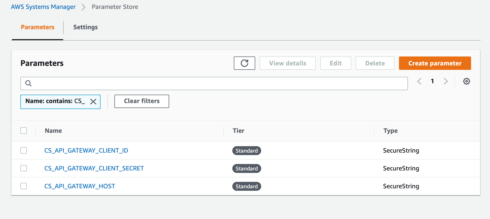

3) The automation script runs a python task that authenticates to the CrowdStrike API and generates an OAuth token


4) The automation script runs a python task that fetches the CID and installation token


5) The automation script then invokes the AWS `AWS-ConfigureAWSPackage` and passes the following parameters to it
    - SSM_CS_INSTALLTOKEN: (CrowdStrike Installation Token)
    - SSM_CS_CCID: (CrowdStrike Customer CID)
    - SSM_CS_INSTALLPARAMS: (Additional Install Params)
    - SSM_CS_AUTH_TOKEN: (CrowdStrike API OAuth2 token)

The `AWS-ConfigureAWSPackage` is a standard AWS package that invokes the process of delivering the software package to
the instance and invoking the install/uninstall scripts.

Running the automation document

## Setup Systems Manager

### Step 1 - Create your AWS SSM package

Select from one of two methods of delivering the CrowdStrike agent to the ec2 instance.

Option-A - Create an install package that combines the installation scripts with the CrowdStrike Falcon installer. For
information on how to complete these steps follow the
guide [here](https://github.com/CrowdStrike/Cloud-AWS/blob/master/systems-manager/Packaging-utilities/examples/linux-sensor-binary/README.md)
.

Option-B - Create an install package that uses installation scripts to download the CrowdStrike Falcon installer during
installation. For information on how to complete these steps follow the
guide [here](https://github.com/CrowdStrike/Cloud-AWS/blob/master/systems-manager/Packaging-utilities/examples/linux-sensor-download/README.md)

Two zip files are included in the *Packaging-utilities/zip-files* folder that contain example files for creating a
CrowdStrike package for AWS Systems Manager.

* `Package-sensor-download.zip` contains the files required to create a package where the sensor is downloaded from the
  CrowdStrike sensor download API.


* `Package-with-binary.zip` contains the files required to create a package where the sensor is bundled with the
  installer scripts and pushed to the host using the systems manager agent. A copy of the instructions with examples is
  here [README.md](https://github.com/CrowdStrike/Cloud-AWS/tree/systems-manager/systems-manager/Packaging-utilities/examples/linux-sensor-binary)

Select one of the above zip files and unzip its contents to a new location. Once unzipped follow the instructions for
Option-A or Option-B

#### Option A - Creating a Package with the Installer

This steps describes how to setup AWS systems manager where the CrowdStrike binary is packaged with the sensor install
script.

1) Create a new directory
2) Unzip the file package-with-binary.zip

```text
user@host linux-sensor-binary % ls -al
total 40
drwxr-xr-x  9 jharris  staff    288  9 Mar 20:07 .
drwx------@ 9 jharris  staff    288  9 Mar 20:04 ..
drwxr-xr-x  6 jharris  staff    192  8 Mar 18:35 CS_AMAZON
drwxr-xr-x  5 jharris  staff    160  5 Mar 17:14 CS_WINDOWS
-rw-r--r--  1 jharris  staff   1725  5 Mar 17:11 README.md
-rw-r--r--@ 1 jharris  staff    167  8 Mar 16:08 agent_list.json
drwxr-xr-x  3 jharris  staff     96  5 Mar 18:13 aws-automation-doc
-rw-r--r--  1 jharris  staff  10040  9 Mar 11:00 packager.py
drwxr-xr-x  4 jharris  staff    128  9 Mar 20:05 s3-bucket
```

The example contains the directories CS_AMAZON and CS_WINDOWS. Each directory should contain the following

* Install script
* Uninstall script
* Sensor Binary for the particular OS

```text
user@host CS_WINDOWS % ls -al
total 82056
drwxr-xr-x  5 jharris  staff       160  5 Mar 17:14 .
drwxr-xr-x  9 jharris  staff       288  9 Mar 20:38 ..
-rw-r--r--  1 jharris  staff  42003824  2 Apr  2020 WindowsSensor.exe
-rwxr-xr-x@ 1 jharris  staff      1137 25 Jun  2019 install.ps1
-rwxr-xr-x@ 1 jharris  staff        50 25 Jun  2019 uninstall.ps1
```      

The root folder should contain an "agent_list.json" file. The agent_list.json file should list all the directories that
will be included in the package. The file should be in json format and contain a list of objects containing the
following keys * os * dir * file

An example 'agent_list.json' file.

  ```yaml
[
  {
    "os": "windows",
    "dir": "CS_WINDOWS",
    "file": "CS_WINDOWS.zip"
  },
  {
    "os": "amazon",
    "dir": "CS_AMAZON",
    "file": "CS_AMAZON.zip"
  }
]
  ```

Execute the script "packager.py". The file performs the following functions dependent on the parameters provided

* No Params - The script will parse the agent_list.json file and generate the *.zip and manifest.json file that is added
  to the s3bucket folder.


* AWS_REGION and S3BUCKET Params - The script will generate the zip and manifest files and upload them to an s3bucket


* AWS_REGION and S3BUCKET and PACKAGE_NAME Params - The script will generate the zip and manifest files upload to the
  bucket and generate the package document in systems manager.

Usage

```txt
   % python3 packager.py -h

    usage: packager.py [-h] -r AWS_REGION -b S3BUCKET -p PACKAGE_NAME

    Script execution
    
    1) Iterates over the "dir's" and creates a Zip file of the contents with the name of "file".
    2) Checks for the existence of the S3 bucket and creates it if it does not exist
    3) Uploads the Zip files to a /falcon folder in the bucket.
```   

Example of the generated files in the s3bucket folder

```text
user@host s3-bucket % ls -al
total 86072
drwxr-xr-x  7 jharris  staff       224  9 Mar 20:58 .
drwxr-xr-x  9 jharris  staff       288  9 Mar 20:38 ..
-rw-r--r--  1 jharris  staff   2072000  9 Mar 20:42 CS_AMAZON.zip
-rw-r--r--  1 jharris  staff  41759324  9 Mar 20:42 CS_WINDOWS.zip
-rw-r--r--  1 jharris  staff     10038  5 Mar 18:13 Local-CrowdStrike-Automation-Doc.yml
-rw-r--r--  1 jharris  staff       414  9 Mar 20:42 manifest.json
-rw-r--r--  1 jharris  staff       148  9 Mar 20:42 packager.log
```

#### Option B - Creating a Package without the Installer

* The DEFAULT for install will be (latest-release)-2. For example if the latest release of the linux sensor is 5.34.9918
  the DEFAULT version installed would be 5.33.9808.  
  It is expected that once installed, sensor versions will be managed via the falcon console.

This guide describes how to setup AWS systems manager where the CrowdStrike binary is downloaded from the CrowdStrike
API.

1) Create a new directory
2) Unzip the file package-without-binary.zip

```text
user@host linux-sensor-binary % ls -al
total 40
drwxr-xr-x  9 jharris  staff    288  9 Mar 20:07 .
drwx------@ 9 jharris  staff    288  9 Mar 20:04 ..
drwxr-xr-x  6 jharris  staff    192  8 Mar 18:35 CS_AMAZON
drwxr-xr-x  5 jharris  staff    160  5 Mar 17:14 CS_WINDOWS
-rw-r--r--  1 jharris  staff   1725  5 Mar 17:11 README.md
-rw-r--r--@ 1 jharris  staff    167  8 Mar 16:08 agent_list.json
drwxr-xr-x  3 jharris  staff     96  5 Mar 18:13 aws-automation-doc
-rw-r--r--  1 jharris  staff  10040  9 Mar 11:00 packager.py
drwxr-xr-x  4 jharris  staff    128  9 Mar 20:05 s3-bucket
```

The example contains the directories CS_AMAZON and CS_WINDOWS. Each directory should contain the following

* Install script that downloads the binary from the CrowdStrike API
* Uninstall script

```text
user@host CS_WINDOWS % ls -al
total 82056
drwxr-xr-x  5 jharris  staff       160  5 Mar 17:14 .
drwxr-xr-x  9 jharris  staff       288  9 Mar 20:38 ..
-rwxr-xr-x@ 1 jharris  staff      5784 25 Jun  2019 install-no-binary.ps1
-rwxr-xr-x@ 1 jharris  staff        50 25 Jun  2019 uninstall.ps1
```      

The root folder should contain an "agent_list.json" file. The agent_list.json file should list all the directories that
will be included in the package. The file should be in json format and contain a list of objects containing the
following keys * os * dir * file

An example 'agent_list.json' file.

  ```yaml
[
  {
    "os": "windows",
    "dir": "CS_WINDOWS",
    "file": "CS_WINDOWS.zip"
  },
  {
    "os": "amazon",
    "dir": "CS_AMAZON",
    "file": "CS_AMAZON.zip"
  }
]
  ```

Execute the script "packager.py". The file performs the following functions dependent on the parameters provided

* No Params - The script will parse the agent_list.json file and generate the *.zip and manifest.json file that is added
  to the s3bucket folder.


* AWS_REGION and S3BUCKET Params - The script will generate the zip and manifest files and upload them to an s3bucket


* AWS_REGION and S3BUCKET and PACKAGE_NAME Params - The script will generate the zip and manifest files upload to the
  bucket and generate the package document in systems manager.

Usage

```txt
   % python3 packager.py -h

    usage: packager.py [-h] -r AWS_REGION -b S3BUCKET -p PACKAGE_NAME

    Script execution
    
    1) Iterates over the "dir's" and creates a Zip file of the contents with the name of "file".
    2) Checks for the existence of the S3 bucket and creates it if it does not exist
    3) Uploads the Zip files to a /falcon folder in the bucket.
```   

Example of the generated files in the s3bucket folder

```text
user@host s3-bucket % ls -al
total 86072
drwxr-xr-x  7 jharris  staff       224  9 Mar 20:58 .
drwxr-xr-x  9 jharris  staff       288  9 Mar 20:38 ..
-rw-r--r--  1 jharris  staff   2072000  9 Mar 20:42 CS_AMAZON.zip
-rw-r--r--  1 jharris  staff  41759324  9 Mar 20:42 CS_WINDOWS.zip
-rw-r--r--  1 jharris  staff     10038  5 Mar 18:13 Local-CrowdStrike-Automation-Doc.yml
-rw-r--r--  1 jharris  staff       414  9 Mar 20:42 manifest.json
-rw-r--r--  1 jharris  staff       148  9 Mar 20:42 packager.log
```

### Step 2 - Verify the files in the S3 bucket

You should now have an s3 bucket that contains all the files required to create the package, automation documents and
secure Parameters in Systems Manager.

The bucket should contain the following files:-

    createSsmParams.zip
    lambda_ssm_setup.zip
    layer.zip
    Local-CrowdStrike-Automation-Doc.yml

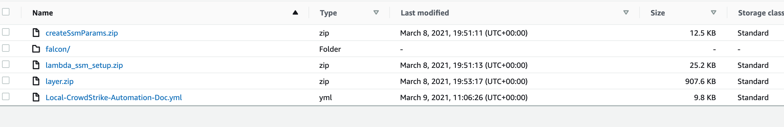

Folder - falcon
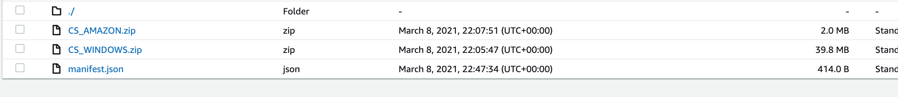
zip installers for each OS manifest.json

### Step 3 - Create the Cloudformation Stack

The CloudFormation template performs three operations

1. Creates an IAM Role CrowdStrike-SSMExecutionRole.  
   The role has the Amazon managed policy AmazonSSMAutomationRole attached to it
   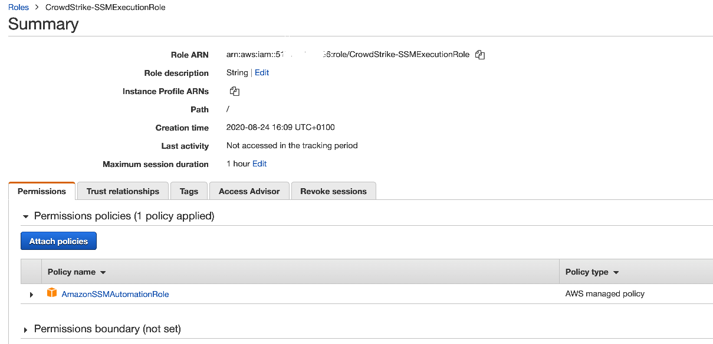


2. Adds parameters to the Systems Manager Parameter Store

3. Checks for the existence of a valid installation token in the falcon console. If a valid installation token does not
   exist the template will create a valid token for use by the ssm installation agent.

4. Creates a Systems Manager "automation" document and a systems manager installation "package".

#### Deploy the cloudformation template

1. Create the OAuth2 API keys in the CrowdStrike Console The API key will require

        -   "Installation Tokens" -- "Read" + "Write"
        -   "Sensor Download" -- "Read"

   <https://falcon.crowdstrike.com/support/documentation/93/oauth2-auth-token-apis#get-an-auth-token>

   Create an OAuth2 api key pair with permissions to "Read" and "Write"
   Installation Tokens and "Read" for Sensor Download.

   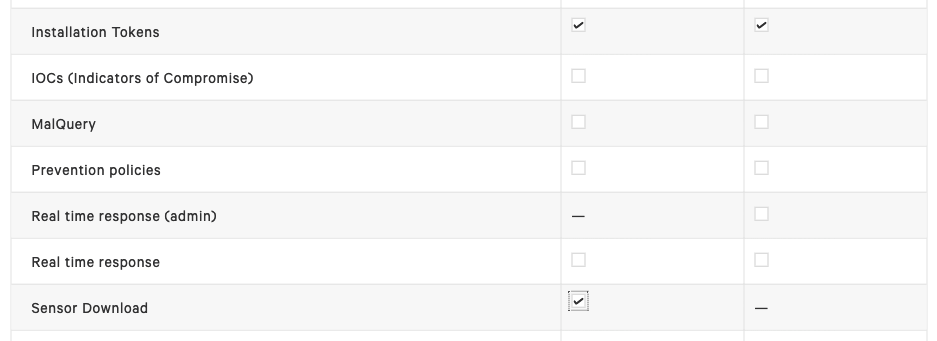


2. Load the CloudFormation template

   Add the CrowdStrike API OAuth2 Client ID and Client secret

   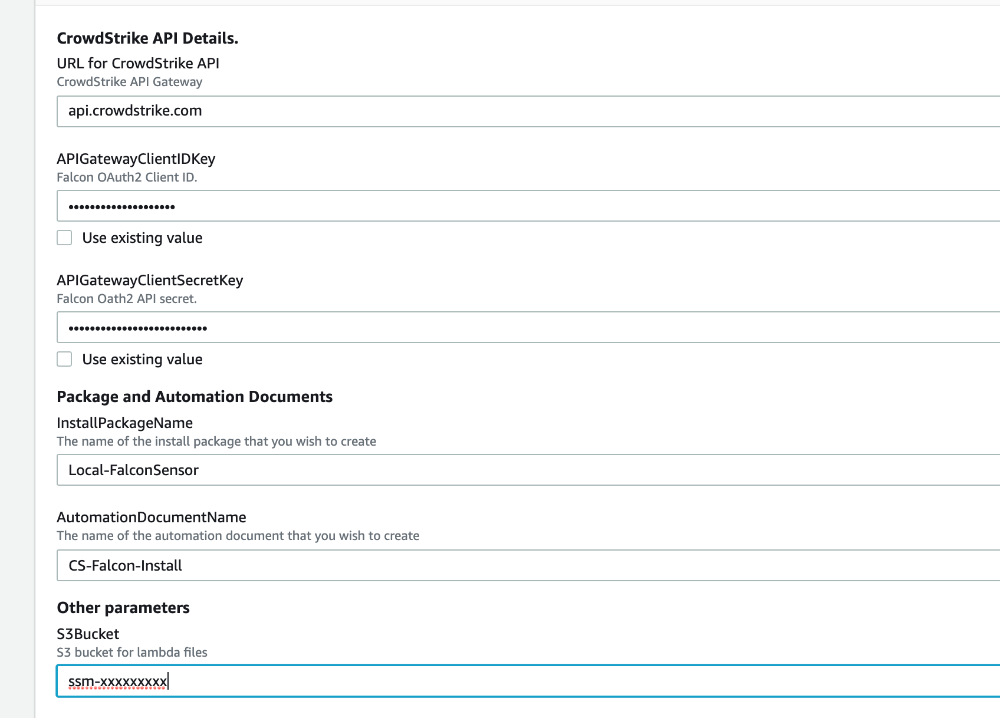


3. Verify that the template has created the resources

   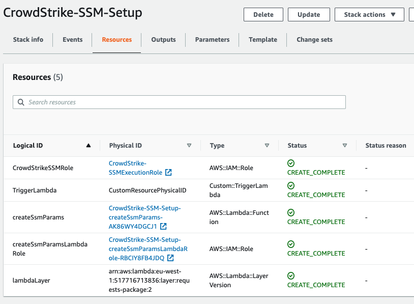


4. Verify that the IAM Role CrowdStrike-SSMExecutionRole has been created.  
   The role has the Amazon managed policy AmazonSSMAutomationRole attached to it
   


5. Check that the parameters have been added to the Systems Manager Parameter Store

   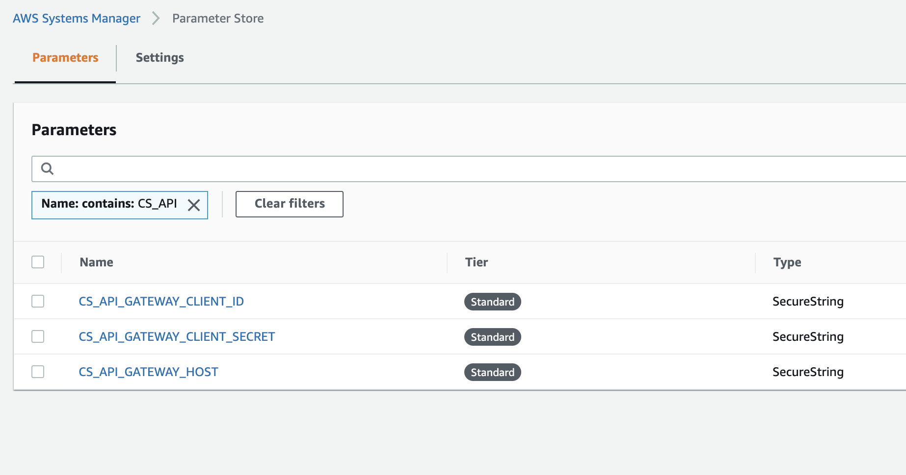


6. Check that the automation document has been created.

   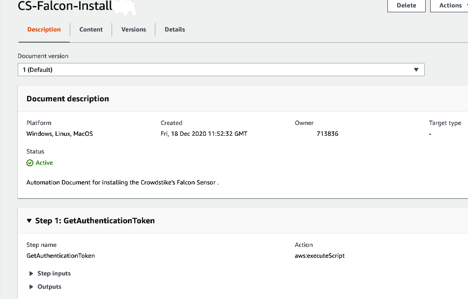


7. Check that the distributor document has been created.

   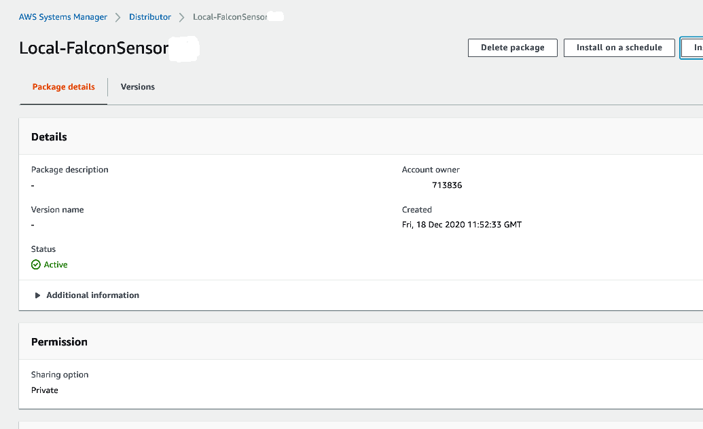

## Installing the CrowdStrike Falcon agent

### Installing With the GUI

1. From the AWS console can be select the automation document under AWS Systems Manager \> Automation \> Owned By Me >
   CS-Falcon-Install

   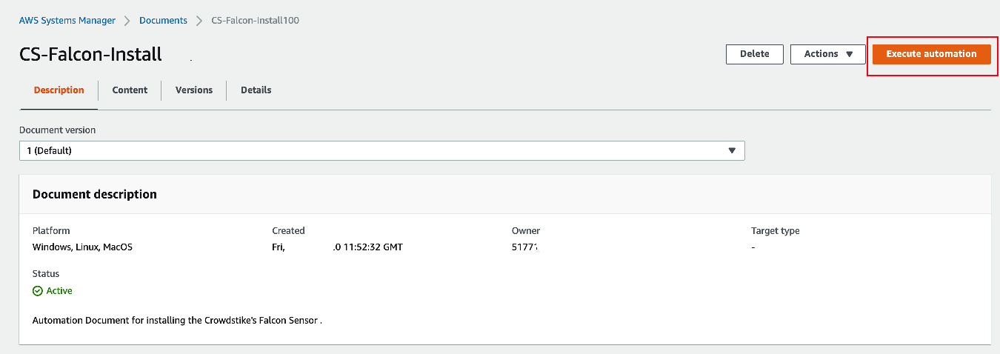


2. Complete the Input parameters form

   Select the *Instanceids* from the selector

   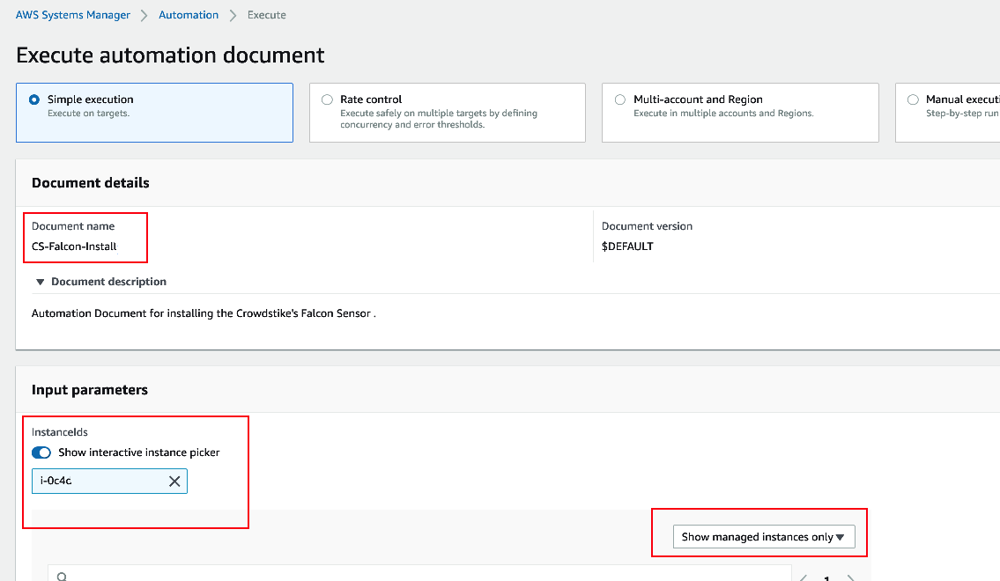


3. Select the *Install or Uninstall* from the Action dropdown
   


4. Select the correct package name and optional package version.

   Package Name - The package is the name of the package you provided in the cloudformation template PackageVersion -
   Leave blank unless you wish to specify a specific version


5. Enter the parameters that you wish to send to the CrowdStrike agent

   Note: No additional parameters are required in most situations

   Additional information for installing the Windows
   sensor [https://falcon.crowdstrike.com/support/documentation/23/falcon-sensor-for-windows](https://falcon.crowdstrike.com/support/documentation/23/falcon-sensor-for-windows)

   Additional information for installing the Linux
   sensor [https://falcon.crowdstrike.com/support/documentation/20/falcon-sensor-for-linux](https://falcon.crowdstrike.com/support/documentation/20/falcon-sensor-for-linux)


6. Select a role that has the pre configured *AWS-SSM-ExecutionRole* policy bound to it. If you have used the supplied
   cloudformation template to setup the account select the role named
   *Crowdstrike-SSMExecutionRole*


7. Check the additional parameters

    - APIGatewayHostKey - The value should be **CS_API_GATEWAY_HOST** and is the key name for the url of the CrowdStrike
      API Gateway secret in the parameter store. This value was created by the cloudformation template described in the
      setup guide.

    - APIGatewayClientID - The value should be **CS_API_GATEWAY_CLIENT_ID** and is the key name for the CrowdStrike API
      ClientID in the parameter store. This value was created by the cloudformation template described in the setup
      guide.

    - APIGatewayClientSecret - The value should be **CS_API_GATEWAY_CLIENT_SECRET** and is the key name for the
      CrowdStrike API ClientSecret in the parameter store. This value was created by the cloudformation template
      described in the setup guide.


8. Select from either the InstanceIds or Targets field. Targets is required if you don\'t select one or more
   InstanceIds.

    - InstanceIds

      Select the instances that you wish to perform the action on

      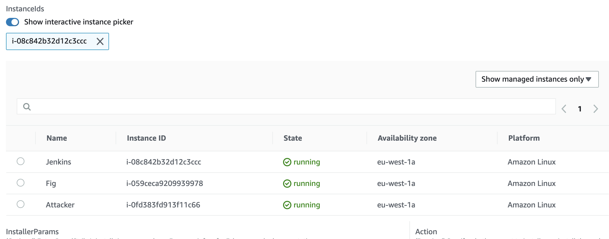

    - Targets

      The Targets tab will select the instances using a filter that is entered. For instance to target by tag enter "
      Key=tag:Name,Values=tag_value". For more information regarding Targets

      <https://docs.aws.amazon.com/systems-manager/latest/userguide/automation-working-targets.html>.

### Installing With the CLI

The CrowdStrike agent is installed with a automation document as described in the earlier section. The document is
[Crowdstrike-FalconSensorDeploy.yml](./documents/Crowdstrike-FalconSensorDeploy.yml)

To start the installation process via the cli use the **aws ssm start-automation-execution** command.
[https://docs.aws.amazon.com/cli/latest/reference/ssm/start-automation-execution.html](https://docs.aws.amazon.com/cli/latest/reference/ssm/start-automation-execution.html)

Substitue values for ```<<automation document name>>``` and ```<<distributor package name>>``` from the names provided
in the cloudformation template.

 ```console
 aws ssm start-automation-execution --document-name "Local-FalconSensor" --document-version "\$DEFAULT" --parameters '{"InstallerParams":[""],"Action":["Install"],"InstallationType":["Uninstall and reinstall"],"PackageName":["CS-Falcon-Install"],"PackageVersion":[""],"CSFalconVersion":[""],"APIGatewayHostKey":["CS_API_GATEWAY_HOST"],"APIGatewayClientIDKey":["CS_API_GATEWAY_CLIENT_ID\n"],"APIGatewayClientSecretKey":["CS_API_GATEWAY_CLIENT_SECRET"],"InstanceIds":["i-0c37e5a0ba8836e49"],"Targets":[],"AutomationAssumeRole":["arn:aws:iam::517716713836:role/CrowdStrike-SSMExecutionRole"]}' --region eu-west-1
```

### Installing With Python

AWS provides a boto3 client for interaction with Systems
Manager [https://boto3.amazonaws.com/v1/documentation/api/latest/reference/services/ssm.html#client](https://boto3.amazonaws.com/v1/documentation/api/latest/reference/services/ssm.html#client)

The
command [start_automation_execution(**kwargs)](https://boto3.amazonaws.com/v1/documentation/api/latest/reference/services/ssm.html#SSM.Client.start_automation_execution)
will begin the execution of the automation document.

## Troubleshooting

SSM Agent writes information about executions, commands, scheduled actions, errors, and health statuses to log files on
each instance. You can view log files by manually connecting to an instance. Logs are written to the following
locations.

#### Linux logs

 ```console
/var/log/amazon/ssm/amazon-ssm-agent.log

/var/log/amazon/ssm/errors.log
```

#### Windows logs

```powershell

%PROGRAMDATA%\\Amazon\\SSM\\Logs\\amazon-ssm-agent.log

%PROGRAMDATA%\\Amazon\\SSM\\Logs\\errors.log
```

Installation of the CrowdStrike agent requires version x.xxx or later of the systems manager agent.

1. Check the version of the agent running on the host

On Windows run

```powershell
Get-WmiObject Win32_Product \| Where-Object { \$\_.Name -eq \'Amazon SSM Agent\' } \| Select-Object Name, Version
```

On Amazon Linux and Amazon Linux 2

```shell script
yum info amazon-ssm-agent
```

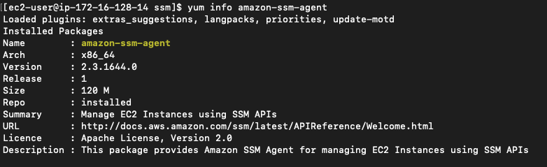

2. Check the Parameters Store

Verify the api keys are correct

3. Check the agent logs

Look for the output in the log files

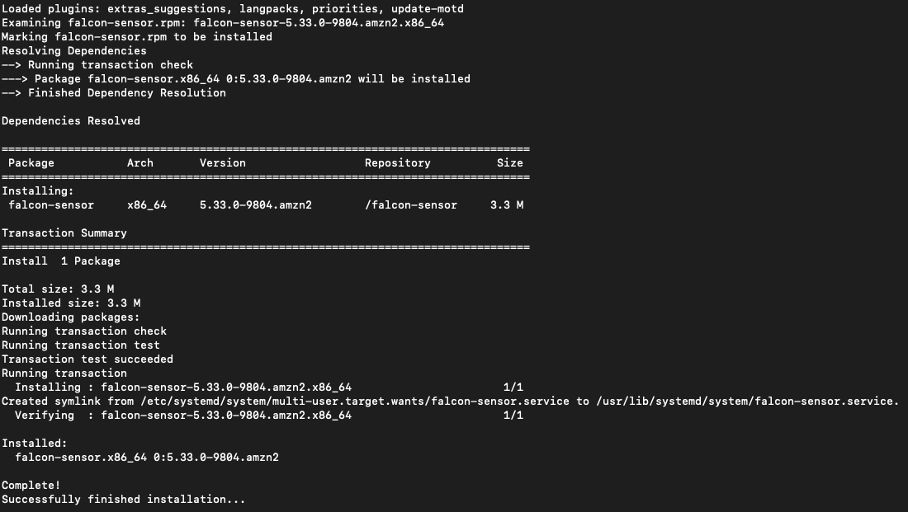
