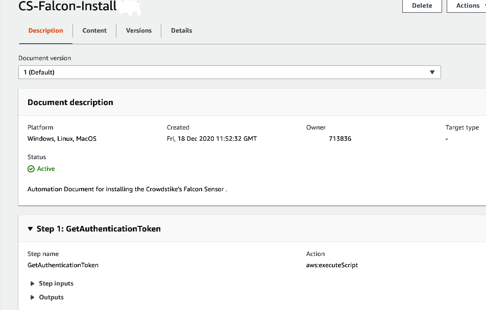

Setup Systems Manager 
=====================

Introduction
------------

CrowdStrike provide a CloudFormation template to assist with the setup of an account so that systems manager can be used to push the Falcon agent to ec2 instances. The CloudFormation template performs three operations

1.  Creates an IAM Role CrowdStrike-SSMExecutionRole.  
    The role has the Amazon managed policy AmazonSSMAutomationRole attached to it
    

2.  Adds parameters to the Systems Manager Parameter Store

3.  Checks for the existence of a valid installation token in the falcon
    console. If a valid installation token does not exist the template will create a valid token for use by the ssm installation agent.
   
4.  Creates a Systems Manager "automation" document and a systems manager installation "package". 

Deploy the cloudformation template
==================================

1. Download the CloudFormation template from github

    Go to

    [https://github.com/CrowdStrike/Cloud-AWS/tree/master/systems-manager/cloudformation](https://github.com/crowdstrike/cloud-aws/systems-manager/cloudformation)

    Download the template *CrowdStrike-ssm-setup.yaml* from the
    cloudformation folder

    *Download the files from the S3 folder and the Packaging Utilities folder
    
    Review the installation scripts in the Falcon folder under S3.   If you are happy with the scripts then proceed to Step 2.  If you wish to modify the scripts   
    then follow the guide ["creating new install scripts and manifest file"](https://github.com/CrowdStrike/Cloud-AWS/tree/master/systems-manager/Packaging%20utilities).

2. Create an S3 Bucket in the region where you will be running the CloudFormation template

    Upload all the files in the s3 folder to the S3 bucket.  Ensure that the folder structure is maintained. 

    
    
3. Create the OAuth2 API keys in the CrowdStrike Console
    The API key will require

        -   "Installation Tokens" -- "Read" + "Write"
        -   "Sensor Download" -- "Read"

    <https://falcon.crowdstrike.com/support/documentation/93/oauth2-auth-token-apis#get-an-auth-token>

    Create an OAuth2 api key pair with permissions to "Read" and "Write"
    Installation Tokens and "Read" for Sensor Download.

    

4. Load the CloudFormation template

    Add the CrowdStrike API OAuth2 Client ID and Client secret

    

5. Verify that the template has created the resources

    

6. Verify that the IAM Role CrowdStrike-SSMExecutionRole has been created.  
    The role has the Amazon managed policy AmazonSSMAutomationRole attached to it
    

7.  Check that the parameters have been added to the Systems Manager Parameter Store

    

8. Check that the automation document has been created.

    

9. Check that the distributor document has been created.

    
