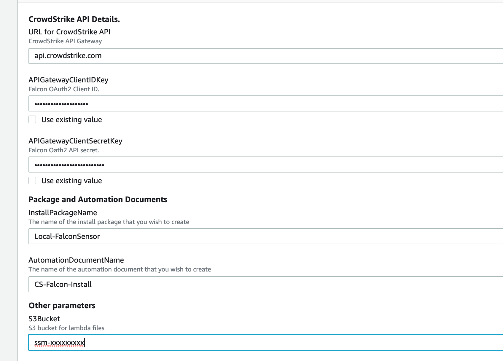

Setup Systems Manager 
=====================

Introduction
------------

CrowdStrike provide a CloudFormation template to assist with the setup
of an account so that systems manager can be used to push the Falcon
agent to ec2 instances. The CloudFormation template performs three
operations

1.  Creates an IAM Role CrowdStrike-SSMExecutionRole

The role has the Amazon managed policy AmazonSSMAutomationRole attached
to it

2.  Adds parameters to the Systems Manager Parameter Store

3.  Checks for the existence of a valid installation token in the falcon
    console

If a valid installation token does not exist the template will create a
valid token for use by the ssm installation agent.

Deploy the cloudformation template
==================================

1\) Download the CloudFormation template from github

Go to
[https://github.com/crowdstrike/cloud-aws/systems-manager/](https://github.com/crowdstrike/cloud-aws/systems-manager/cloudformation)

Download the template *CrowdStrike-ssm-setup.yaml* from the
cloudformation folder*\
*Download the lambda files "createSsmParams.zip" and "layer.zip from the
lambda/staging folder

2\) Create an S3 Bucket in the region where you will be running the
CloudFormation template

Upload the files to the S3 bucket

3\) Create the OAuth2 API keys in the CrowdStrike Console

<https://falcon.crowdstrike.com/support/documentation/93/oauth2-auth-token-apis#get-an-auth-token>

Create an OAuth2 api key pair with permissions to "Read" and "Write"
Installation Tokens

4\) Load the CloudFormation template

Add the CrowdStrike API OAuth2 Client ID and Client secret

The API key will require

-   "Installation Tokens" -- "Read" + "Write"

-   

5\) Verify that the template has created the resources

