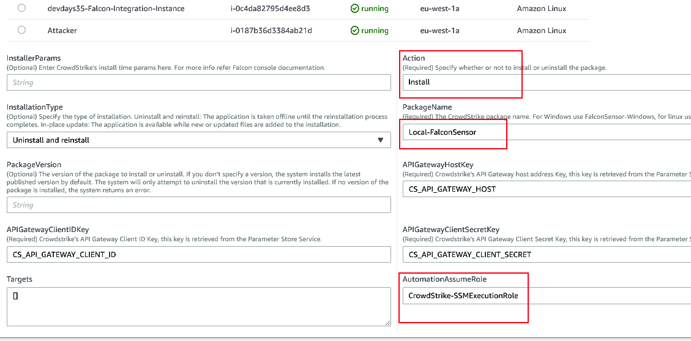

Using Systems Manager
=====================

Check that your environment meets the prerequisites for Systems Manager
<https://docs.aws.amazon.com/systems-manager/latest/userguide/systems-manager-prereqs.html>

Use the supplied CloudFormation template to setup your account to setup the required IAM Role and parameters in the Systems Manager parameter store.

<https://github.com/CrowdStrike/Cloud-AWS/blob/master/systems-manager/documentation/setup/Setup-your-account.md>

# Important Information: 

* The DEFAULT version referred to in the package will be a version that is two versions behind the latest published by CrowdStrike. For example (see screenshot below)
if the latest release of the linux sensor is 5.34.9918 the DEFAULT version installed would be 5.33.9808.  
It is expected that once installed, sensor versions will be managed via the falcon console.

 

# Managing Sytems Agent Versions
AWS releases a new version of SSM Agent when we they update Systems Manager capabilities. This solution requires version 2.3.1550.0 or later of the systems manager agent. At the time of writing, the Amazon AMIs that have the systems manager agent pre installed have an earlier version of the agent installed.  The host will therefore require that the systems manager agent is upgraded before it can be used to deploy the CrowdStrike agent.
We recommend that you automate the process of updating SSM Agent on your instances using any of the following methods.

[https://docs.aws.amazon.com/systems-manager/latest/userguide/ssm-agent-automatic-updates.html](https://docs.aws.amazon.com/systems-manager/latest/userguide/ssm-agent-automatic-updates.html)
* You can configure all instances in your AWS account to automatically check for and download new versions of SSM Agent. To do this, choose Agent auto update on the Managed instances page in the AWS Systems Manager console (Recommended)

* You can use State Manager to create an association that automatically downloads and installs SSM Agent on your instances. If you want to limit the disruption to your workloads, you can create a Systems Manager maintenance window to perform the installation during designated time periods.


## Installing the CrowdStrike Falcon agent 
## Installing With the GUI

1. From the AWS console can be select the automation document under AWS Systems Manager \> Automation \> Owned By Me > CS-Falcon-Install 

    

2. Complete the Input parameters form

    Select the *Instanceids* from the selector
    

3. Select the **Action** that you wish to perform

4.  Select the *Install or Uninstall* from the Action dropdown
    
    
5.  Select the correct package name and optional package version.

    Package Name - The package is the name of the package you provided in the cloudformation template
    PackageVersion - Leave blank unless you wish to specify a specific version
6.  Enter the parameters that you wish to send to the CrowdStrike agent
            
    Note: No additional parameters are required in most situations
    
    Additional information for installing the Windows sensor [https://falcon.crowdstrike.com/support/documentation/23/falcon-sensor-for-windows](https://falcon.crowdstrike.com/support/documentation/23/falcon-sensor-for-windows)
    
    Additional information for installing the Linux sensor [https://falcon.crowdstrike.com/support/documentation/20/falcon-sensor-for-linux](https://falcon.crowdstrike.com/support/documentation/20/falcon-sensor-for-linux)
    
6.  Select a role that has the pre configured *AWS-SSM-ExecutionRole* policy
    bound to it. If you have used the supplied cloudformation template to setup the account select the role named
    **Crowdstrike-SSMExecutionRole**

7. Check the additional parameters

   APIGatewayHostKey - The value should be **CS_API_GATEWAY_HOST** and is the key name for the url of the CrowdStrike API Gateway secret in the parameter store.  This value was created by the cloudformation template described in the setup guide.

   APIGatewayClientID - The value should be **CS_API_GATEWAY_CLIENT_ID** and is the key name for the CrowdStrike API ClientID in the parameter store.  This value was created by the cloudformation template described in the setup guide.
   
   APIGatewayClientSecret - The value should be **CS_API_GATEWAY_CLIENT_SECRET** and is the key name for the CrowdStrike API ClientSecret in the parameter store.  This value was created by the cloudformation template described in the setup guide.
   
8. Select from either the InstanceIds or Targets field. Targets is required if you don\'t select one or more InstanceIds.

    - InstanceIds

        Select the instances that you wish to perform the action on

        

    - Targets

        The Targets tab will select the instances using a filter that is entered. For instance to target by tag enter "Key=tag:Name,Values=tag_value". For more information regarding Targets

        <https://docs.aws.amazon.com/systems-manager/latest/userguide/automation-working-targets.html>.
  

### Installing With the CLI

The CrowdStrike agent is installed with a automation document as described in the earlier section.  The document is
 
[Crowdstrike-FalconSensorDeploy.yml](./documents/Crowdstrike-FalconSensorDeploy.yml)


To start the installation process via the cli use the **aws ssm start-automation-execution** command.
 [https://docs.aws.amazon.com/cli/latest/reference/ssm/start-automation-execution.html](https://docs.aws.amazon.com/cli/latest/reference/ssm/start-automation-execution.html)
 
Substitue values for ```<<automation document name>>``` and ```<<distributor package name>>``` from the names provided in the cloudformation template.
 
 ```console
aws ssm start-automation-execution --document-name "<<automation document name>>" --document-version "\$DEFAULT" --parameters '{"InstallerParams":[""],"Action":["Install"],"InstallationType":["Uninstall and reinstall"],"PackageName":["<<distributor package name>>"],"PackageVersion":[""],"APIGatewayHostKey":["CS_API_GATEWAY_HOST"],"APIGatewayClientIDKey":["CS_API_GATEWAY_CLIENT_ID\n"],"APIGatewayClientSecretKey":["CS_API_GATEWAY_CLIENT_SECRET"],"Targets":[]}' --region eu-west-1
```

### Installing With Python

AWS provides a boto3 client for interaction with Systems Manager [https://boto3.amazonaws.com/v1/documentation/api/latest/reference/services/ssm.html#client](https://boto3.amazonaws.com/v1/documentation/api/latest/reference/services/ssm.html#client)
The command [start_automation_execution(**kwargs)](https://boto3.amazonaws.com/v1/documentation/api/latest/reference/services/ssm.html#SSM.Client.start_automation_execution) will begin the execution of the automation document.

An example python script is included [here](python-example/example_aws_ssm_package_installation.py)


## Troubleshooting


SSM Agent writes information about executions, commands, scheduled
actions, errors, and health statuses to log files on each instance. You
can view log files by manually connecting to an instance. Logs are
written to the following locations.

#### Linux logs
 ```console
/var/log/amazon/ssm/amazon-ssm-agent.log

/var/log/amazon/ssm/errors.log
```

#### Windows logs
```powershell

%PROGRAMDATA%\\Amazon\\SSM\\Logs\\amazon-ssm-agent.log

%PROGRAMDATA%\\Amazon\\SSM\\Logs\\errors.log
```

Installation of the CrowdStrike agent requires version x.xxx or later of
the systems manager agent.

1.  Check the version of the agent running on the host

On Windows run

```powershell
Get-WmiObject Win32_Product \| Where-Object {\$\_.Name -eq \'Amazon SSM Agent\'} \| Select-Object Name,Version
```

On Amazon Linux and Amazon Linux 2

```shell script
yum info amazon-ssm-agent
```


2.  Check the Parameters Store

Verify the api keys are correct


3.  Check the agent logs

Look for the output in the log files


