# Deploying the CrowdStrike Falcon Sensor to Amazon WorkSpaces

## Prerequisites

- An AWS account that is able to create or administer an Amazon WorkSpace. Users do not need an AWS account or AWS console access to use their Amazon WorkSpaces.
- Choose between a yearly sensor licensing model or AWS metered billing. You are required to create a separate image for each of the licensing models.
- On launching the WorkSpace, you must specify profile information for the user, including a username and email address. You can also access the directory service and
  create your usernames to be linked in the Workspace build. Users complete their profiles by specifying a password that will accessible from a system generated email.
  Information about WorkSpaces and users is stored in a directory.
- Verify and select the supported region(s) for your WorkSpaces. Amazon WorkSpaces is available in most AWS Regions. For more information about the
  supported regions, see [Amazon’s Region Table](https://aws.amazon.com/about-aws/global-infrastructure/regional-product-services/).
- A Fully Qualified Domain Name (FQDN) is required for the deployment of WorkSpaces.

> [!NOTE]
>  - Login to the CrowdStrike Falcon Console or CrowdStrike Support portal for CrowdStrike related questions and help.
>  - Email aws@crowdstrike.com for any questions regarding CrowdStrike integrations with AWS.

### Create Amazon WorkSpaces - Personal

With Amazon WorkSpaces, you can create either personal or [pooled WorkSpaces](#create-amazon-workspaces---pools). In this walkthrough, we will show how to configure a Personal WorkSpace.

1. Select Region to Host the Personal WorkSpace

   To begin, select an AWS region that supports WorkSpaces. Please refer to the list of regions
   that support WorkSpaces on [Amazon’s Region Table](https://aws.amazon.com/about-aws/global-infrastructure/regional-product-services/).
   For this example, we will be using `us-east-1 (N. Virginia)` region.

   Open the Amazon WorkSpaces console at https://console.aws.amazon.com/workspaces/v2/home

   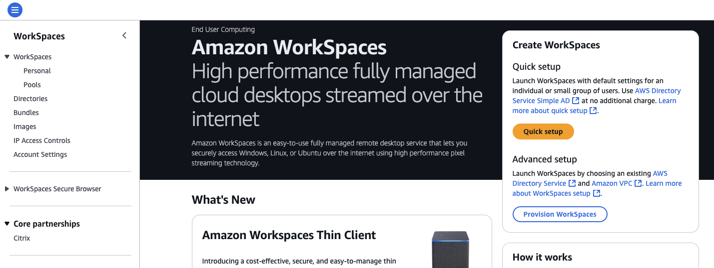

2. Validate the Personal Directory Services

   From the WorkSpaces console, select the `Directories` tab to validate your Directory services in
   your AWS region. You should have an active directory services that is registered and has the `Workspace type` of `Personal` that is similar to the picture
   below:

   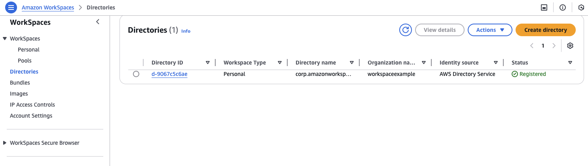

   If you do not have a directory service, you can easily create one by clicking on the `Create directory` button.

3. Personal WorkSpace Golden Image Creation

   > :warning: IMPORTANT
   >
   > If you do not have a current image and this is a new install, you will need to create a WorkSpace
   > to connect and create your golden image which will be done in the steps below. Otherwise, if you have a current Golden Image that you would
   > like to modify and add the CrowdStrike Falcon Sensor, see [Install the CrowdStrike Sensor](#install-the-crowdstrike-falcon-sensor).

   We will step through the creation of the WorkSpace in the next steps:

   From the WorkSpaces console, click `Personal` under the `WorkSpaces` drop-down navigation pane.

   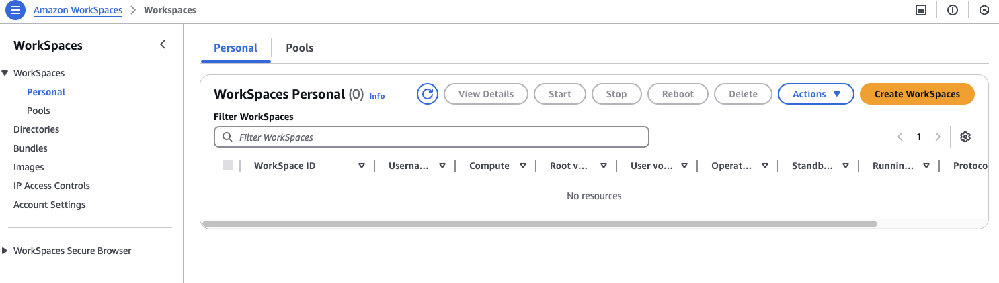

   Click the `Create WorkSpaces` button to create a new WorkSpace.

4. Personal WorkSpace Onboarding

   In the Onboarding step, you can choose different types of onboarding options. In this example, `I know what WorkSpace options I need for my use case.` was selected.
   Once an Onboarding option has been selected, click `Next`.

   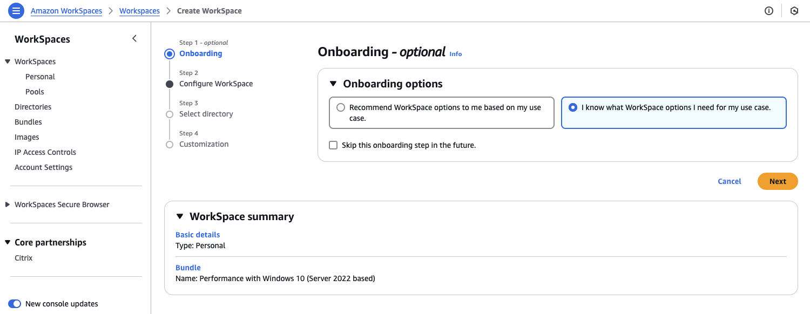

5. Personal WorkSpace Configuration

   In the WorkSpace Configuration step, choose the following settings:

   1. Select `Personal` for the `WorkSpace type`
   2. Select `Use a WorkSpaces Bundle`. If you already have an existing golden image with the CrowdStrike Falcon Sensor installed, select `Use your own custom or BYOL bundle` instead.
   3. In the Bundles drop-down, choose the bundle that you would like to use. In this example, `Performance with Windows 10 (Server 2022 based)` was selected. If you are using a custom or BYOL bundle, you would select it here.
   4. Select your desired `Running mode`. In this example, `Auto stop` was selected.

   Once all the options for the WorkSpace are configured, click `Next`.

   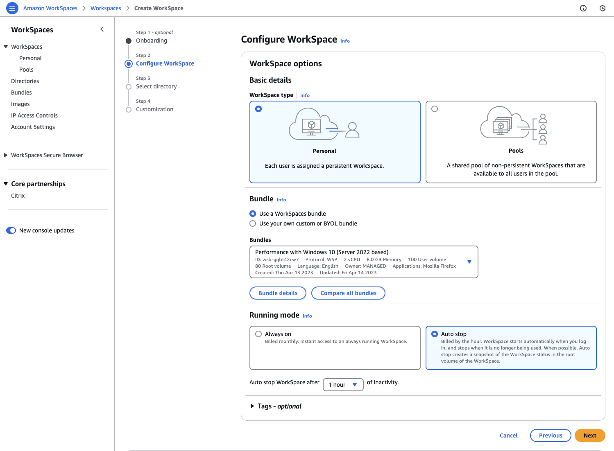

6. Personal WorkSpace Directory

   Select your directory service. If you do not have one and wish to create one, you can do so here by clicking the `Create directory` button.
   Once you have selected your directory service, you will either create your users or select existing users from your directory service.

   To create a new user, click `Create User`. Will need to provide  the username, first name, last name, and email address in the new `Users` windows that opens.
   Once you have created your user account, you should see the user listed. In this example, the user is `awsworkspace`.
   Once you have created and/or selected your users, click `Next.`

   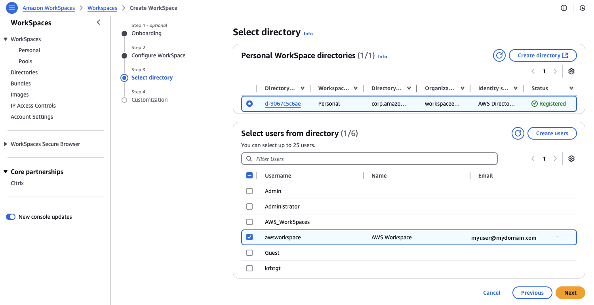

7. Personal WorkSpace Customization

   In this step, you will select `Encryption` for volumes, and `User volume` settings, if
   required.

   > :warning: IMPORTANT
   >
   > Do not encrypt your volumes as we will be using this to create your golden image!

   Click the `Create WorkSpaces` to begin creation of your Personal WorkSpace

   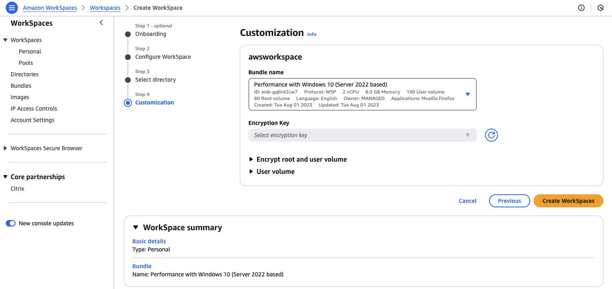

8. WorkSpace Creation

   Once the WorkSpace build is complete, you will see the WorkSpace status `Available`. The user
   email address should also receive an email with information on how to set the username
   password and download instructions for the WorkSpace’s client. This will allow you to connect to the WorkSpace.

   Below is an example of the email generated by WorkSpaces creation.

   ```
   Dear Amazon WorkSpaces User,

   Your administrator has created an Amazon WorkSpace for you. Follow the steps below to quickly get started with
   your WorkSpace:

   1. Complete your user profile and download a WorkSpaces client using the following link: https://myworkspaceexample.awsapps.com/
   auth/?#invite:token=11RUqdE9OFCXVqYACiLp-yDk7A7Unp8VEiQr_rvgGelKh4hj7VALogHFOdrlE3kyU9IhvRydQWVFpsoCalik1taH1oLNS382SEBRpOoKiyZy
   Y2qYQ-_TNSl3S01vsq9vI-d1Dr0HvLqurrXzerX9Ck2dNrxeZu2pduZPwHOvGbwMa0GTvO0Bch-qQFOr1_buAC7nCarC2fE8
   &redirect_uri=https://clients.myamazonworkspaces.com/&client_id=a95c28b20a7643e3

   2. Launch the client and enter the following registration code: ABcdef+GHI01JK

   3. Login with your newly created password. Your username is awsworkspace

   You may download clients for additional devices at https://clients.myamazonworkspaces.com/

   If you have any issues connecting to your WorkSpace, please contact your administrator.

   Sincerely,

   Amazon WorkSpaces

   ```

9. Set WorkSpace Password

   Click the link in the email to set the password for the user account used during the WorkSpace creation.

   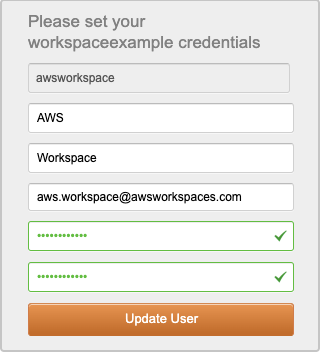

   Once you have created your password, you will be taken to a website that will allow you to
   download the WorkSpaces Client for your operating system.

   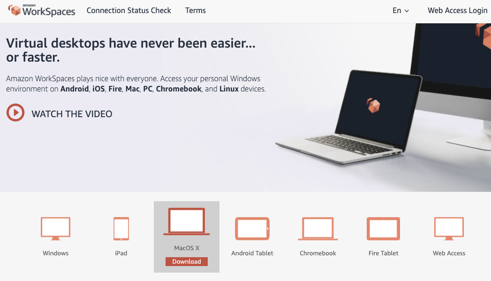

   Once you have downloaded and installed the client, you are now ready to connect to your WorkSpace.

10. Connecting to your WorkSpace

    To connect to your WorkSpace, launch the WorkSpaces client software. You will need to copy
    your registration code that is listed in bullet 2 on the email sent from AWS.

    In the initial login box for WorkSpaces, paste the registration code into the box and click `Register`.

    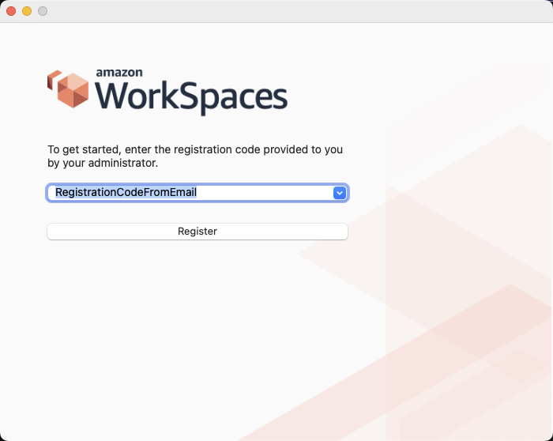

    From the next screen, you will enter the username and password that you created for the account.

    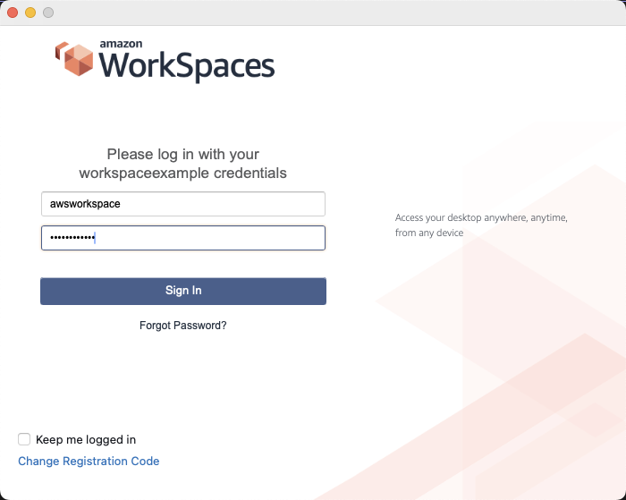

    This will connect you to the Amazon WorkSpaces environment. You will now be ready to install
    the Falcon Sensor and build your new Golden Image.

### Create Amazon WorkSpaces - Pools

To create Amazon WorkSpaces Pools, the process is similar to creating personal Amazon WorkSpaces and many of the steps can be followed except that there are some additional considerations:

1. When configuring a new pooled WorkSpace, you will have to consider session duration/timeouts and capacity/scaling configurations.
2. When configuring a directory service for a pooled Workspace, it is required to provide a SAML 2.0 identity provider (IdP), and you will need to consider the following:
   - If connecting to the internet, you will need to have VPCs, Subnets, and Security groups configured.
   - If using Smart (PIV) cards, you will need to have Active Directory configured.
   - And more.

### Install the CrowdStrike Falcon Sensor

1. Install the CrowdStrike Falcon Sensor

   To install the CrowdStrike Falcon sensor, log into your Falcon Console to download the sensor
   installer file. Download the installer file and place the installer file into a folder on the `D:` drive
   of the WorkSpaces instance.

   > :warning: IMPORTANT
   >
   > It is important to note that the entire contents of the `C:\Drive` and the entire
   > `D:\Users\username` are included except for the some of the personal folder directories such as
   > `Contacts`, `Downloads`, `Music`, etc. Since the downloads from the web browser usually are
   > downloaded to the `D:\Users\username\downloads` folder, you will need to create a new folder
   > and move the Falcon sensor installer file to that new folder.

   Download the Falcon Sensor installer file

   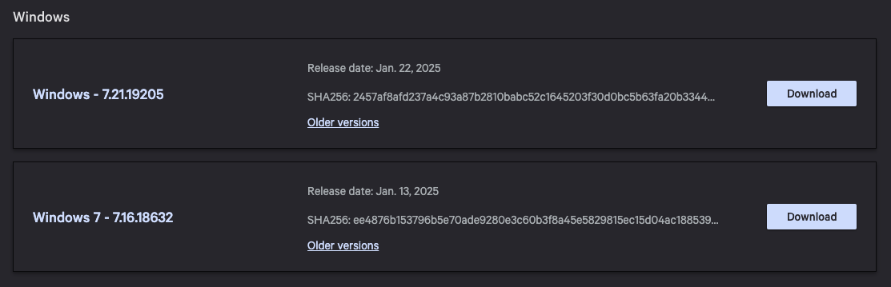

   Once the file is downloaded, create a new folder in the `D:\Users` directory

   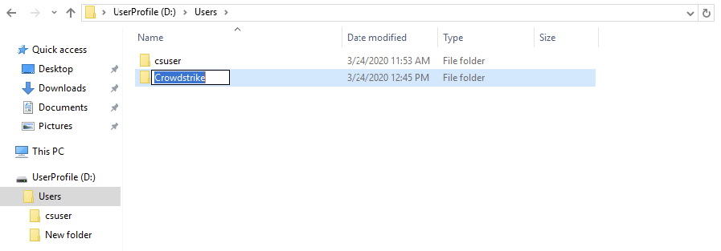

   Move the Falcon Sensor installer file to a new `CrowdStrike` folder.

   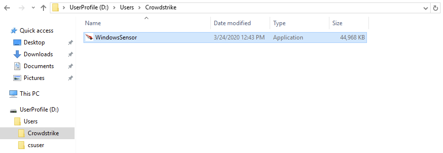

   Once the installer file is in the CrowdStrike folder, we are ready to install the Falcon Sensor.

2. Decide Pricing Model between Yearly or Metered Billing

   You will need to decide the licensing model you would like to use for your sensor install. There
   are two models that you can choose from - yearly licensing for existing license agreement or AWS
   metered billing that will be billed through AWS Marketplace based on hourly usage.

   Sensor installation and building of the golden image of Amazon WorkSpace will depend on the
   selected licensing model. You have the option for creating two separate images - one for metered
   billing and one for yearly licensing.

   For this document, we will detail both the installations of yearly and AWS Marketplace metered billing.

   #### Option 1: Yearly Licensing model

   From the Amazon WorkSpace, open up a Windows command prompt and navigate to `D:\Users\Crowdstrike\`

   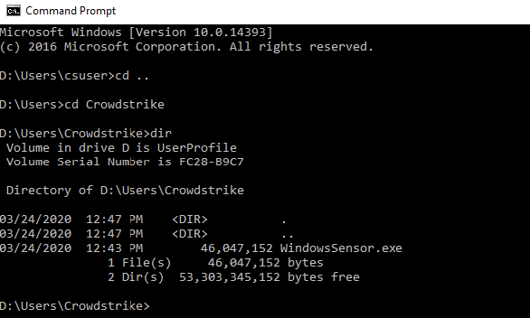

   To install the Falcon sensor with a yearly license, you will need to run the following
   command to make sure that we identify the sensor as a VDI build that will need unique AID
   hardware identifiers in the console:

   ```powershell
   WindowsSensor.exe /install /quiet /norestart CID=<your CID> NoFA=1 NoDC=1 VDI=1 NO_START=1
   ```

   In the above command, you will need to insert your Customer ID (CID) in the command above
   replacing <your CID> with your CID plus checksum. Your CID can be found on the sensor
   download page of the CrowdStrike Console.

   Once you run the command, you will see a window pop-up to allow the Falcon Sensor to make
   changes to the system. Click `Yes` to allow the Falcon Sensor to complete the installation.

   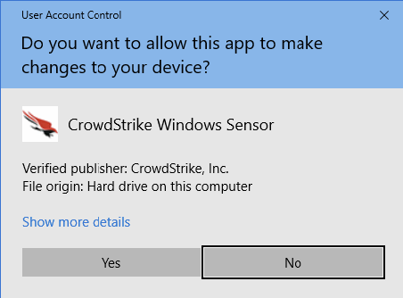

   Once the sensor install completes, you can check to validate that the sensor deployed by using
   the `SC` command at the command prompt. You will notice that the agent state
   shows a stopped state. This is expected due the `NO_START=1` flag used in the sensor install
   command. This allows a new unique AID to be generated per WorkSpace that created from the
   image.

   ```powershell
   sc query csagent
   ```

   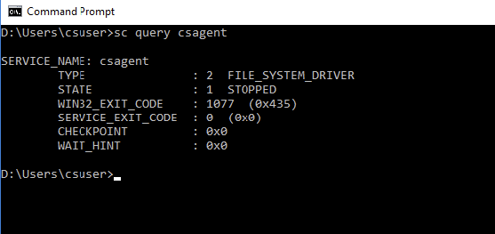

   Add Windows updates and software as needed for the WorkSpace image.

   #### Option 2: Metered billing Licensing model:

   From the Amazon WorkSpace, open up a Windows command prompt and navigate to `D:\Users\Crowdstrike\`

   

   To install the Falcon sensor with metered billing, you will need to run the following
   command to make sure that we identify the sensor as a VDI build that will need unique AID
   hardware identifiers in the console:

   ```powershell
   WindowsSensor.exe /install /quiet /norestart CID=<your CID> NoFA=1 NoDC=1 VDI=1 NO_START=1 BILLINGTYPE=Metered
   ```

   In the above command, you will need to insert your Customer ID (CID) in the command above
   replacing `<your CID>` with your CID with checksum. Your CID can be found on the sensor
   download page of the CrowdStrike Console.

   Once you run the command, you will see a window pop-up to allow the Falcon Sensor to make
   changes to the system. Click `Yes` to allow the Falcon Sensor to complete the installation.

   

   Once the sensor install completes, you can check to validate that the sensor deployed by using
   the `SC` command at the command prompt. You will notice that the agent state
   shows a stopped state. This is expected due the `NO_START=1` flag used in the sensor install
   command. This allows a new unique AID to be generated per WorkSpace that created from the
   image.

   ```powershell
   sc query csagent
   ```

   

   Add Windows updates and software as needed for the WorkSpace image.

### Create Golden Image Bundle

1. Create Golden Image

   You are now ready to create your WorkSpace image. Make sure you have logged out of your
   WorkSpace environment from the WorkSpace client.

   Make sure the box for the WorkSpace you created for the golden image is selected. Click on
   the `Actions` button and from the drop-down menu, select `Create Image`.

   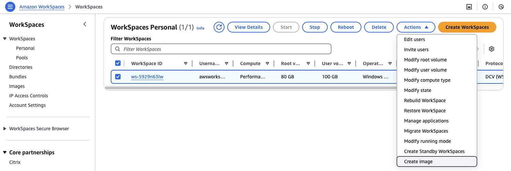

   You will be prompted to name your new image and provide a description of the image. After
   completion, click the `Create Image` button.

   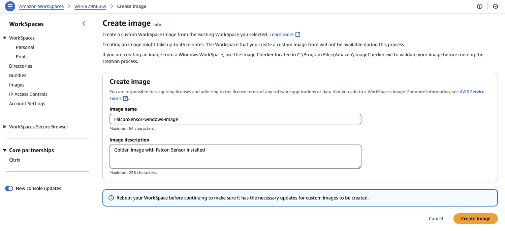

   A new image will be created from your WorkSpace. This process can take up to 45 minutes to
   complete. Once the image reaches the `Available` status, you can now create a new bundle that allows you
   to create a new WorkSpace with the new golden image.

2. Create Bundle

   When the `Image` status shows `Available`, select the box next to the image, click the `Actions` dropdown menu, and click `Create Bundle`.

   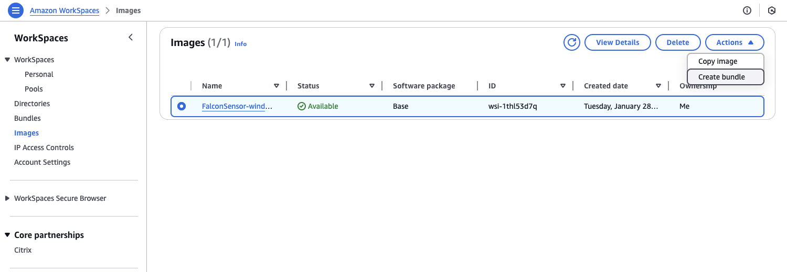

   In the `New Button` section, provide a `Bundle Name` and `Description` of the bundle.

   Next, select the `Bundle Hardware Type`. This will allow you to select the `Resources` (virtual CPU and
   Memory) required to run the applications in the WorkSpace. For this build, the standard bundle type was selected.

   Next set the `Root` and `User Volume Sizes` you would like. Once you have entered the
   information select `Create Bundle` at the bottom of the page.

   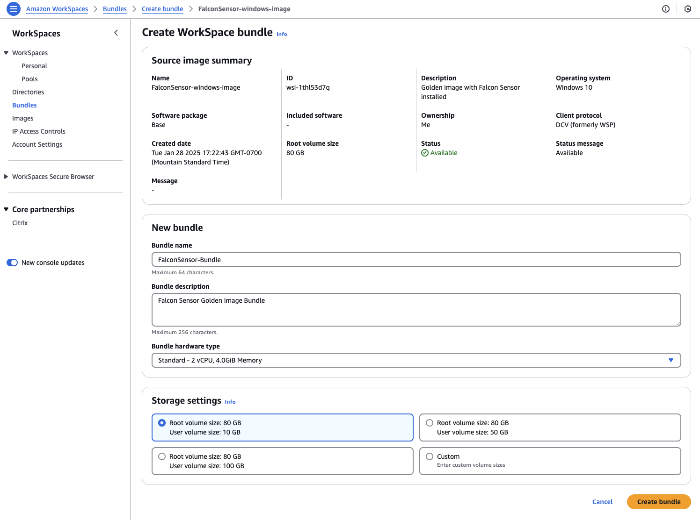

   Once the bundle is created, if you click on the `Bundles` tab in the WorkSpaces console, you will
   see your new bundle and image pair.

   

3. Deploy a WorkSpace using the new Bundle with the baked-in Falcon Sensor

   Next, we will deploy a new WorkSpace with the created bundled image. Click `WorkSpaces` from the WorkSpaces console submenu.

   > :warning: IMPORTANT
   >
   > You may need to delete the WorkSpace created in the first step with the temp user
   > `awsworkspace`. You can use the `Migrate WorkSpaces` option, if a snapshot has been created for the
   > WorkSpace. If a snapshot has not been created, you will have to remove the WorkSpace and
   > build a new WorkSpace.

   Select the box next to your WorkSpace. Select the `Migrate WorkSpaces` option from the `Actions` drop-down menu.

   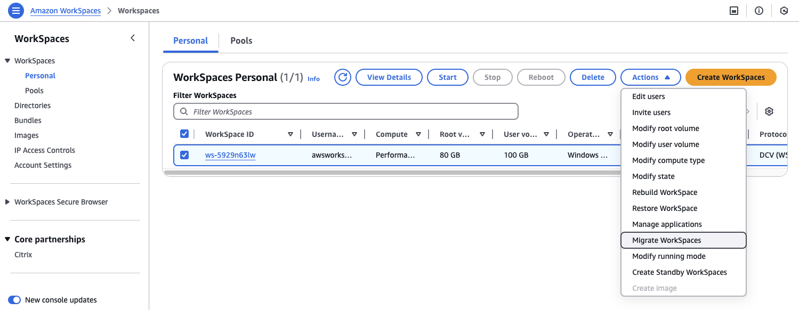

   In the `Migrate WorkSpaces` menu, select the `Bundle` you created above. In this example, `FalconSensor-Bundle` was the name of the bundle, and click the` Migrate WorkSpaces` button.

   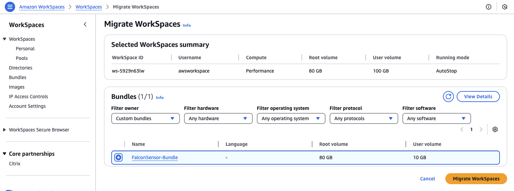

   Once the migration is complete, your WorkSpace should show a status of `Available`.

4. Validate the Sensor is installed and running

   If you would like to validate that the CrowdStrike sensor is running, log into the WorkSpaces environment with the WorkSpaces client.
   Once you have logged in, open a command prompt to validate the sensor is installed and
   running in the image. From the command prompt, type the following command:

   ```powershell
   sc query csagent
   ```

   The state should show the Falcon sensor as `Running`.

   This completes the build of your Amazon WorkSpaces environment with the CrowdStrike Falcon sensor deployed.

   As you build new WorkSpaces, pointing the build to the custom bundle and image that was
   built will ensure that the Falcon sensor is running and protecting your WorkSpaces Desktop-as-a-Service (DaaS) environments.

## Additional Resources

Learn how Desktop-as-a-Service (DaaS) solves the challenges you face with Virtual Desktop Infrastructure (VDI), and how to deploy DaaS on AWS in minutes.

- [Desktop-as-a-Service](https://aws.amazon.com/workspaces-family/)

Learn about Directory Services from AWS and how to deploy it in AWS Cloud

- [AWS Directory Service](https://aws.amazon.com/directoryservice/)
- [Active Directory Directory Services on AWS - Quick Start](https://aws.amazon.com/quickstart/architecture/active-directory-ds/)

Visit CrowdStrike products on AWS Marketplace

- [AWS Marketplace CrowdStrike Listings](https://aws.amazon.com/marketplace/search/results?searchTerms=crowdstrike)
